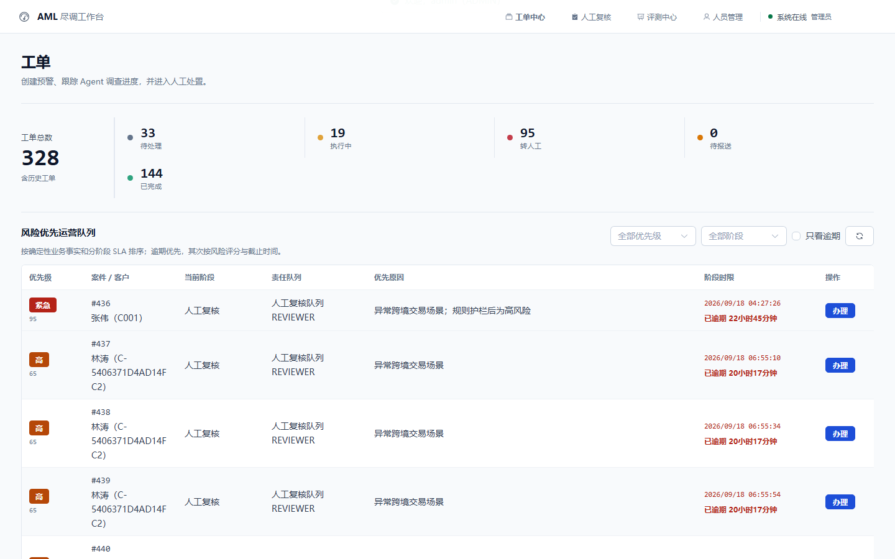
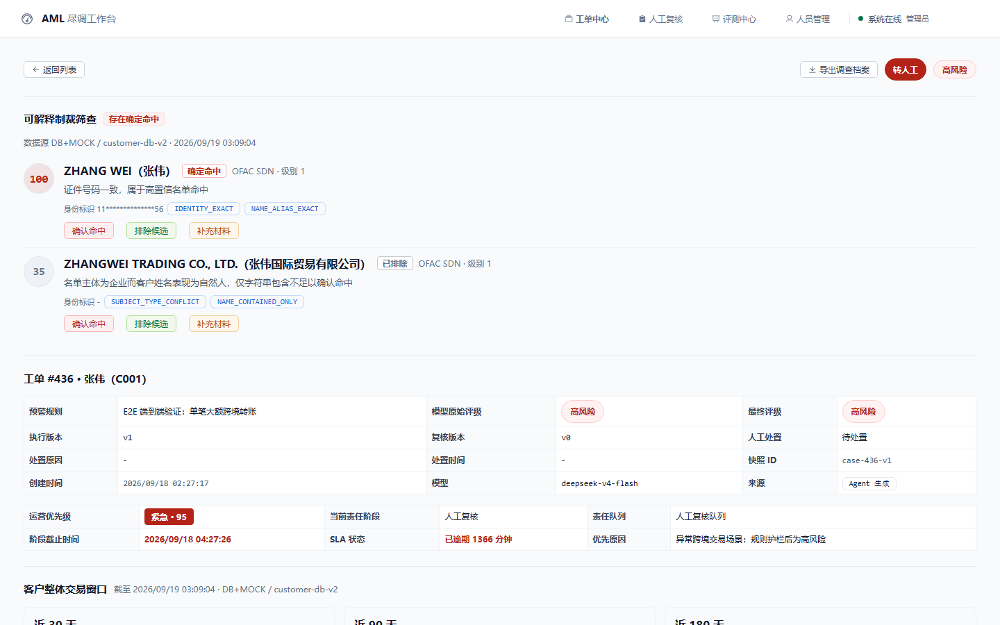
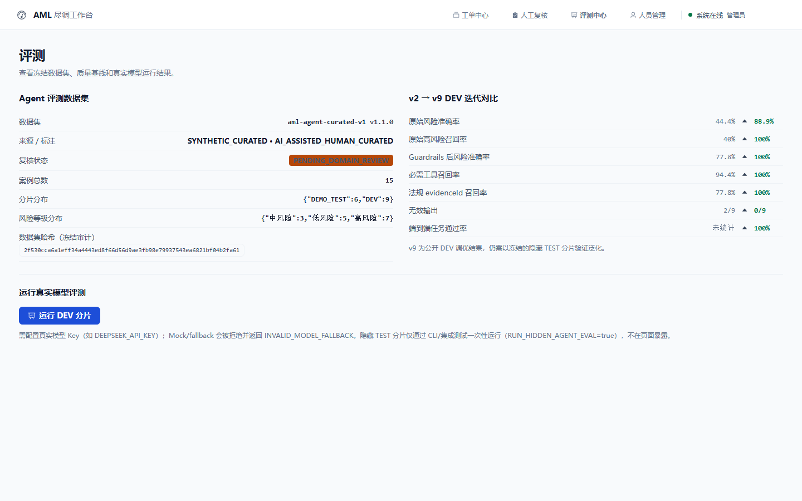

# 商业银行智能反洗钱（AML）与高风险客户尽调 Agent 平台

<div align="center">


**可评测 · 可追溯 · 可恢复 · 可观测 · 安全可控** 的企业级 AI 尽调闭环

</div>



工单台按**确定性优先级**排队（逾期优先，其次风险评分与截止时间），而不是按创建时间。
下面三张是实际运行的界面，截自本机 `docker compose` + 后端的完整栈，用的是仓库自带的演示数据。

<details>
<summary><b>工单详情 · 可解释制裁筛查</b>（命中理由、模型评级与人工终评并列、SLA 逾期）</summary>



筛查结果不只是一个「命中」布尔值：每条候选都带**为什么**命中（证件号一致 / 名单主体是企业而客户是自然人 / 仅姓名包含），
并给出确认命中、排除候选、补充材料三个出口。命中判定与人工处置分开记录，事后可复盘。

</details>

<details>
<summary><b>评测中心 · 冻结核验与迭代对比</b></summary>



左侧是数据集的冻结状态（含**数据集哈希**用于审计、以及 `PENDING_DOMAIN_REVIEW` 的复核标注），
右侧是 v2 → v9 的逐指标对比。页面上同时写着这句限定：
**v9 是公开 DEV 分片的调优结果，仍需以冻结的隐藏 TEST 分片验证泛化**。

</details>

## ✨ 一句话概括

接收反洗钱系统预警工单后，可靠地调度 Agent 工作流，自动完成交易画像、股权穿透、制裁名单筛查、监管法规检索、风险研判和结构化报告生成；使用独立于大模型的 **Guardrails 规则护栏**校验最终结论，并将高风险工单转入**人工复核闭环**。

**分层能力速览：**

| 能力项 | 实现 |
|---|---|
| 🔁 可靠任务 | Transactional Outbox + Redis Streams + 死信 + 租约 fencing + 崩溃恢复 |
| 🧊 数据一致性 | Snapshot First：推理前一次性冻结业务快照（`sourceDigest`） |
| 🔍 证据追溯 | 混合 RAG（向量+关键词+RRF+精排），法规证据带 `evidenceId` |
| 🛡️ 安全护栏 | 配置化规则 DSL、Prompt 注入三层防护、禁错检测 |
| 📏 评测体系 | 规则回归 / RAG 检索评测 / Agent DEV-TEST 盲测（freezeId 冻结） |
| 👁️ 可观测 | Prometheus 指标 + **OpenTelemetry GenAI 语义约定**追踪（`gen_ai.*` span），traceId 全链路透传 |
| 🔐 安全认证 | JWT HttpOnly Cookie + CSRF 双 Cookie、登录限流、生产启动自检 |

平台同时提供面向 ADMIN 的"当前客户 AI 小助"：在客户详情页进行只读、多轮、流式分析。会话由后端绑定当前客户，模型只接收脱敏冻结快照；七个工具均为只读且客户工具不接受 `customerId`。输入、跨 token 流式输出与最终回答经过三层确定性防护，Redis 租约避免同会话并发，Redis Stream 支持 SSE 重放，MySQL 加密消息作为最终事实源。公开银行知识与企业 AML 法规检索结果在每次 run 开始前冻结，回答引用只能来自该证据包。

## 📑 目录

- [核心工作流](#核心工作流)
- [当前验证结果](#当前验证结果)
- [技术栈](#技术栈)
- [快速启动](#快速启动)
- [配置 LLM](#配置-llm可选)
- [演示客户](#演示客户)
- [目录结构](#目录结构)
- [API 概览](#api-概览)
- [关键设计](#关键设计)
- [设计文档](#设计文档)
- [自动化测试](#自动化测试)
- [性能压测与可靠性演示](#性能压测与可靠性演示)
- [AI 应用工程能力](#ai-应用工程能力)
- [项目亮点（可写进简历）](#项目亮点可写进简历)
- [后续优化方向](#后续优化方向)

## 核心工作流

```
预警工单触发
  → Transactional Outbox + Redis Streams 可靠任务队列（幂等 / 重试 / 死信 / 崩溃恢复）
  → 任务规划 Planner      拆解子任务（交易画像 / 股权穿透 / 黑名单 / 法规匹配）
  → 工具调用 Tool Engine  并行调用四类数据工具（LangChain4j @Tool）
  → 企业 RAG 法规比对     ACL/有效期门控 + 向量/中文词法召回 + 加权 RRF/精排，证据可追溯
  → 深度风险推理          模型综合研判，输出风险点与评级
  → Guardrails 规则护栏   配置化规则强制修正（一级制裁 → 高风险 + 转人工 HOLD）
  → 结构化报告            含证据链与法规证据 ID，实时 SSE 推送到前端
  → 人工处置              合理排除，或创建限时、实名分派的补充尽调任务并在材料回传后再次复核
  → 可疑报告闭环          确认可疑后进入待报送；登记外部系统受理编号后结案，支持退回补正
  → 风险优先运营          按确定性风险评分、责任阶段与 SLA 逾期情况排序各角色待办
  → 调查档案导出          聚合流程/工具/快照/复核记录并生成 SHA-256 内容摘要
  → Agent / 规则 / RAG评测 独立案例夹具运行真实模型，原始结果与 Guardrails 分开计分
```


## 当前验证结果

| 验证项目 | 结果 | 数据性质 |
|---|---|---|
| 风险规则回归 | 100 条独立期望的合成边界案例 | 覆盖合法跨境/夜间负例、交易模式、UBO、数据缺失和制裁；不调用 LLM |
| 一级制裁规则漏报 | **0 / 5** | 合成规则案例 |
| RAG 法规检索评测 v2（18 条） | 无精排：Recall@5/Top3 **93.3%/93.3%**、MRR **81.1%**、nDCG@5 **84.2%**、无答案拒答 **100%**、P95 **135ms**；本地 bge 精排：**100%/100%**、MRR **95.6%**、nDCG@5 **96.7%**、拒答 **100%**、P95 **671ms** | 15 条业务改写 + 3 条无答案，真实 MySQL/PGVector/Redis，2026-08-23 本机冷缓存；`PENDING_DOMAIN_REVIEW`，仅为 DEV 基线 |
| 独立 Agent 案例集 | 15 条（DEV 9 / TEST 6） | AI 辅助人工整理的合成案例，待领域专家复核 |
| DeepSeek 真实 Agent DEV（v2 → v5） | 原始风险准确率 **44.4% → 100%**；Guardrails 后 **77.8% → 100%**；高风险召回率 **40% → 100%**；无效输出 **2/9 → 0/9** | 9 条冻结合成 DEV（`PENDING_DOMAIN_REVIEW`）；2026-08-12/13 本地实测 |
| v5 工具与证据覆盖 | 必需工具召回率 **100%**；法规 evidenceId 召回率 **100%**；端到端任务通过率 **66.7%**；strictPass **0**（5 次重复调用） | 5 次重复调用的汇总结果 |
| 首轮工具与证据覆盖（v2） | 必需工具召回率 **94.4%**；法规 evidenceId 召回率 **77.8%** | 失败集中在隐藏法规关键词导致的无效重试，已通过 v5 工具契约修复 |
| 当前客户 AI 小助确定性评测 | 70 条合成案例意图分类 **70/70**；15/15 攻击在模型前阻断 | 2026-08-23 本机验证；新助手真实模型质量评测尚未执行，不宣称模型准确率 |

> 本表只放**评测结果**，不放测试条数——测试数字由脚本从真实产物统计，见
> [自动化测试](#自动化测试)。两者混在一张表里，会让人分不清"跑过多少测试"
> 和"测出来的效果如何"。整表最近一次复核：2026-08-23。

> 规则回归结果只用于验证 Guardrails 和风险规则，不代表大模型准确率。Agent 数字来自 DeepSeek 对 9 条合成 DEV 的迭代基线，v5 指标为调优集结果（可能过拟合），需以冻结的隐藏 TEST 分片验证泛化能力；Agent 与 RAG 数据集标签仍待领域专家复核（`PENDING_DOMAIN_REVIEW`），因此不等同生产准确率。

运行真实 Agent DEV 评测前，请在启动后端的同一终端设置模型密钥，例如 PowerShell：

```powershell
$env:DEEPSEEK_API_KEY = "your-key"
```

真实 Agent DEV 评测默认不会在普通测试中调用外部模型。确认 9 条数据均为可发送的合成案例后，可显式运行：

```powershell
$env:RUN_LIVE_AGENT_EVAL = "true"
./mvnw -Dtest=AgentEvalLiveTest test
```

脱敏后的 JSON 报告写入 `backend/target/agent-eval/`；不保存 API Key、客户姓名、证件号、原始工具参数或模型长文本。

未配置密钥时，`POST /api/eval/agent/dev` 会返回 `INVALID_MODEL_FALLBACK`，且所有质量指标分母为 0。

### 实验可复现性

真实 Agent 评测结果由以下版本要素锁定，可通过 `GET /api/eval/agent/dataset` 查看数据集 SHA-256：

| 要素 | 值 |
|---|---|
| 代码基线 | 以当前 Git commit 为准（运行报告中记录版本，不在 README 固化易过期哈希） |
| Prompt 版本 | `aml-dd-agent-v7-production-contract-final-decision` |
| 模型 | `deepseek-v4-flash`（多提供商可切换） |
| 数据集 | `agent-cases-v1.json`（15 条：DEV 9 / DEMO_TEST 6，`PENDING_DOMAIN_REVIEW`）；正式 TEST 从仓库外加载专家审批数据 |
| 数据集哈希 | 由 `AgentEvalDatasetLoader` 启动时计算（内置数据 + 可选外部 TEST 的组合 SHA-256） |
| 护栏规则 | `risk_rule` 表 + `RiskRuleSeeder`（确定性 DSL） |

> v5 的 100% 指标来自反复调优的 9 条 DEV，仅证明当前迭代在 DEV 上有效；需以冻结的隐藏 TEST 分片验证泛化能力，不宣称真实银行生产准确率。

## 技术栈

| 层级 | 选型 |
|---|---|
| Agent 框架 | Spring Boot 3.5 + LangChain4j 1.20（AiServices + @Tool 并行调用） |
| 大模型 | 多提供商可配置：DeepSeek / 通义千问 / OpenAI / Claude / Mock |
| 向量库（RAG） | PostgreSQL 16 + pgvector（法规条文向量检索） |
| 业务存储 | MySQL 8（工单、工作流日志）+ Redis 7 |
| Embedding | all-MiniLM-L6-v2（本地离线，可换中文 embedding） |
| 前端 | Vue 3 + Vite + Element Plus + ECharts（SSE 实时监控） |

## 快速启动

**一共三步**——`docker-compose.yml` 里只有基础设施，没有后端与前端的镜像，
所以不存在"一条命令起全栈"。`docker compose up -d` 是后台的，
第 2、3 步各占一个终端；下面就是实际要敲的东西。

### 1. 启动依赖（终端 A，Docker）

```bash
docker compose up -d
```

启动三个容器（端口已避开本机常见的 3306/5432 占用）：

| 服务 | 主机端口 | 用途 |
|---|---:|---|
| MySQL 8 | 3307 | 工单、工作流、Flyway 迁移 |
| PostgreSQL 16 + pgvector | 5433 | 法规向量检索 |
| Redis 7 | 6379 | Outbox / 可靠任务队列 |

确认三个都起来了再往下走：

```bash
docker compose ps          # 三个服务都应是 healthy
```

### 2. 启动后端（终端 B，8080）

```bash
cd backend
./mvnw spring-boot:run                                  # 默认 Mock 模型：不需要任何 API Key，可离线演示全流程
./mvnw spring-boot:run -Dspring-boot.run.profiles=dev   # 改用真实 DeepSeek Key（需先设置 DEEPSEEK_API_KEY）
```

后端会一直占用终端 B，**不要关掉**。就绪判断：

```bash
curl -fsS http://localhost:8080/actuator/health
```

> 项目内置 **Maven Wrapper（3.9.x）**，无需本机安装新版 Maven。
> 真实 API Key 只通过 `DEEPSEEK_API_KEY` 环境变量注入；项目配置文件只保留占位符。

### 3. 启动前端（终端 C，5173）

```bash
cd frontend
npm install
npm run dev
```

浏览器打开 **http://localhost:5173**，使用以下账号登录：

| 账号 | 密码 | 角色 |
|---|---|---|
| admin | admin123 | ADMIN（全部权限，含评测） |
| reviewer | reviewer123 | REVIEWER（人工复核） |
| analyst | analyst123 | ANALYST（工单处理） |

登录后：选择客户 → 创建预警工单 → 实时查看 Agent 工作流推进与尽调报告；HOLD 工单可进入"人工复核"页面处置。

### 可选：监控面板

```bash
docker compose up -d prometheus grafana
```

Prometheus: http://localhost:9090 · Grafana: http://localhost:3000（admin / admin）

### 停止与清理

```bash
# 停后端/前端：在终端 B、C 按 Ctrl+C

docker compose stop            # 停容器，保留数据
docker compose down            # 停并删除容器，数据卷保留（下次启动数据还在）
docker compose down -v         # 连同数据卷一起删——MySQL/PGVector/Redis 数据全部清空
```

> `down -v` 之后下次启动会重新执行 Flyway 迁移、重新写入法规向量。
> 想回到干净状态就用它，想保留演示数据就用 `down`。

AI 小助仅在开发环境默认启用。ADMIN 可进入“客户管理 → 查看 → AI 小助”；生产环境必须显式设置
`AML_ASSISTANT_ENABLED=true`，否则入口与接口保持关闭。它不能修改客户、工单、账户或审核状态，也不能跨客户比较。

下列运行策略均可通过环境变量调整；未设置时采用表中默认值。单位是变量名所示的毫秒、秒、分钟或天。

| 环境变量 | 默认值 | 用途 |
|---|---:|---|
| `VITE_API_TIMEOUT_MS` | 120000 | 浏览器 API 请求整体超时（毫秒） |
| `AML_CUSTOMER_IMPORT_MAX_BYTES` | 5242880 | Excel 客户导入及 multipart 单文件上限（字节） |
| `AML_CUSTOMER_IMPORT_MAX_REQUEST_BYTES` | 6291456 | Excel multipart 总请求上限（字节，必须不小于文件上限） |
| `AML_CUSTOMER_IMPORT_MAX_ROWS` | 1000 | Excel 客户导入最大数据行数 |
| `AML_SANCTION_RECALL_LIMIT` | 50 | 生产制裁名单单次候选召回容量 |
| `AML_QUEUE_CONSUMER_POLL_TIMEOUT_MS` | 300 | Redis Stream 消费者阻塞轮询超时（毫秒） |
| `AML_QUEUE_OUTBOX_CLAIM_STALE_SECONDS` | 30 | 工作流 Outbox 发布 Claim 接管窗口（秒） |
| `AML_QUEUE_OUTBOX_PUBLISH_BATCH_SIZE` | 200 | 工作流 Outbox 单轮发布上限 |
| `AML_QUEUE_RETRY_BACKOFF_EXPONENT_CAP` | 6 | 重试指数退避的指数上限 |
| `AML_QUEUE_HEALTH_PROBE_SECONDS` | 15 | Redis Stream 健康探测周期（秒） |
| `AML_QUEUE_HEALTH_INITIAL_DELAY_SECONDS` | 5 | 首次健康探测等待时间（秒） |
| `AML_QUEUE_MINIMUM_LAG_RECOVERY_CYCLES` | 2 | 积压恢复前最少连续异常周期 |
| `AML_QUEUE_HEARTBEAT_EXECUTOR_THREADS` | 2 | Worker 租约心跳调度线程数 |
| `AML_QUEUE_SUMMARY_EXECUTOR_THREADS` | 2 | 最终报告推送执行线程数 |
| `AML_WORKFLOW_EVENT_HEARTBEAT_SECONDS` | 15 | 工单 SSE 心跳间隔（秒） |
| `AML_WORKFLOW_EVENT_HEARTBEAT_THREADS` | 2 | 工单 SSE 共享心跳线程数 |
| `AML_AUDIT_OUTBOX_POLL_MS` | 2000 | 可靠审计 Outbox 扫描周期（毫秒） |
| `AML_AUDIT_OUTBOX_BATCH_SIZE` | 200 | 可靠审计单轮投递上限 |
| `AML_ASSISTANT_EVENT_READ_BLOCK_SECONDS` | 2 | AI 小助事件流单次阻塞读取时长（秒） |
| `AML_ASSISTANT_EVENT_READ_BATCH_SIZE` | 50 | AI 小助事件流单次读取上限 |
| `AML_ASSISTANT_EVENT_HEARTBEAT_SECONDS` | 15 | AI 小助 SSE 心跳间隔（秒） |
| `AML_ASSISTANT_RECOVERY_GRACE_SECONDS` | 30 | 启动恢复判定失联任务的宽限时间（秒） |
| `AML_ASSISTANT_RETENTION_SCAN_MS` | 3600000 | AI 小助会话过期扫描周期（毫秒） |
| `AML_ASSISTANT_FROZEN_KNOWLEDGE_RESULT_LIMIT` | 3 | AI 小助单次冻结知识检索结果上限 |
| `AML_ASSISTANT_TASK_CORE_POOL_SIZE` / `AML_ASSISTANT_TASK_MAX_POOL_SIZE` | 2 / 4 | AI 小助运行线程池核心/最大线程数 |
| `AML_ASSISTANT_TASK_QUEUE_CAPACITY` | 50 | AI 小助运行线程池队列容量 |
| `AML_ASSISTANT_LEASE_SCHEDULER_THREADS` | 1 | AI 小助租约续期线程数 |
| `AML_ASSISTANT_SSE_CORE_POOL_SIZE` / `AML_ASSISTANT_SSE_MAX_POOL_SIZE` | 4 / 12 | AI 小助 SSE 线程池核心/最大线程数 |
| `AML_ASSISTANT_SSE_QUEUE_CAPACITY` | 50 | AI 小助 SSE 线程池队列容量 |
| `AML_AGENT_MAX_TOOL_ROUND_TRIPS` | 3 | 合规尽调 Agent 最大工具调用轮次 |
| `AML_AGENT_OUTPUT_MAX_TEXT_CHARACTERS` | 8000 | 尽调 Agent 单个输出文本字段的最大字符数 |
| `AML_AGENT_OUTPUT_MAX_LIST_ITEMS` | 50 | 尽调 Agent 单个输出列表的最大元素数 |
| `AML_EVAL_P95_LATENCY_BUDGET_MS` | 10000 | Agent 评测 P95 延迟预算（毫秒） |
| `AML_EVAL_AVERAGE_TOKENS_PER_CASE_BUDGET` | 6000 | Agent 评测单案例平均令牌预算 |
| `AML_RAG_BUILD_LEASE_MINUTES` | 15 | 法规索引构建租约时长（分钟） |
| `AML_RISK_RULE_CACHE_TTL_SECONDS` | 60 | 风险规则缓存有效期（秒） |
| `AML_INVESTIGATION_FUTURE_TIMESTAMP_TOLERANCE_MINUTES` | 5 | 外部预警未来时间容忍窗口（分钟） |
| `AML_REVIEW_EDD_DEFAULT_DUE_DAYS` | 14 | 分析员补充尽调建议的默认期限（天） |
| `AML_REVIEW_EDD_MAXIMUM_DUE_DAYS` | 90 | 补充尽调任务允许的最长期限（天） |

后端配置由 `@ConfigurationProperties` 绑定并校验范围；非法值会使应用启动失败。前端的 `VITE_*` 值会进入浏览器构建产物，不能用于存放密钥。
运营优先级/SLA、交易风险、名单匹配、解释提醒和 RAG 证据阈值集中在主配置的
`aml.operations`、`aml.risk`、`aml.explanation` 与 `aml.rag.retrieval` 中，并通过版本号或跨字段校验保护；这些是业务政策，不应按部署环境随意漂移。

## 配置 LLM（可选）

默认未配置 API Key 时自动降级到 **Mock 模型**（可离线演示完整链路）。
接入真实模型：设置环境变量或直接修改 `backend/src/main/resources/application.yml`：

```yaml
aml:
  llm:
    active-provider: deepseek   # 切换 deepseek / openai / qwen / claude / mock
    providers:
      deepseek:
        type: openai-compatible
        base-url: https://api.deepseek.com
        api-key: ${DEEPSEEK_API_KEY:}
        model-name: deepseek-v4-flash
```

| 提供商 | type | base-url | model-name |
|---|---|---|---|
| DeepSeek | openai-compatible | https://api.deepseek.com | deepseek-v4-flash |
| 通义千问 | openai-compatible | https://dashscope.aliyuncs.com/compatible-mode/v1 | qwen-plus |
| OpenAI | openai-compatible | https://api.openai.com/v1 | gpt-4o-mini |
| Claude | anthropic | — | claude-sonnet-4-6 |

## 演示客户

| 客户 | 特征 | 预期结果 |
|---|---|---|
| C001 张伟 | 夜间+跨境大额频繁、命中 OFAC 一级制裁 | 高风险 → 转人工（HOLD） |
| C002 王强 | 现金拆分存取、命中人行可疑名单 | 高风险 |
| C003 李娜 | 正常交易 | 低/中风险 |

## 目录结构

```
backend/                  Spring Boot 后端
  src/main/java/com/bank/aml/
    common/               ApiError、全局异常、枚举(CaseStatus/WorkflowStage)、异常分类
    messaging/            Transactional Outbox、Redis Streams 生产者/消费者、死信、Pending 接管
    workflow/             case_execution 阶段执行记录（检查点）
    risk/                 risk_rule 配置化规则 + RiskRuleEngine（DSL）
    sanction/             制裁候选召回后的身份匹配评分、解释与分级处置
    dossier/              案件调查档案聚合与 SHA-256 完整性摘要
    evaluation/           规则回归、独立 Agent 案例集、RAG 评测与评测报告
    agent/                AiServices Agent、报告 DTO、Guardrails（规则驱动）
    tools/                四个 @Tool（交易/股权/黑名单/法规）
    rag/                  法规导入（evidenceId）、混合检索（向量+关键词+RRF）
    datasource/           客户主数据 Port/Adapter、演示数据与 JPA 实体/仓库
    service/              工作流编排、客户管理、规则兜底报告、SSE 推送
    config/               LLM 多提供商工厂、双数据源、RAG/队列配置
  data/legal/             法规文档（启动时向量化入库）
frontend/                 Vue 3 界面（工单看板、工作流监控、报告）
docker-compose.yml        MySQL + PostgreSQL(pgvector) + Redis
```

## API 概览

> 除登录与监控端点外，其余接口需认证。认证使用 HttpOnly Cookie（登录后自动携带），也支持 `Authorization: Bearer <token>`；SSE 通过 Cookie 认证，JWT 不进入 URL/localStorage。

<details>
<summary><b>展开全部 API 端点</b></summary>

| 方法 | 路径 | 说明 |
|---|---|---|
| POST | /api/auth/login | 登录 `{username, password}` → JWT（放行） |
| POST | /api/cases | 创建工单 `{customerId, alertRule, autoProcess}`，自动写入 Outbox 触发尽调 |
| GET | /api/cases | 工单列表（DTO） |
| POST | /api/cases/{id}/process | 手动触发（幂等：已在执行/完成的工单忽略） |
| POST | /api/cases/{id}/retry | 人工重试（HOLD/FAILED 工单重新入队） |
| GET | /api/cases/{id}/events | 订阅工作流实时进度（SSE） |
| GET | /api/cases/{id}/executions | 阶段执行记录（检查点：阶段/耗时/输入输出） |
| GET | /api/cases/{id}/logs | 工作流日志（含触发规则） |
| GET | /api/cases/{id} | 工单详情（含报告 reportJson、执行版本） |
| GET | /api/queues/dead | 死信队列查看 |
| POST | /api/eval/rules | 确定性规则回归（不调用 LLM，ADMIN） |
| POST | /api/eval/rag | 独立 RAG DEV 评测（Recall@5/Top3/MRR/nDCG/拒答/P95，ADMIN） |
| GET | /api/admin/rag/indexes | 索引 Manifest 与发布状态（ADMIN） |
| POST | /api/admin/rag/indexes/{version}/rollback | 回滚到已发布索引（ADMIN，审计） |
| POST | /api/admin/rag/indexes/cleanup | 清理失败/退役候选（ADMIN，可恢复） |
| GET | /api/admin/rag/quarantines | 入库隔离记录（ADMIN） |
| GET | /api/eval/agent/status | 真实 Agent 评测就绪状态及数据集概览（ADMIN） |
| POST | /api/eval/agent/dev | 运行真实模型 DEV 评测；Mock/fallback 直接标记无效（ADMIN） |
| POST | /api/eval/agent/test | 运行冻结的隐藏 TEST 分片（最终评测，标准答案冻结，ADMIN） |
| GET | /api/eval/agent/dataset | 独立 Agent 案例集元信息（含 datasetHash），不返回 TEST 标准答案（ADMIN） |
| GET | /api/eval/reports?evalType=RULE_REGRESSION\|AGENT_DEV\|AGENT_TEST | 按类型查询历史评测报告（ADMIN） |
| GET | /api/reviews/pending | 待复核队列（REVIEWER/ADMIN） |
| POST | /api/reviews/{id} | 提交人工处置（确认可疑/排除预警/补充尽调 + 原因码 + 分析记录，REVIEWER/ADMIN） |
| GET | /api/reviews/{id} | 工单复核记录 |
| GET | /api/reviews/stats | 复核反馈统计（一致率等） |
| GET | /api/cases/{id}/edd | 查询工单补充尽调轮次与当前状态 |
| POST | /api/cases/{id}/edd/{requestId}/submit | 回传材料说明、来源记录编号和内容 SHA-256（ANALYST/ADMIN） |
| POST | /api/cases/{id}/edd/{requestId}/cancel | 撤销尚未提交的补充尽调任务并记录原因（REVIEWER/ADMIN） |
| GET | /api/edd/tasks | 分析员本人待办；ADMIN 可查询全部待办（ANALYST/ADMIN） |
| GET | /api/edd/assignees | 查询可分派的启用分析员（REVIEWER/ADMIN） |
| GET | /api/reports/pending | 待报送与退回补正的可疑交易报告（REVIEWER/ADMIN） |
| GET | /api/reports/{caseId} | 查询案件可疑交易报告状态（REVIEWER/ADMIN） |
| POST | /api/reports/{caseId}/submit | 登记外部报告系统受理编号并结案（REVIEWER/ADMIN） |
| POST | /api/reports/{caseId}/return | 将已报送报告退回补正并重开待报送状态（REVIEWER/ADMIN） |
| GET | /api/case-operations | 当前角色的风险优先运营队列；支持优先级、阶段和逾期筛选 |
| GET | /api/case-operations/{caseId} | 查询案件的确定性优先级、责任阶段和当前 SLA |
| GET/POST | /api/admin/customers | 客户分页查询/新增（ADMIN） |
| PUT/DELETE | /api/admin/customers/{id} | 客户编辑/软删除（ADMIN） |
| PUT | /api/admin/customers/{id}/status | 启停客户（ADMIN） |
| POST | /api/admin/customers/import | Excel 批量导入，5MB/1000 行限制（ADMIN） |
| GET | /api/queues/dead | 死信队列查看（ADMIN） |
| POST | /api/queues/dead/{caseId}/replay | 死信重放（ADMIN） |
| GET | /actuator/prometheus | Prometheus 指标（仅 ADMIN） |
| GET | /swagger-ui.html | OpenAPI 文档（开发环境公开，生产环境关闭） |
| GET | /api/cases/customers | 演示客户（脱敏，不含证件号） |
| GET | /api/cases/stats | 工单全量状态统计（态势概览，跨分页） |
| GET | /api/agent/ping | LLM 连通性验证 |

</details>

## 关键设计

<details>
<summary><b>展开全部 20 项关键设计</b></summary>

- **可靠异步任务**：Transactional Outbox（工单与事件同事务，`caseId:eventType:executionVersion` 幂等键防重复发布）→ **发布抢占（PENDING→PUBLISHING→PUBLISHED 原子状态机，多实例并发只允许一个发布器投递，杜绝重复/错投；崩溃残留由可配置的陈旧 Claim 窗口回收）** → Redis Streams 消费组 → 条件更新抢占（`executionVersion`）→ 版本化租约 + Worker 心跳（心跳/完成/失败均绑定 worker+version，防旧 Worker 污染新执行版本）→ 指数退避重试（RETRY_WAIT）→ 死信队列 → Pending 超时接管（服务重启任务不丢失）。重试、接管、死信重放统一走 Outbox，消除数据库提交与 Redis 投递之间的双写丢失窗口。工作流 Stream 禁止使用 MAXLEN 直接裁剪，避免删除尚未 ACK 的消息正文；容量治理必须依据所有消费组的安全位点执行。
- **Guardrails 配置化**：`risk_rule` 表驱动（DSL 条件表达式 + 优先级 + 生效时间），决策可解释（ruleCode / version / evidence / 动作），一级制裁命中零漏报并强制转人工。规则加载带 60s TTL 缓存，避免每次护栏评估查库。
- **RAG 证据追溯**：结构化检索显式携带法域、适用时间和访问范围，存储层预过滤并二次 fail-closed 校验；法规片段带 `evidenceId`，按主题冻结到快照，关键处置必须由被引用条文直接支持。
- **可回滚索引供应链**：语料、分块、元数据、Embedding 制品与距离度量共同构成完整索引身份；中央租约/心跳构建、Smoke Test、原子发布、显式回滚、可恢复清理和管理员审计避免半成品污染在线检索。
- **知识投毒隔离**：入库前检测非常规/超大文件、控制字符、提示注入、疑似密钥和身份数据；只保存摘要与原因代码，隔离记录先提交再阻断构建。
- **召回 + 精排两步走**：PGVector + 中文词法加权 RRF 召回 top-20，本地 bge-reranker（Cross-Encoder）按长度分桶微批精排；固定 DEV 上 Recall@5 由 **93.3%** 提升到 **100%**，代价是本机冷缓存 P95 由 **135ms** 增至 **671ms**，因此质量与延迟分别设发布门槛，不隐藏成本。
- **分层评测**：固定种子生成 100 条规则回归输入，各场景期望结果显式定义且基线固定为低风险，覆盖困难负例并隔离验证 Guardrails 升级行为；RAG 同源问题集仅用于检索回归。真实 Agent 指标来自独立 DEV 夹具，避免将规则结果误标为模型能力。
- **独立 Agent 案例集**：首版 15 条版本化合成案例与规则代码完全分离，覆盖正常交易、跨境夜间、拆分交易、复杂 UBO、名单精确/误命中、数据缺失和提示注入；仓库内 DEV/DEMO_TEST 仅用于开发演示，正式 TEST 只从仓库外加载领域专家审批数据，且标准答案不经接口暴露。当前内置标签状态为 `PENDING_DOMAIN_REVIEW`，不宣称专家金标。
- **真实 Agent DEV 评测**：每例动态创建独立 AiServices 与冻结工具夹具，校验客户 ID / 姓名 / 证件号及法规查询主题并记录并发调用轨迹；同时保留原始模型契约通过率与 Guardrails 后端到端任务通过率，报告风险准确率、高风险召回、人工升级、结构化代码覆盖、法规 evidenceId 引用、工具精度、禁错检测、P50/P95 与 Token。模型异常进入严格分母，Mock 或 fallback 不计质量指标；持久化副本对风险、代码、工具名使用闭集白名单并移除模型原文、身份和查询参数。
- **DeepSeek 工具调用兼容**：V4 默认 thinking 模式要求多轮回传 `reasoning_content`；当前基线显式使用非思考模式，保证 LangChain4j 多轮工具调用稳定且温度设置有效。
- **DeepSeek 请求参数兼容**：同步 Agent 与可选流式摘要统一在出站边界移除 DeepSeek 不支持的 `prompt_cache_retention` / `prompt_caching_retention`，保留其服务端自动上下文缓存，避免 OpenAI 扩展参数导致请求失败。
- **多数据源隔离**：MySQL 业务库（@Primary，JPA）与 PostgreSQL 向量库（pgDataSource，仅 RAG）通过显式 DataSource 分离，避免自动配置冲突。
- **Port/Adapter 数据解耦**：领域模型（`CustomerProfile`/`TransactionRecord`/`ShareholdingRecord`/`SanctionRecord`）与数据源分离，`CustomerDataPort` 接口隔离 Mock 与真实数据源；工具/Service/Guardrails 依赖 Port 而非 Mock 实现，生产核心包不再引用 `datasource.mock` 内部类型。
- **Snapshot First 统一快照**：`InvestigationSnapshotFactory` 在 Agent 推理前一次性冻结客户、交易、股权、制裁原始领域对象、法规证据与派生风险事实，并计算 `sourceDigest`/`snapshotId`/`asOfTime`/`legalIndexVersion`；每个工单由 `DueDiligenceAgentFactory` 动态创建绑定只读快照工具套件（`SnapshotToolSuite`）的 Agent，Agent 工具、Guardrails 与**规则兜底报告器**只读同一份冻结快照，不再二次访问可变数据源，消除长链路时序不一致。
- **生产 Agent 输出契约**：模型仅返回不含客户身份的 `AgentAnalysis`；生产与评测共用闭集词表、证据归属和事实前置条件校验。原始分析独立留痕，违规输出强制 HOLD；`FinalDecisionAssembler` 统一最终评级、人工复核、处置代码和结论，防止 Guardrail 上调后报告字段互相矛盾。
- **Mock 可插拔数据层**：`MockDataSource` 内置交易/股权/黑名单演示数据；接入真实系统时替换实现即可，工具签名不变。
- **客户主数据维护**：ADMIN 可分页增删改查、启停与 Excel 导入客户；导入限制文件类型/大小/行数并防公式与证件号数值精度丢失，数据库快照采用构建后原子切换，避免刷新期间读到半成品。
- **人工处置闭环**：将技术执行状态与业务结论分离；调查契约 v1 案件的自动分析完成后统一进入 HOLD，
  最终结案只能由复核员形成（合理排除直接完结，确认可疑进入 `REPORT_PENDING`，
  只有登记外部报告系统受理编号后才完结，已报送报告可退回补正）。补充尽调会创建带材料清单、实名承办人/部门、截止时间和 revision 的独立任务；分析员工作台展示本人待办与逾期，复核员可有因撤销。材料回传必须覆盖每个必需项，并登记来源系统、来源记录编号与内容 SHA-256。
- **统一调查就绪门禁**：详情页、运营队列与最终复核共用 `InvestigationReadinessEvaluator`；
  假设改判会使引用其的覆盖结论失效（绑定假设版本，改判后要求重新确认），
  旧版本或矛盾结论无法被最终处置采用；版本冲突返回 409 并保留用户输入。
- **冻结关联预警输入**：Worker 抢占后一次性冻结案件的全部 LINKED 预警（含命中原因与版本，
  `alertsDigest` 摘要），模型逐条收到预警事实而非规则编号摘要，法规主题按逐条原因与场景合并；
  归并/拆分后两侧的模型输入与各自当前关联预警一致，档案可追溯到本次执行实际见到的预警版本。
- **可靠高影响审计**：人工处置、补充尽调提交/撤销、报告报送/退回均在业务事务内写入独立审计 Outbox；写入失败使业务回滚，后台按事件键幂等投递 `audit_log`，避免审计故障被静默吞掉。
- **严格调查档案**：处置、补充尽调分派/撤销、结构化证据元数据及报告状态均进入 SHA-256 覆盖范围；业务证据历史 JSON 损坏时拒绝导出，避免把损坏记录伪装成“无证据”。敏感材料正文不进入档案或操作审计。
- **风险优先运营**：`P1_V1_DETERMINISTIC_CASE_PRIORITY` 只使用已落库业务事实评分，同场景重复预警不重复叠加；高风险和已确认可疑分别设置优先级下限。SLA 从预警进入系统、Agent 完成、EDD 提交/撤销或报告退回等真实阶段事件起算，EDD 使用人工明确截止时间，运营口径随档案 schema 1.5 一并归档。
- **Mock 模型 agentic 循环**：无 API Key 时 Mock 模型模拟多轮工具调用，保证链路离线可演示。
- **本地 embedding**：DeepSeek 无官方 embedding API，默认用 all-MiniLM-L6-v2 离线向量化，可在配置中切换中文 embedding 服务。
- **安全加固**：登录失败速率限制（按 IP+用户名固定窗口计数，超限锁定 5 分钟，缓解暴力破解与撞库）；`X-Request-Id` 透传白名单校验（防日志注入），响应体/响应头/日志 MDC 三方 traceId 一致；JWT 走 HttpOnly Cookie，CSRF 双 Cookie，生产环境启动自检（强密钥/非默认口令/Flyway/真实 Key）。
- **模型调用追踪遵循 OTel GenAI 语义约定**：指标（Prometheus）回答"总体调用了多少次、P95 多少"，**span 回答"这一次调用发生在哪条链路、用了哪个模型、token 与结束原因是什么"**——两者互补才能既看大盘又下钻单次。span 名按约定为 `chat {模型}`，属性涵盖 `gen_ai.operation.name` / `gen_ai.provider.name` / `gen_ai.request.model` / `gen_ai.response.model` / `gen_ai.usage.input_tokens` / `gen_ai.usage.output_tokens` / `gen_ai.response.finish_reasons`，并扩展 `aml.purpose` 用于成本归属。采用标准命名的直接收益是：接入 Jaeger / Tempo / Langfuse 等任意 OTel 后端**无需再写私有埋点**。**span 只记录元数据，绝不写入 prompt 或补全内容**——AML 场景下那等同于把客户数据写进追踪后端。
- **可观测性**：统一 `MetricsRecorder` 埋点（`aml_llm_*`、`aml_case_*`、`aml_stage_duration_seconds`、`aml_queue_*`），LLM 失败路径同样记录耗时与错误数；Agent 调用失败走规则降级时单独计数 `aml_case_llm_fallback_total`，保留完整异常堆栈，不再被静默掩盖；`aml_queue_lag` 用可变 AtomicLong 注册 Gauge，实时反映消费积压。

</details>

## 设计文档

- [Snapshot First 尽调执行模型](docs/architecture/snapshot-first.md)
- [可靠工作流：Outbox、租约与状态机](docs/architecture/workflow-reliability.md)
- [企业级 RAG 法规证据服务与运维手册](docs/architecture/enterprise-rag-evidence-service.md)
- [ADR-005：GraphRAG / Late Interaction 采用门槛](docs/architecture/ADR-005-graphrag-and-late-interaction.md)
- [隐藏 TEST 盲测协议](docs/evaluation/hidden-test-protocol.md)
- [Cookie 认证与 CSRF 模型](docs/security/cookie-csrf-model.md)

## 自动化测试

```bash
# 后端单元测试（不依赖 Docker；真实模型评测默认跳过）
cd backend && ./mvnw test

# 后端集成回归（需要本机 Docker 的 MySQL / Redis / pgvector）
cd backend && ./mvnw -Pintegration-test test

# 前端组件测试 + 类型检查 + 生产构建
cd frontend && npm test
cd frontend && npm run build
```

**这一节不手写测试总数。** 需要数字时，用脚本从真实产物里读：

```bash
python scripts/test_summary.py              # 人类可读
python scripts/test_summary.py --markdown   # 可直接贴进文档
```

脚本只读 `backend/target/surefire-reports/`（Surefire XML）与 `frontend/.reports/vitest.json`
（由 `npm run test:json` 产出），并遵守三条：

- **单元测试、集成测试、真实模型评测分栏**，不相加成一个模糊的"测试总数"——它们的运行条件完全不同；
- 产物不存在时显示**未执行**，而不是 0。"没跑"和"跑了 0 项通过"是两件事，
  把前者写成后者正是这类文档最容易骗人的地方；
- 真实模型评测未运行时明确列出，不沿用上一次的结果。

最近一次验证。前 3 行里**集成回归那行取的是 CI**（其余取本机）：

| 层 | 执行/总数 | 通过 | 失败 | 跳过 | 最近验证 |
|---|---:|---:|---:|---:|---|
| 后端单元测试（不含 `integration` 标签） | 575/576 | 575 | 0 | 1 | 2026-09-19 13:56（本机） |
| 后端集成回归（`-Pintegration-test`，需 MySQL/PGVector/Redis） | 43/44 | 43 | 0 | 1 | 2026-09-19 15:53（CI） |
| 前端组件测试 | 85/85 | 85 | 0 | 0 | 2026-09-19 07:40（本机） |
| Playwright E2E（需后端 + 前端，Mock 模型） | 8/8 | 8 | 0 | 0 | CI 最近一次运行 |

> 前 3 行的数字由 `python scripts/test_summary.py --markdown` 直接产出，它**只读真实执行产物**
> （Surefire XML / Vitest JSON），不读人写的数。第 4 行由 `npx playwright test --list` 给出条数、
> 由 CI 的 `Playwright E2E` job 给出通过与否。CI 上的 `README Test Numbers` job 会拿这张表
> 与当次产物**逐格比对**，对不上就红——所以这张表不再可能悄悄漂。
>
> ⚠️ 这张表此前写的是「549/550」，而真实值是 **575/576**——差了 26 项，
> 说明加测试时没改文档。**别手抄这张表**，跑一遍上面那条命令。

单元测试行跳过的 1 项是 `AgentEvalLiveTest`——真实 DeepSeek 评测，需显式配置模型 Key 与
`RUN_LIVE_AGENT_EVAL=true`；**未执行时不产生任何准确率数字，也不沿用旧结果**。

集成回归行跳过的 1 项是 `RagSecurityAndPipelineIntegrationTest#comparesDenseLexicalHybridAndRerankPipelines`
（四路检索 A/B）。它要求本机加载了 bge 精排模型才跑得起来，测试里用
`assumeTrue(reranker.isAvailable())` **显式跳过**——前置条件不满足，不代表被测行为错了；
如果硬跑，rerank 这一路就没开精排，A/B 比的是空气，那才是把伪对照当结论。

**这一行因此是环境相关的，而且本机与 CI 不一致：**装好模型的机器上它是 **44/44、0 跳过**，
CI 上没有模型文件，就是上表的 **43/44、1 跳过**。这里取 **CI 的数字**，因为 CI 是任何人都能
翻出来复现的那个环境；本机的「44/44」换台机器就不成立。

> **集成回归现在全绿：44 项里 43 通过、1 项按上面前置条件跳过，0 失败。** 本轮开始时它是 43 项里 19 项失败，
> 逐簇查下来是三个互相独立的原因——都不是"测试发现了真问题"：
>
> | 簇 | 原因 | 处理 |
> |---|---|---|
> | 退款台账（6） | 服务端新增「分配必须指向权威交易来源」，夹具仍是旧的 `T-1001` | 改为从数据端口取真实交易 |
> | 解释工作区（3） | 新增来源版本一致性校验，夹具写死历史版本号 | 改为取当前来源版本 |
> | PGVector（2） | 表名白名单 + 扩展装在 public 而 search_path 被收窄 | 表名用允许列表常量、隔离下沉到 schema；补齐搜索路径 |
> | 工作流 / RAG（5） | **法规语料按字节做 SHA-256 校验，而 Windows 检出是 CRLF** | 加 `.gitattributes` 统一 LF |
> | 可靠性工作流（3） | 夹具用 `LocalDateTime.now()`（本地时区），应用用 UTC Clock | 改用应用同一个 Clock |
>
> 前三簇的校验本身都是**对的**（它们来自那个改了 703 个文件、标题写着 style 的提交），
> 错的是没同步的测试夹具。后两簇则是本地环境与 CI 不一致：
> 一个来自行尾、一个来自时区——两者在 CI 上都不成立，也就是说它们**只在 UTC+8 的 Windows 上红**。

> 集成回归与 Playwright E2E 在 CI 上执行（`.github/workflows/ci.yml`）。
> 本机只跑了单元测试时，上面的命令会把这两层显示为"未执行"，而不是沿用旧数字。

### 集成回归的失败要能定位到具体依赖

集成测试基本是 `@SpringBootTest`，启动的是完整应用上下文，MySQL / PGVector / Redis 缺一不可。
所以它们**不能**按依赖拆成三个 job（拆了每个 job 还是得把三个 service 都起一遍），
真正需要分开的是"依赖没起来"和"测试断言失败"这两件事：

```bash
python scripts/integration_report.py --preflight          # 跑之前逐个探测三个依赖
python scripts/integration_report.py --failures           # 跑完之后逐条列出失败的测试类
```

依赖没起来时，`--preflight` 会给出 `::error::集成测试依赖未就绪：MySQL, Redis` 这样的行，
并在消息里写明该起哪个容器——而不是让人对着一条连接超时自己推断。

### 端到端（Playwright）

```bash
cd frontend
npx playwright test                 # 需要后端已在 8080 运行
```

`e2e/case-closure.spec.ts` 是主链路：登录 → 创建预警工单 → 等 Agent 定级 →
核对风险评级与**证据链里的法规证据编号** → 由复核角色完成一次处置 → 回查处置记录与
派出的补充尽调任务。它断言的是业务状态，不是"页面上有这个标题"。

Playwright 会在跑用例前先做一次**预热**（`e2e/global-setup.ts`）：登录后把复核页与
工单详情页各访问一遍。原因是 Vite 的依赖预构建按需触发，某个懒加载路由第一次被访问时
会重建依赖并让页面**整页重载**——重载若发生在用例中途，断言就会红。
这在新装依赖后的第一次运行（例如 CI 每次 `npm ci`）必然发生，
而本地第二次跑就绿，所以很容易被当成偶发。

后端**必须**以 Mock 模型启动，否则终态不确定、还依赖外网：

```bash
cd backend && AML_LLM_ACTIVE_PROVIDER=mock ./mvnw spring-boot:run
```

> 用例串行执行（`workers: 1`）。这些用例共享服务端状态——同一个账号、同一个待复核队列；
> 而登出接口会吊销该账号已签发的**全部** JWT，并行跑会让另一个用例的会话静默失效。

## 持续集成

`.github/workflows/ci.yml` 的 7 个 job：

| job | 跑什么 | 什么时候 |
|---|---|---|
| Backend Quality Gate | 格式、单元测试、静态分析 | push / PR / 定时 |
| Frontend Test & Build | 组件测试、lint、类型检查、生产构建 | push / PR / 定时 |
| Integration Tests | 真实 MySQL / PGVector / Redis 上的迁移、队列与检索回归 | push / PR / 定时 |
| Playwright E2E | 后端 + 前端 + 浏览器，跑核心业务闭环 | push / PR / 定时 |
| Secret Scan / Python Quality Gate | 密钥、辅助脚本规范 | push / PR / 定时 |
| Backend Dependency Vulnerability Scan | OWASP dependency-check，CVSS ≥ 7 阻断 | push / PR / 定时 |

**为什么有定时任务**：push/PR 只在有人提交时才跑，而依赖镜像 tag、Flyway 迁移、
外部依赖的变化与提交无关。一个几周没人动的仓库，门禁可能早就红了却没人知道——
定时任务（每日 `23 2 * * *`）是发现这种"沉默失效"的唯一办法。

### 四类失败信号要分清

1. **依赖没就绪** → preflight 的 `::error::` 直接点名是 MySQL、PGVector 还是 Redis；
2. **测试断言失败** → `--failures` 逐条列出失败的测试类；
3. **应用起不来** → 后端日志落盘为 `backend-e2e.log`，随截图与 trace 一起作为
   `e2e-diagnostics` 工件上传。
4. **漏洞库拉不到** → 依赖扫描失败时会先分类：报一堆 `Failed to process CVE-…`
   说明是 NVD 数据源限流（**这一次检查根本没跑成**），与"发现了高危依赖"是两回事。
   配置 `NVD_API_KEY` 可解决限流；没有它时这一步可能常态化失败。

这几类问题以前会混成一句"job failed"，而它们的处理方式完全不同。

**NVD 数据缓存**：没有 API Key 时这个 job 实测要跑 22–26 分钟，时间几乎全花在下载
CVE 库上，而那份数据一天之内不会变。缓存写错过一次，值得单独记：

原先只写了一个 `actions/cache@v4`，而它的保存在**后置步骤**、默认只在前面所有步骤
成功时才执行——可这个 job 恰恰是"扫到漏洞就 `exit 1`"。于是缓存**永远存不下来**：
只在扫描通过时写入，而那正是不需要缓存的场合。证据是 job 步骤列表里
`Post Cache NVD data` 显示 `completed/skipped`，仓库缓存列表里也**根本没有
`nvd-data-*` 条目**（13 条全是 setup-java 的）。

现在拆成 `actions/cache/restore` + 扫描之后单独一步 `actions/cache/save` 且带
`if: always()`。`key` 里带 `run_id` 让每次运行都写一份新缓存（数据每天在变，
固定 key 会永远命中最旧的那份、反而让数据停在过去），`restore-keys` 让下一次
接到最近的一份。`-DdataDirectory` 是**显式指定**的，与缓存 path 必须一致——
不显式写就会取插件在本地仓库下的默认位置，那样缓存路径就成了对第三方默认值的推断，
插件升级改了默认值就会静默失配（缓存永远不命中，而没人会注意到）。

**效果是量出来的**（看 job 的 `started_at` → `completed_at`，不是看感觉）：
同一条流水线上，改之前扫描一步要 **22–26 分钟**、限流严重时到过 2 小时；
改之后**整个 job 从 21:21:23 到 21:22:25，62 秒**。
62 秒本身就说明数据已经在本地了——没有 NVD 数据时 dependency-check 必须先把
约 115 MB 的库拉下来，那是分钟级的，装不进这个时长。

**但这个方案自己也有代价，而且同样是量出来的**：`key` 里带 `run_id` 意味着
**每次 CI 都新写一份 115 MB**。跑了一天 20 次 CI 之后，仓库缓存到了
**4081 MB / 10240 MB（39.9%）**，其中 6 条 `nvd-data-*` 占 689 MB。
缓存配额是**全仓库统一 LRU 淘汰**的——再涨下去，被挤掉的会是
`setup-java` 那 11 条（实测 3272 MB，那才是真正让 CI 变快的东西）。

所以 `key` 改成**按天**：`nvd-data-$(date -u +%Y-%m-%d)`。NVD 数据本来一天只变一次，
当天第一次运行写下来、当天所有运行命中同一份；老的那几份没人再读，会被 GitHub 的
「7 天未被访问即回收」自然清掉，稳态约 7 份 ≈ 800 MB。配套两处：

- `Save` 步骤加 `if: always() && steps.nvd-restore.outputs.cache-hit != 'true'`——
  当天已有就不写，因为 `actions/cache/save` 遇到**已存在**的 key 会直接失败；
- 该步骤带 `continue-on-error`——两个 job 同时开始时会抢着写同一个 key，
  而缓存只是加速手段，写不进去不该让门禁变红。

改之前那 6 条旧 `nvd-data-*`（689 MB）已手动回收，回收后 3506.9 MB / 16 条。

**⚠️ 还有第三个坑，也是最阴的一个：坏掉的数据目录会被缓存传播下去。**

`if: always()` 保证了这个 job「扫到漏洞也存缓存」。但 `always()` **不等于
"无条件存"**——扫描因为数据源问题失败时，那个目录里是**没下完的库**，
甚至还残留着上一轮被杀掉时留下的 `odc.update.lock`。把它存进缓存，下一个运行
恢复它之后会在同一个地方再挂一次，而且看起来还是"依赖扫描又红了"。**自己喂自己。**

这不是推演，是 2026-09-19 实际发生的一次：

```
[INFO] Lock file found `/home/runner/.m2/dependency-check-data/odc.update.lock`
[INFO] Existing update in progress; waiting for update to complete
[WARNING] Unable to update 1 or more Cached Web DataSource, using local data instead.
[ERROR] Unable to continue dependency-check analysis.
        UpdateException: Unable to obtain an exclusive lock on the H2 database to perform updates
        NoDataException: No documents exist
```

两个信号对上了：那一轮存下来的缓存只有 **23.2 MB**（正常是 **114.9 MB**），
而这次 job 跑了 **40 分钟**（21:39:14 → 22:19:45）——它是先下了一半、卡在锁上、
最后整轮作废。**这一轮的结论里没有任何依赖漏洞信息**，它什么都没查出来。

所以保存条件补了第二个：只有判定为 `pass`（扫描通过）或 `findings`
（扫出漏洞，**但数据是好的**——漏洞判定本身可信）才存。
判定由 `scripts/classify_dependency_scan.py --github-output` 写进步骤 output。
**"扫出漏洞"要存、"没跑成"不存**，这个区分正是那个分类器存在的意义
——它同时也是一个回归用例（`test_locked_database_writes_a_non_cacheable_verdict`，
反向验证过：把 `data-source` 放进可缓存集合，该用例立刻变红）。
运行被**并发取消**时也一样：扫描没跑完，`verdict` 根本写不出来，自然落不到那两个值上。

顺带说明为什么"分段缓存"这件事值这么多笔墨：它带来的失效**看起来都像同一个东西**
——「依赖扫描又红了」——而三种原因（真扫出漏洞 / 没跑成 / 缓存在喂坏数据）
的处理方式完全不同。分不清就会去改错的地方，或者干脆把这个门禁关掉。

**⚠️ 最后一条，也是最该记住的一条：这份缓存不会自举。**
上面那些守卫让缓存"不会存坏的"，但缓存**空了之后也长不回来**——因为从零建库这一步
本身就过不去。实测（2026-09-19，我把 6 份旧缓存回收之后）：

```
[WARNING] An NVD API Key was not provided - it is highly recommended to use an NVD API key
[INFO] NVD API has 395,446 records in this update
[WARNING] NVD API request failures are occurring; retrying request for the 31st time
[ERROR] Error updating the NVD Data
    Caused by: NvdApiException: NVD Returned Status Code: 429
```

**39 万条记录**，匿名访问被限流，重试 31 次后放弃——整轮 **4 分 37 秒**结束，
一个依赖都没检查。也就是说：**这个 job 能不能工作，取决于 `NVD_API_KEY` 有没有配**，
缓存只是让配了之后的每一次运行便宜（62 秒）。此前的 114.9 MB 缓存是更早某次
侥幸下完留下的，删掉就没有了——这次是我亲手删的，代价就是下一轮直接没跑成。

密钥是免费的（<https://nvd.nist.gov/developers/request-an-api-key>），
加为仓库 secret `NVD_API_KEY` 即可。**没有它时这一步不成其为门禁**：
它红，但红的不是"发现了漏洞"。分类器现在会把这两种 `data-source` 分开说
（没配密钥 / 配了还失败），因为把它们说成一句会把人引到错误的排查方向
——回归用例 `test_keyed_log_does_not_blame_a_missing_key`。

### 依赖安全

扫描用 OWASP dependency-check，`CVSS ≥ 7` 阻断。**这一节记录当前已知状态，不粉饰。**

> **有了 Dependabot 为什么还要跑这个扫描？** 因为 Dependabot 只能对**公告里映射到了
> 具体包坐标**的漏洞告警，而 NVD 收录的一批 Java 公告在 GitHub 公告库里**只有 CVE 记录、
> 没有 ecosystem 映射**。实测（`GET /advisories?cve_id=…`）：
>
> | CVE | GitHub 公告 | `vulnerabilities`（生态映射） | Dependabot |
> |---|---|---|---|
> | 2026-47884 spring-framework | GHSA-pc63-qcmh-9cmg（critical） | `[]` 空 | ❌ 看不见 |
> | 2026-59270 spring-security | GHSA-rhjh-84m4-5qg7（critical） | `[]` 空 | ❌ 看不见 |
> | 2026-18022 pgvector | GHSA-87hg-xjfg-qh5r（high） | `[]` 空 | ❌ 看不见 |
> | 2026-60586 mysql-connector-j | GHSA-7p69-9748-7pc9（high） | `[]` 空 | ❌ 看不见 |
> | 2026-54512 jackson-databind | GHSA-j3rv-43j4-c7qm | `maven:com.fasterxml.jackson.core:jackson-databind` | ✅ 能 |
> | 2026-65898 DOMPurify | GHSA-cmwh-pvxp-8882 | `npm:dompurify`（**不是** Java webjar） | ❌ 看不见 |
>
> 所以本仓库的 Dependabot 页面**现在是 0 条告警**，而这个扫描同时报出 **17 条阻断**
> ——两者不是"谁更准"，是**覆盖面不同**。Dependabot 是本仓库主动打开的（8 个仓库都开了，
> 开启前后都核过 `GET /repos/…/vulnerability-alerts`），它负责能映射的那些；
> 剩下只有 SCA 扫描看得见。同理 `CVE-2026-65898` 映射的是 `npm:dompurify`，
> Dependabot 永远不会对 `swagger-ui` jar 里内嵌的那份 JS 告警。
>
> 这个 17 不是数的：`scripts/classify_dependency_scan.py` 会把日志里带 CVSS 分数的
> 阻断项按依赖归并后打印出来，CI 的注解下面就能看到
> 「`org.springframework/spring-core@6.2.19 — 12 条（最高 9.8）`」这样的逐条统计。
> （该脚本只整理日志里**已有**的结论，不重新判分；它的失效方式是**少数几条**，
> 所以有一条拿真实日志做的用例专门盯着"无分数行不得计入"——低于阈值的
> `spring-data-jpa` 就只出现在「Identified」列表里、没有分数。）
>
> **还有第二个原因，而且更根本**：GitHub 的依赖图对 Maven 是**静态解析**的，
> 解析不出跨模块的属性继承，也解析不出 BOM 管理的版本。实测本仓库的
> `GET /repos/…/dependency-graph/sbom`：**33 个 Maven 坐标里有 17 个没有 `versionInfo`**
> （`spring-boot-starter-*` / `micrometer-*` 这些由 Boot BOM 管的全在内）。
> **Dependabot 拿不到版本号，就无法与公告的版本区间比对，于是静默放过。**
>
> 同族仓库放在一起看，这个差别非常干净：
>
> | 仓库 | Maven 坐标 | 其中无版本号 | Dependabot 告警 |
> |---|---:|---:|---:|
> | mcp-sentinel（单模块，版本写在同一份 pom 里） | 5 | **0** | 拿到过 5 条 |
> | ctxpress（多模块，属性定义在父 pom） | 8 | 2 | 0 条 |
> | desensitize-spring-boot-starter（Boot BOM 管版本） | 7 | 5 | 0 条 |
> | amlagent（Boot BOM 管版本） | 33 | **17** | 0 条 |
>
> **唯一拿到过告警的，正是唯一一个解析得出全部版本的仓库。** 顺着这条查下去还发现：
> ctxpress 里那个 `jackson-databind:2.19.0`——与 mcp-sentinel 那 5 条告警命中的是
> **同一个版本**——从来没有被任何告警报出来过，已单独修掉。
>
> 这件事本仓库修不了（除非把版本号从属性/BOM 里抠出来写死，那是拿可维护性换可见性）。
> 所以结论不是"改用 Dependabot 就行"，而是：**在这个工作区里，Dependabot 的 Maven
> 覆盖是打折的，而这个扫描不是。**

**2026-09-18：分类器把"真发现漏洞"误报成"只是限流"。** 扫描其实跑完了，也真的扫出了
一批高危依赖（`opennlp-tools@2.5.9` 10.0、`kotlin-stdlib@1.9.25` 9.8、
`spring-core@6.2.17` 9.8、`tomcat-embed-core@10.1.53` 9.8 …），
但 CI 打出来的却是"这不是发现依赖漏洞，而是这一次检查根本没跑成"——
**正好把安全门禁说成可以忽略**。根因是判定模式里有个裸的 `429`（本意 HTTP 429 限流），
它匹配到了 `[INFO] Completed processing batch 59/198 (30%) in 429ms`，一个处理耗时。

修法：分类逻辑抽到 `scripts/classify_dependency_scan.py`，**先判"有没有真发现"**
（`One or more dependencies were identified with vulnerabilities` 只在真扫到东西时打印），
再判数据源；`429` 现在必须与 `NVD` / `HTTP` / `status` 同行才算限流；
两者都不满足时如实报 `unknown`，而不是挑一个像样的理由。
那次误判已固化成回归用例（`scripts/test_classify_dependency_scan.py`）。

**处理原则：先去 NVD 查受影响版本区间，再决定升不升。** 看到扫描器报红就升版本，
和看到报红就关掉它一样不负责任——前者可能升了个没用的版本，后者会漏掉真的。
下面两张表来自逐条查 `services.nvd.nist.gov/rest/json/cves/2.0?cveId=…` 的
`configurations[].nodes[].cpeMatch[]`，再对照本工程 `dependency:list` 实际解析到的版本。

**第一轮（2026-09-18，扫描首次真正跑出结果时暴露的）**

| CVE | 包 | 受影响区间 | 本仓库版本 | 结论 |
|---|---|---|---|---|
| 40971 / 40974 | spring-boot | `3.5.0 ≤ v < 3.5.14` | 3.5.13 → **3.5.16** | ✅ 已清 |
| 54512 | jackson-databind | `2.19.0 ≤ v < 2.21.4` | 2.21.2 → 2.21.4 | ✅ 已清 |
| 65905 | tomcat | `10.1.0 ≤ v < 10.1.58` | 10.1.53 → **10.1.60** | ✅ 已清 |
| 34479 | log4j | `2.7 ≤ v < 2.25.4` | 2.24.3 → 2.25.4 | ✅ 已清 |
| 54291 | postgresql (JDBC) | `42.7.4 ≤ v < 42.7.12` | 42.7.11 → **42.7.12** | ✅ 已清 |
| 82617 | opennlp-tools | `2.0.0 ≤ v < 2.5.12` | 2.5.9 → **2.5.12** | ✅ 已清 |

**第二轮（2026-09-19，清完上一批之后新浮出来的）**

| CVE | 包 | 受影响区间 | 本仓库版本 | 结论 |
|---|---|---|---|---|
| 89044 等 **22 条** | netty | `4.1.133 ≤ v < 4.1.138`；其余 21 条落在 `4.1.0 ≤ v < 4.1.136` | 4.1.135 → **4.1.138.Final** | ✅ 已清 |
| 54515 | jackson-databind | `2.19.0 ≤ v < 2.21.5` | 2.21.4 → **2.21.5** | ✅ 已清 |
| 49844 | log4j | `2.13.1 ≤ v < 2.25.5` | 2.25.4 → **2.25.5** | ✅ 已清 |
| 48924 | commons-lang3 | `3.0 ≤ v < 3.18.0` | 3.17.0 → **3.18.0** | ✅ 已清 |
| 65898、75838 | swagger-ui 内嵌的 DOMPurify | `v < 3.4.11` / `v < 3.4.13` | 3.2.6 → **3.4.13** | ✅ 已清 |
| 53914 / 29582 | kotlin-stdlib | `v < 2.4.20` | 1.9.25 | ✅ 已清（**移除依赖，不是升版本**） |

netty 那 22 条合起来是**一个动作**：NVD 对 netty 只登记了一个笼统的
`cpe:2.3:a:netty:netty`，于是每条公告都会同时命中 `netty-transport` / `netty-codec` /
`netty-handler` 一串模块，而其中不少公告讲的其实是一个具体模块
（例如 `CVE-2026-62380` 说的是 `netty-codec-socks` 的 SOCKS4/SOCKS5 编码器）。
这里不去逐条论证"哪个模块算不算"——**4.1.138.Final 一次覆盖全部 22 条**，
比写 22 条豁免干净得多。

清掉的方式按「上游是否管这个包」分四种：

- **Spring Boot BOM 管的** → 覆盖它的属性：`tomcat.version`、`log4j2.version`、
  `postgresql.version`、`netty.version`、`jackson-bom.version`、`commons-lang3.version`
- **BOM 不管的** → `dependencyManagement` 显式锁：`opennlp-tools`（来自 flyway 的传递依赖）、
  `org.webjars:swagger-ui`（来自 springdoc）
- **Spring Boot 版本本身** → 直接升到 3.5.x 最新
- **能连根拔掉的** → 移除拉它进来的那个依赖，而不是压它的版本（kotlin-stdlib，见下）

取的版本都是**修复线，不是最新版**：log4j 有 2.26.x、jackson 有 2.21.6，
但它们不是任何一条公告的要求，跨 minor 升级徒增风险。log4j 从 2.25.4 又挪到 2.25.5，
是因为新公告 `CVE-2026-49844` 的修复线正是 2.25.5——**不是**因为"有更新的就用最新的"。

**验证方式**：每一轮改完都跑 CI 同款命令 `./mvnw verify -Dgroups='!integration'`，
**当时是 550 项全绿且与改动前基线逐项一致**（写这句时的数；当前值见上面的测试表，
跑 `python scripts/test_summary.py` 取）；再用 `dependency:list` 确认解析到的
确实是新版本，而不是只改了 pom 文字。**「清掉了」这件事不是靠推断，
是靠下一次扫描的输出里那些包不再出现。**

**没修的：修复线尚未发布，只能等上游。** 上面那些清完之后，扫描仍然阻断 **17 条**
——其中 **16 条**是下表这三类（12 + 2 + 2），第 17 条是 `pgvector` 那条已判定为误报的，
但它**仍然被扫描器算作阻断**（为什么不做豁免见本节末尾）。下面这张表说的是那 16 条。
逐条记在 `backend/pom.xml` 的注释里，附各自要求的版本号——上游一发布就能照着加属性：

| 包 | 分支区间 | 修复线 | 现状 | 阻断 |
|---|---|---|---|---|
| spring-framework | `6.2.0 ≤ v < 6.2.20`（59313/59314 写作 `≤ 6.2.19`） | 6.2.20 | 6.2.x 在 Central 上最新就是 6.2.19 | 12 |
| spring-security | `6.5.0 ≤ v < 6.5.12` | 6.5.12 | 6.5.x 最新就是 6.5.11 | 2 |
| mysql-connector-j | 见下 | — | Oracle 尚未给出可取的修复版 | 2 |

spring-framework 阻断的是 47884、47885、47886、47888、47889、47890、47891、
47892、47893、59282、59283、59313。另有 **8 条分数低于阻断阈值 7**、不阻断但同样
被扫出：spring-framework 的 47883 / 47887 / 59280 / 59281 / 59314、spring-security 的
47842 / 59276、spring-data-jpa 的 47834 —— 它们同样等着上游，也一并记在 pom 注释里。
跨到 7.x / 4.x 能绕开，但那不是补丁级升级，不在这个门禁的处置范围内。

> 这几条数目不是估的：从 CI 的 `dependency-scan.log` 产物里按
> `[ERROR] One or more dependencies were identified with vulnerabilities that have a
> CVSS score greater than or equal to '7.0'` 那一段逐条数出来的。

**补一条 2026-09-19 查证的路：这些「修复线未发布」在 3.5.x 线上确实无解，
但在 Spring Boot 4.x 线上是好的。** 对比两个 BOM 的属性
（`spring-boot-dependencies` 的 pom，直接拉的）：

| | Spring Boot 3.5.16（现在用的） | Spring Boot 4.1.1 |
|---|---|---|
| spring-framework | 6.2.19 | **7.0.9** |
| spring-security | 6.5.11 | **7.1.1** |
| tomcat | 10.1.55 | 11.0.24 |
| netty | 4.1.135.Final | 4.2.17.Final |
| jackson-bom | 2.21.4 | **3.1.5**（Jackson 3，换成了 `tools.jackson.*` 另一套坐标） |
| spring-data-bom | 2025.0.13 | 2026.0.1 |

拿这两组版本去逐条比对上面那 16 条的受影响区间（**脚本算的，不是肉眼看**）：

```
spring-framework 6.2.19（现在）  → 12/12 仍在区间内
spring-framework 7.0.9（Boot 4） →  0/12 ✓
spring-security  6.5.11（现在）  →  2/2 仍在区间内
spring-security  7.1.1（Boot 4） →  0/2  ✓
```

**即 Boot 4.1.1 能清掉 16 条里的 14 条**，只剩 `mysql-connector-j` 那 2 条
（Boot 4.1.1 带的仍是 9.7.0，而它没有可取的修复版）。

所以这个门禁「红着不动」的真正原因**不是修不了，是唯一的路是一次大版本迁移**：
Boot 3.5 → 4.x 会带上 Jakarta EE 11 / Tomcat 11 / Spring Security 7 /
Jackson 3（连 artifact 坐标都换了一套），不是能靠属性覆盖解决的补丁级升级。
**该不该走这一步是项目决策，不是门禁能决定的**——但至少「为什么红」和
「怎么才能不红」现在都有据可查，而不是一句"等上游"。

> 附带说明：Dependabot 早就开了 PR #12 提议 3.5.16 → 4.1.1，只是无人处理。
> 它当时的本体是对的，但 diff 里把本文件上面那段注释的正文也一并"改写"了
> （把「3.5.16 而非 3.5.13」替换成「4.1.1 而非 3.5.13」）——**合并会污染注释**，
> 所以那个 PR 不能直接合。

`mysql-connector-j` 是另一种情形：**Oracle 说了受影响范围，却没有可取的修复版本**。
公告原文写的是"受影响版本 9.7.0–9.7.1"，可 9.7.1 在 Maven Central 上**根本不存在**
（9.x 最新就是 9.7.0），9.7.2 也没有。退回 9.6.0 理论上不在受影响范围，
但那是一次功能降级；而 Oracle 的 CPU 通常在下个季度给修复版。
**先如实记录，不降级也不豁免。**（`CVE-2026-60586` 7.7 / `CVE-2026-60623` 7.1）

**两条判为误报，依据是 NVD 原文里的 `target_sw`，不是"看着不像"**：

- `CVE-2026-18022` 报的是 `com.pgvector:pgvector:0.1.6`，NVD 的 CPE 却是
  `cpe:2.3:a:pgvector_project:pgvector:*:*:*:*:*:postgresql:*`——**`target_sw` 是
  `postgresql`**，指的是 PostgreSQL 侧的 C 扩展；描述写的是"IVFFlat 索引构建中的整数回绕"，
  末尾还有一句 **"Only 32-bit systems are affected"**。被扫到的那个是 **JDBC 客户端库**
  （Java，不建索引、不做整数回绕运算），两者只是版本号恰好都落在 0.1.x 才被配上。
  这条误报**不覆盖部署侧**：`docker-compose.yml` 里的 pgvector 已从浮动 tag
  `pg16` 钉到 `0.8.6-pg16`（两者是同一个 digest，已在 Docker Hub 核对），
  所以「这个部署的扩展版本不在受影响区间内」现在是**可断言**的，
  而不是取决于拉取时间；实测本机运行的容器里扩展版本正是 `0.8.6`。
- `CVE-2026-54285` 报的是 `io.opentelemetry:opentelemetry-api:1.49.0`，NVD 的 CPE 是
  `cpe:2.3:a:opentelemetry:opentelemetry:*:*:*:*:*:node.js:*`——**`target_sw` 是
  `node.js`**；描述开头就写着"opentelemetry-**js** is the OpenTelemetry **JavaScript**
  Client"，讲的是 `@opentelemetry/core` 里 `W3CBaggagePropagator.extract()` 不限制入站
  baggage 头的大小。被扫到的是 **Java** 实现，两个生态共用一个 vendor:product 名字。

这两条**没有写进豁免文件**。理由是：豁免会把判断依据挪进一个评审时没人会打开的
XML 里，而这一节存在的意义正是让这个 job 红得**说的对**——红着，但每一条都能当场
说清为什么。反正上面那 16 条本来就会让它红，豁免这两条换不来一个绿的构建，
只会少掉两行解释。（`CVE-2026-54285` 那条分数低于阈值，本来就不在阻断项里；
`pgvector` 那条在，所以扫描器的阻断数是 17 = 16 + 这 1 条。）

**kotlin-stdlib 是「移除依赖」而不是「升版本」，代价写在明处。**
它在本工程里是纯陪嫁——零 Kotlin 代码——由 OTLP 的 okhttp 发送器拖进来
（`exporter-sender-okhttp → okhttp → okio → kotlin-stdlib(-jdk7/-jdk8)`），占了两条告警：

- `CVE-2026-53914`（NVD 9.8）描述的是**Kotlin 构建缓存元数据的不安全反序列化**，
  受影响的是编译器 / Gradle 插件；但 NVD 只有一个笼统的 `cpe:2.3:a:jetbrains:kotlin`，
  dependency-check 就把运行时 stdlib 这个 jar 配了上去。
- `CVE-2020-29582` 是 **NVD 自己的区间与描述矛盾**：描述写"before 1.4.21"（即 1.4.21 已修），
  CPE 区间却写成 `v < 2.1.0`，于是 1.9.25 被卷进来——本工程远在修复线之后。

两条都能写成豁免，但把发送器换成 `opentelemetry-exporter-sender-jdk`
（只依赖 `exporter-common` + `sdk-common`，**不带 okhttp / okio / Kotlin**）
是同一件事的**结构性解法**：依赖树里不再有那个 jar，也就不需要任何豁免。

> ⚠️ **代价**：`sender-jdk` 只注册 `HttpSenderProvider`，没有 `GrpcSenderProvider`
> （okhttp 那个两个都注册）。所以换掉之后**只能走 OTLP/HTTP（4318）**，
> 不能配 `management.otlp.tracing.transport=grpc`。本工程可以接受：Spring Boot 的
> OTLP 导出器默认就是 http/protobuf，且 `application.yml` 默认根本不导出。
> 这一点已写进 `application.yml` 的注释，免得运维照别处的 gRPC 例子配。

这一层此前**零测试覆盖**（默认不导出，测试碰不到它）。新增的 `OtlpExportSmokeTest`
起了个本地 HTTP 接收端，真的导出一个 span，断言对方收到含该 span 的 OTLP/protobuf 报文，
并钉住"必须用 JDK 发送器"。**两条反向验证都做过**：拿掉发送器 → 测试报
`No HttpSenderProvider found on classpath`；把 okhttp 发送器放回来 → 守卫断言失败。

**`swagger-ui` 里的 DOMPurify 是真修掉的，不是豁免。** springdoc 2.8.14 带的
`org.webjars:swagger-ui:5.30.1` 内嵌 DOMPurify **3.2.6**，命中 `CVE-2026-65898`
（修复线 3.4.11）。升到 webjar 的最新版 **5.32.15**，它内嵌 **DOMPurify 3.4.13**。

这里有个值得记的往返：**先只升到 5.32.11（内嵌 3.4.12），扫描立刻报出下一条**
`CVE-2026-75838`（DOMPurify < 3.4.13，IN_PLACE 净化时元素移除钩子未能中和已脱离
文档的子树，净化完成后后代元素上的事件处理器仍会执行）。这条分数是 5.1、
**低于阻断阈值**，所以它不会让 job 红——只会安静地留在报告里。最后还是取 5.32.15
（同时也是该 webjar 的最新版），两条一起清。

升级前先确认了兼容性：5.30.1 / 5.32.11 / 5.32.15 三个版本的 `index.html` 与
`swagger-initializer.js` **逐字节相同**（各 734 / 539 字节），而这两个正是 springdoc 的
`SwaggerIndexPageTransformer` 唯一会改写的东西；springdoc 的 class 文件里也搜不到
任何硬编码的 `5.30.1`（webjar 路径由 Spring 的 `WebJarsResourceResolver` 从 jar 内的
`pom.properties` 动态解析）。

验证是**观测出来的，不是推断的**：真的把后端起起来，
`curl /swagger-ui/swagger-ui-bundle.js` 拿到的 1.5 MB 内容里 `DOMPurify.version`
是 **3.4.13**；同时 `/swagger-ui/index.html` 与 `/v3/api-docs/swagger-config` 都 200。

> 顺带记一个 dependency-check 自身的毛病：这条它按 **V3.1 的 7.2** 阻断，
> 但打印出来的分数是 **V4.0 的 5.1**——**注解里写的分数不是它实际用来判断的那个**。
> 这与本项目在 mcp-sentinel 里修过的同类问题是同一个形态（注解报阈值而非实际分级），
> 只不过这次在第三方插件里，只能记录、改不了。

监控那两个也从 `latest` 钉成了具体版本（prometheus `v3.13.2`、grafana `13.1.3`）——
`latest` 会跨大版本跳，与 `mysql:8.0` / `redis:7` 那种「大版本内浮动」不是一回事，
后者是故意保留的。

因此这个 job 目前仍然是红的——但它现在红得**说的对**：
剩下的每一条都能说清"为什么修不了"或"为什么是误报"。

## 性能压测与可靠性演示

### 压测（benchmark/load_test.py）

测量系统吞吐与端到端延迟（Mock 模式，排除外部模型延迟）：

```bash
python benchmark/load_test.py --count 100 --concurrency 20
```

实测（本机 Mock 模式，单 Worker）：

| 指标 | 结果 |
|---|---|
| 创建吞吐 | **379 工单/秒** |
| 端到端延迟 | P50 **8.9s** / P95 **14.1s** |

> 端到端延迟含 Outbox 发布器轮询间隔（默认 5s，`aml.queue.outbox-poll-seconds`）与单消费者串行处理，为当前架构真实特性，可通过调小轮询间隔 / 增加 Worker 数优化。

### 可靠性演示（benchmark/fault_demo.py）

一键演示"可重试失败 → 指数退避重试 → 超限进死信 → 人工重试恢复"：

```bash
python benchmark/fault_demo.py
```

演示链路：`/api/debug/fault` 注入 COLLECTING 阶段失败 → 自动重试 3 次 → 进入死信队列（`/api/queues/dead`）→ 关闭注入 → `POST /api/cases/{id}/retry` 人工重试恢复。

## AI 应用工程能力

### Prompt 注入防护（三层）
- **代码层**：`PromptInjectionGuard` 正则扫描用户可控输入（预警规则），命中注入模式记录告警（`aml_case_log`）
- **Prompt 层**：`DueDiligenceAgent` 声明"工具返回是不可信数据"，并含 `PROMPT_INJECTION_ATTEMPT` / `IGNORE_UNTRUSTED_INSTRUCTION` 处置代码
- **兜底层**：Guardrails 确定性规则强制修正评级

### 成本控制
- **RAG 检索缓存**：`CachingLegalSearcher` 用 Redis 缓存检索结果（TTL 1h），命中跳过 embedding/向量检索，指标 `aml_rag_cache_hit_total` / `aml_rag_cache_miss_total`
- **Token 计量**：`ObservedChatModel` / `ObservedStreamingChatModel` 包装器按 purpose 显式打标（main_agent / summary），记录每次模型调用的 Token 与延迟，指标 `aml_llm_token_total`（分 input/output） / `aml_llm_request_total` / `aml_llm_duration_seconds`
- **成本路由**：`CostRouter` 仅用复杂度决定是否附加确定性报告流；请求侧预警文本不能触发 `RULE_ONLY`，所有业务工单均执行主 Agent。零 LLM 分支将在引入服务端签名的受信路由元数据后再开放。

### CI 评测回归（.github/workflows/ci.yml）

**7 个 job，全部在 push / PR 上自动跑**（另有每天 `23 2 * * *` 的定时跑与手动触发）。
**没有哪个 job 是"只能手动"的。**

> 这里此前写的是「`integration-test` job：`workflow_dispatch` 手动触发」，**那是错的**：
> 该 job 没有 `if:` 门禁，与其余 6 个一样随 push/PR 触发。2026-09-19 核对过
> 最新一次 push 的运行记录——`Integration Tests` 与 `Playwright E2E` 都真的
> `Initialize containers` 并跑完了测试，不是跳过式通过。
> 写错的方向是**低估**（把自动的说成手动的），但同样是错的。

| job | 跑什么 |
|---|---|
| Backend Quality Gate | `./mvnw verify -Dgroups='!integration'`——确定性单元测试与规则回归，无需模型/网络；**`integration` 标签默认排除** |
| Integration Tests | `./mvnw -Pintegration-test test`，起真实 service 容器（MySQL / Redis / pgvector）。`needs: unit-test`，前面挂了就不跑 |
| Playwright E2E | 起真实后端 + 浏览器跑端到端 |
| Frontend Test & Build | 前端测试 + `vue-tsc` + Vite 生产构建 |
| Backend Dependency Vulnerability Scan | OWASP dependency-check，CVSS ≥ 7 阻断。**当前是红的**——原因与逐条依据见上文「依赖安全」，不是工具故障 |
| Python Script Quality Gate | `ruff format --check` / `ruff check` / 脚本单元测试 / 仓库文本规范 |
| Secret Scan | 无依赖的密钥扫描（纯 grep，不引第三方服务、不需要 token） |

## 项目亮点（可写进简历）

- **可靠 Agent 任务链路**：Transactional Outbox + Redis Streams 消费组 + 租约/心跳/死信/Pending 接管，保证异步尽调任务在应用重启、Worker 并发抢占下不丢失、不重复、可恢复。
- **Snapshot First 数据一致性**：Agent 推理前一次性冻结客户交易/股权/制裁/法规证据并计算 `sourceDigest`，Agent 工具、Guardrails、规则兜底共享同一份只读快照，杜绝长链路中的时序不一致。
- **Tool Calling 工程化**：四个领域工具绑定冻结快照，参数做身份/关键词业务校验，记录工具调用轨迹（不落敏感参数明文），支持 LangChain4j 并行工具调用并限制最大工具轮次防死循环。
- **混合 RAG + Rerank**：PGVector 向量召回 + ILIKE 关键词召回 + RRF 融合 + bge-reranker 精排，法规证据带 `evidenceId` 可端到端追溯；Redis 缓存命中可跳过重复 embedding。
- **确定性 Guardrails + 分层评测**：配置化风险规则护栏强制修正模型评级；规则回归 / RAG 检索评测 / 独立 Agent DEV-TEST 盲测三层评测体系，冻结清单保证结果可复现。
- **可观测性与安全**：Micrometer + Prometheus 指标、traceId 全链路透传、JWT HttpOnly Cookie + CSRF、登录限流、Prompt 注入三层防护、生产启动自检与密钥环境变量注入。

## 后续优化方向

- 将 Tool 调用从快照并行执行扩展为真实业务系统的异步多数据源接入。
- 若未来增加交互式尽调追问，再引入会话级 Memory（最近 N 轮 + 长期摘要）；当前工单式单轮尽调无需为技术展示强行增加会话记忆。
- 基于 `CostRouter` 增加模型分级路由（简单工单用更快更便宜的模型，复杂工单用强模型）。
- 将 RAG 关键词召回升级为 PostgreSQL 全文索引（`tsvector` + `GIN`），进一步提升大数据量下的检索性能。
- 为 SSE 增加断线后的消息补偿/对账机制，保证前端最终状态与后端一致。


## Git 提交清单

<details>
<summary>推送 GitHub 前的文件清单注意事项（.gitignore 已配置）</summary>

| 提交（✅） | 说明 |
|---|---|
| `backend/src/main/java/` | 全部后端源码 |
| `backend/src/main/resources/application.yml` | 主配置（API Key 为占位符，无敏感信息） |
| `backend/src/test/resources/application-test.yml` | 集成测试配置（无密钥） |
| `backend/data/legal/` | 法规文档 |
| `backend/pom.xml` `mvnw` `mvnw.cmd` `.mvn/` | 构建与 Maven Wrapper |
| `backend/src/test/` | 测试代码 |
| `frontend/`（排除 node_modules、dist） | 前端源码 |
| `docker-compose.yml` `prometheus/` | 部署配置 |
| `.gitignore` `README.md` | 工程文档 |

| 不提交（⛔，已被 .gitignore 排除） | 原因 |
|---|---|
| `backend/src/main/resources/application-dev*.yml` | 本地开发覆盖配置（仅保留环境变量占位符） |
| `backend/target/` | Maven 构建产物 |
| `frontend/node_modules/` `frontend/dist/` | 依赖与构建产物 |
| `*.log` `.idea/` `.vscode/` | 日志与 IDE 配置 |

</details>

## License

[MIT](LICENSE) © 2026 XIAOXUsop

> 2026-09-19 补：这一节此前**没有**——仓库里有 `LICENSE` 文件（MIT），但 README 从头到尾
> 一次都没提过它，而同族的另外六个仓库都写了。措辞与它们保持一致。
