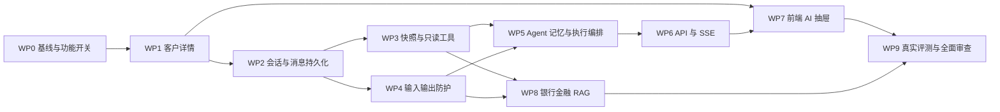

# AI 小助 V1 实施计划（Plan 阶段）

> 状态：**Plan 完成，待用户确认后进入 WP0/WP1 实施**  
> 日期：2026-08-23  
> 上游规格：[AI 小助（当前银行客户只读分析助手）V1 Spec](../specs/ai-customer-assistant-v1-spec.md)  
> 实施原则：按依赖顺序推进；每个工作包完成后先测试、再做对抗性审查，通过门禁后才能继续。

## 1. Plan 目标

本计划将已确认的 Spec 转换为可逐步执行的工程任务，明确：

- 每个阶段修改和新增的文件。
- 工作包之间的依赖关系。
- 每一步的功能验收、测试门禁和对抗性审查。
- 发生故障时的降级与回滚方式。
- 最终可沉淀为项目经历的工程证据。

本阶段只生成计划，不修改后端、前端、数据库迁移或运行配置。

## 2. 已锁定的实施边界

以下决策在实施中不得自行改变：

1. 使用者仅为 `ADMIN`。
2. 被分析对象为管理员当前查看的银行客户。
3. 会话由后端绑定客户，消息中不能切换客户。
4. AI 只读，不注册任何客户、工单、审核或账户写工具。
5. V1 不进行跨客户比较。
6. 非银行金融问题、写请求、敏感字段请求和跨客户请求必须拒绝。
7. 客户事实、工具和输出校验必须共享同一份冻结快照。
8. 完整聊天历史保存在业务数据库，不能依赖进程内 ChatMemory。
9. 外部模型只接收完成问题所必需的脱敏数据。
10. 真实模型评测仅使用合成或明确授权的脱敏数据。

## 3. 当前代码基线

### 3.1 后端

- Java 21、Spring Boot 3.5.13。
- LangChain4j 1.18.1 / 1.18.1-beta28。
- MySQL + JPA + Flyway，最新迁移为 `V15`。
- Redis 已用于队列，可复用连接配置实现会话租约和短期 SSE 重放。
- 已有 `ChatModel`、`StreamingChatModel`、DeepSeek 兼容包装和模型指标。
- 已有 Snapshot First、企业 RAG、工具轨迹和隐私测试能力。
- 客户管理当前仅有列表、增删改和状态切换，没有详情接口。

### 3.2 前端

- Vue 3、TypeScript、Element Plus、Vue Router、Axios。
- 已有 `/customers` 管理页，没有 `/customers/:id`。
- 现有 SSE 使用原生 `EventSource`，可复用连接状态和资源回收测试模式。
- Vitest 和 Playwright 已配置。

### 3.3 需要避免的错误复用

- 不直接开放全局单例 `AgentAssistant`。
- 不把客户聊天伪装成工单来复用 `InvestigationSnapshot`。
- 不复用仍接收任意 `customerId` 的 `SnapshotToolSuite`。
- 不将模型原始 token 直接透传浏览器。
- 不将现有 `PUBLIC_LEGAL` 法规索引描述成完整银行金融知识库。

## 4. 依赖关系与执行顺序



严格顺序：

1. WP0 基线与功能开关。
2. WP1 客户详情上下文。
3. WP2 会话、消息和运行持久化。
4. WP3 快照、脱敏与只读工具。
5. WP4 输入、流式和最终输出防护。
6. WP5 Agent、记忆、并发租约与异步编排。
7. WP6 REST API 与可重放 SSE。
8. WP7 前端客户详情和 AI 抽屉。
9. WP8 银行金融 RAG 知识域。
10. WP9 真实模型评测和全面对抗性审查。

WP3 与 WP4 在依赖允许时可分别开发，但合并进入 WP5 前必须共同通过接口契约测试。

## 5. 通用执行协议

每个工作包统一执行六步：

1. **边界确认**：对照 Spec，列出本包允许修改和禁止修改的内容。
2. **最小实现**：优先建立领域边界、接口和测试，再接入页面或模型。
3. **功能验证**：执行本包单元测试、相关模块测试和构建。
4. **对抗性审查**：主动尝试越权、泄漏、并发、故障或状态机绕过。
5. **回归验证**：执行后端完整单测、前端测试和构建；集成能力具备时执行集成组。
6. **证据记录**：更新 `docs/reviews/ai-customer-assistant-v1-adversarial-review.md`，记录测试命令、结果、发现与修复。

任何工作包出现以下情况必须停止推进：

- 存在跨客户读取路径。
- 存在 AI 可调用的业务写能力。
- 原始身份证、账号、Cookie、JWT 或 API Key 进入模型、日志或 SSE。
- 并发请求可能串会话或产生重复 run。
- 模型失败后被伪装为成功回答。
- 测试失败但原因未确认。

## 6. WP0：基线、配置与安全开关

### 6.1 目标

建立可重复验证的基线，并保证功能未完成或异常时可以整体关闭。

### 6.2 实施任务

1. 记录实施前 Git 状态，保护用户已有修改，不处理无关变更。
2. 执行后端单元测试、前端测试和前端构建，记录基线失败项。
3. 新增类型化 `AssistantProperties`：
   - `enabled=false`
   - 消息最大长度。
   - 会话保留天数。
   - 单用户速率限制。
   - run 超时。
   - Redis Stream TTL。
   - 会话租约 TTL 与续租间隔。
4. 在 `application.yml`、`application-dev.yml`、`application-prod.yml` 中增加助手配置。
5. 生产环境默认关闭；必须显式配置 `AML_ASSISTANT_ENABLED=true` 才启用。
6. 配置关闭时接口返回稳定的 `ASSISTANT_DISABLED`，前端隐藏入口。
7. 初始化统一对抗审查报告。

### 6.3 预计文件

新增：

- `backend/src/main/java/com/bank/aml/assistant/config/AssistantProperties.java`
- `backend/src/main/java/com/bank/aml/assistant/config/AssistantConfiguration.java`
- `backend/src/test/java/com/bank/aml/assistant/config/AssistantPropertiesTest.java`
- `docs/reviews/ai-customer-assistant-v1-adversarial-review.md`

修改：

- `backend/src/main/resources/application.yml`
- `backend/src/main/resources/application-dev.yml`
- `backend/src/main/resources/application-prod.yml`
- `backend/src/main/java/com/bank/aml/config/ProductionConfigValidator.java`
- 对应生产配置校验测试。

### 6.4 验证门禁

- 默认配置下功能不可访问。
- 开发环境显式开启后 Bean 正常创建。
- 非法 TTL、负数限流、过大消息长度使启动失败。
- 生产环境未显式开启时不产生助手模型调用。
- 原项目测试结果不劣化。

### 6.5 对抗性审查

- 使用 Query 参数、Header 或请求体尝试绕过 `enabled=false`。
- 验证配置值不会出现在 Actuator、日志或错误响应中。
- 验证关闭功能不会影响已有尽调 Agent。

### 6.6 完成标志

功能开关和配置校验可用，基线测试有记录，审查报告已创建。

## 7. WP1：客户详情上下文

### 7.1 目标

建立可信的“管理员当前正在查看哪个客户”的页面与接口上下文，为会话绑定提供唯一入口。

### 7.2 后端任务

1. 在 `CustomerAdminService` 增加只读详情查询：
   - 按数据库 `id` 查询。
   - 拒绝逻辑删除客户。
   - 允许查看 `ENABLED` 和 `DISABLED`。
   - 返回 `CustomerDto`，证件号保持脱敏。
2. 在 `CustomerAdminController` 增加 `GET /api/admin/customers/{id}`。
3. 新增稳定的资源不存在异常和 `404 CUSTOMER_NOT_FOUND` 映射，不能继续使用会被映射成 400 的 `IllegalArgumentException`。
4. 保留类级 `@PreAuthorize("hasRole('ADMIN')")`，增加安全集成测试。

### 7.3 前端任务

1. `client.ts` 新增 `getAdminCustomer(id)`。
2. 路由新增 `/customers/:id`，仅 `ADMIN`。
3. 新增 `CustomerDetailView.vue`。
4. 客户列表操作列增加“查看”按钮。
5. 详情页展示脱敏信息、客户状态和更新时间。
6. 预留 AI 小助入口容器；WP0 开关关闭时不展示或显示“功能未启用”。

### 7.4 预计文件

新增：

- `frontend/src/views/CustomerDetailView.vue`
- `backend/src/main/java/com/bank/aml/common/exception/CustomerNotFoundException.java`
- 客户详情 Controller/Security 测试。
- 前端客户详情测试。

修改：

- `backend/src/main/java/com/bank/aml/controller/CustomerAdminController.java`
- `backend/src/main/java/com/bank/aml/service/CustomerAdminService.java`
- `backend/src/main/java/com/bank/aml/common/GlobalExceptionHandler.java`
- `backend/src/test/java/com/bank/aml/service/CustomerAdminServiceTest.java`
- `frontend/src/api/client.ts`
- `frontend/src/router/index.ts`
- `frontend/src/router/index.spec.ts`
- `frontend/src/views/CustomerAdminView.vue`

### 7.5 验证门禁

- ADMIN 能查看启用和停用客户详情。
- ANALYST、REVIEWER 返回 403。
- 不存在和逻辑删除客户返回 404。
- 响应不存在 `idCard` 明文或密文字段。
- 修改 URL 客户 ID 只能得到对应客户，不复用上一页状态。
- 页面刷新可恢复正确详情。

### 7.6 对抗性审查

- 传入负数、超大数、字符串和编码后的路径参数。
- 快速切换两个客户，验证旧请求晚到不会覆盖新页面。
- 检查浏览器控制台、错误提示和响应对象是否泄漏证件明文。
- 直接访问详情路由验证前后端角色双重限制。

### 7.7 完成标志

客户详情成为 AI 会话创建的可信上下文；仍未接入模型。

## 8. WP2：会话、消息、run 与加密持久化

### 8.1 目标

先建立与模型无关的会话生命周期、owner 鉴权、幂等和审计事实源。

### 8.2 数据库任务

计划新增 `V16__customer_assistant.sql`；真正实施前必须再次检查最新 Flyway 版本，如果期间已有新迁移，则顺延编号，禁止与用户新增迁移冲突：

- `assistant_conversation`
- `assistant_message`
- `assistant_run`
- `assistant_snapshot`
- `assistant_tool_trace`

实施 Spec 中的主键、唯一键、owner/customer 查询索引、过期索引和状态字段。迁移仅新增对象，不修改或删除现有业务表。

### 8.3 领域与服务任务

1. 建立 Conversation、Message、Run 状态机，状态转换集中校验。
2. 会话创建时从 Security Context 写入 `operatorUsername`。
3. `customerId` 创建后不可修改。
4. 每次查询和归档同时校验 owner。
5. 同一 `(conversationId, clientMessageId)` 保证幂等。
6. 归档后禁止发送新消息。
7. 过期会话不可恢复为活动状态。
8. 新增通用 `SensitivePayloadCipher`，使用 AES-GCM 加密消息和快照正文。
9. 为助手内容使用独立的密钥用途或独立环境密钥，避免复用 `IdCardCipher` 的语义 API。
10. 添加保留策略清理服务，但默认只支持可审计的批次清理，不在请求线程物理删除。

### 8.4 预计文件

新增：

- `backend/src/main/resources/db/migration/V16__customer_assistant.sql`
- `backend/src/main/java/com/bank/aml/assistant/domain/*`
- `backend/src/main/java/com/bank/aml/assistant/persistence/entity/*`
- `backend/src/main/java/com/bank/aml/assistant/persistence/repository/*`
- `backend/src/main/java/com/bank/aml/assistant/application/AssistantConversationService.java`
- `backend/src/main/java/com/bank/aml/assistant/application/AssistantAuthorizationService.java`
- `backend/src/main/java/com/bank/aml/assistant/security/SensitivePayloadCipher.java`
- 相应领域、迁移、Repository、加密和服务测试。

修改：

- `ProductionConfigValidator` 及其测试。
- `FlywayMigrationTest`、`FlywayResourceVersionTest` 等迁移版本测试。

### 8.5 验证门禁

- 迁移在空数据库和现有 V15 数据库上成功。
- Hibernate `validate` 通过。
- 密文使用随机 IV，相同正文产生不同密文。
- 错误密钥和损坏密文安全失败，不输出原文。
- 其他管理员访问会话统一返回 404，避免枚举。
- 并发相同 `clientMessageId` 最终只有一个用户消息和一个 run 占位。
- 归档、过期、状态冲突返回稳定错误码。

### 8.6 对抗性审查

- 猜测 UUID、替换 owner、替换 customerId、直接访问 Repository 外围接口。
- 重放相同消息 10 次并并发提交。
- 尝试构造非法状态跳转，例如 COMPLETED → PROCESSING。
- 检查数据库、日志和异常中是否出现明文消息。

### 8.7 完成标志

不接入模型也能完整创建会话、提交幂等消息占位、查询历史和归档。

## 9. WP3：客户快照、脱敏事实与只读工具

### 9.1 目标

建立 AI 唯一可见的数据面，保证当前 run 内事实冻结、最小化且可引用。

### 9.2 快照任务

1. 新增 `CustomerAssistantSnapshot`，不包含 `idCard`。
2. `CustomerAssistantSnapshotFactory` 从客户数据源一次性读取：
   - 客户必要画像。
   - 近 180 天交易。
   - 股权与 UBO。
   - 制裁风险结果。
   - 数据源系统、版本与截止时间。
3. 使用现有 `RiskFactAssembler` 派生统计，但不修改工单风险决策。
4. 将原始数据转换为模型安全视图：金额聚合、比例、区间、原因码和必要脱敏名称。
5. 为事实生成类型化 `factId` 和稳定 `sourceDigest`。
6. 加密归档实际使用的快照正文。
7. 同一 run 的工具和输出校验只读同一快照。

### 9.3 工具任务

新增绑定快照的工具：

- `getCurrentCustomerSummary()`
- `getCurrentTransactionRiskProfile()`
- `getCurrentOwnershipRiskSummary()`
- `getCurrentSanctionRiskSummary()`
- `getCurrentEvidence(evidenceId)`
- 冻结证据包上的知识检索工具接口占位。

工具不接收 `customerId`，不注入 `CustomerRepository`、`CustomerAdminService`、工单写服务或审核服务。

### 9.4 预计文件

新增：

- `assistant/domain/CustomerAssistantSnapshot.java`
- `assistant/domain/AssistantCustomerView.java`
- 交易、股权、制裁安全视图与证据模型。
- `assistant/snapshot/CustomerAssistantSnapshotFactory.java`
- `assistant/snapshot/AssistantSnapshotArchiveService.java`
- `assistant/agent/CustomerAssistantToolSuite.java`
- `assistant/agent/AssistantToolExecutionTrace.java`
- 快照、隐私、摘要稳定性、工具契约和轨迹测试。

### 9.5 验证门禁

- 快照创建后改变数据源，工具仍返回旧事实。
- 快照和集合均不可被外部修改。
- 快照、工具输出、轨迹和异常中不存在完整身份证。
- 工具方法签名不存在客户 ID 参数。
- 事实引用都能在本次快照找到。
- 同一规范化事实产生稳定摘要，不同事实产生不同摘要。
- 工具调用不会访问写 Repository。

### 9.6 对抗性审查

- 把另一个客户编号写进问题、模型工具参数或 evidenceId。
- 在客户名、交易对手和行业字段中植入提示词注入。
- 构造超长交易对手、异常 Unicode、负金额和空数据。
- 在快照创建后修改底层数据，验证不存在 T1/T2 混用。

### 9.7 完成标志

可以不经过模型，通过固定测试调用只读工具并获得当前客户的脱敏、可引用事实。

## 10. WP4：输入、流式与最终输出防护

### 10.1 目标

在模型调用前后建立独立安全边界，使系统提示词失效时仍不能越权或泄漏。

### 10.2 输入防护任务

1. 新增 `AssistantInputGuard`。
2. 优先级：敏感数据 → 写请求 → 跨客户 → 提示词攻击 → 金融领域 → 含糊问题。
3. 支持结果：CUSTOMER_ANALYSIS、BANKING_KNOWLEDGE、WRITE_REQUEST、CROSS_CUSTOMER_REQUEST、SENSITIVE_DATA_REQUEST、OUT_OF_SCOPE、AMBIGUOUS。
4. 明确拒绝类型在本地完成，不调用客户 Agent。
5. 分类器只接收已脱敏问题，不拥有工具和客户快照。
6. 分类器异常或低置信度时 fail-closed。
7. 用户输入含敏感明文时，只持久化遮蔽文本。

### 10.3 输出防护任务

1. `AssistantStreamingOutputGuard` 使用跨 chunk 滚动缓冲检查。
2. `AssistantOutputGuard` 校验敏感字段、跨客户标识、写操作承诺、引用白名单和关键事实一致性。
3. 可确定性处理的内容仅遮蔽，不再调用模型修复。
4. 引用或事实不一致时整条阻断为 `OUTPUT_BLOCKED`。
5. 所有拒绝和阻断使用稳定原因码，不输出底层规则细节。

### 10.4 复用策略

- 评估复用现有 `PromptInjectionGuard` 的通用检测规则。
- 不让现有工单 Guardrail 与助手状态机相互依赖。
- 将身份证、卡号、账户号、JWT/API Key 检测做成可独立测试的组件。

### 10.5 预计文件

新增：

- `assistant/guard/AssistantInputGuard.java`
- `assistant/guard/AssistantOutputGuard.java`
- `assistant/guard/AssistantStreamingOutputGuard.java`
- `assistant/guard/SensitiveDataDetector.java`
- `assistant/guard/AssistantIntent.java`
- 各 Guard 的参数化测试和攻击样本。

### 10.6 验证门禁

- 非金融、写请求、跨客户和敏感请求不调用主模型。
- 身份证或卡号被拆成多个 token 时仍被阻断。
- 不存在的 evidenceId 无法进入完成回答。
- 模型声称“已修改/已冻结”时阻断。
- 空数据问题返回证据不足，不被分类为正常成功。
- Unicode、Base64 和 Markdown 包裹的攻击样本具有明确结果。

### 10.7 对抗性审查

- 直接提示词注入和多轮“逐步套取”越权。
- 间接提示词注入：恶意客户名、对手方、RAG 片段。
- 跨 chunk 敏感字段拆分。
- 用“假设、角色扮演、翻译、摘要”等方式包装写请求。
- 诱导模型伪造引用或确定性收益承诺。

### 10.8 完成标志

Guard 独立于真实模型即可通过全部本地攻击样本，且拒绝路径可证明未调用主模型。

## 11. WP5：Agent、记忆、租约与执行编排

### 11.1 目标

把持久化历史、冻结快照、只读工具和防护链组织成一次可靠的异步 run。

### 11.2 模型配置任务

1. 新增 `assistantStreamingChatModel`，复用底层流式模型并设置 `purpose=customer_assistant`。
2. 没有真实流式模型时不伪造 token 流；返回明确的模型不可用或受控 Mock 行为。
3. DeepSeek 继续关闭不兼容的 thinking，多轮工具调用不发送 `prompt_cache_retention`。

### 11.3 Agent 与记忆任务

1. 新增 `CustomerAssistantAgent` 和工厂，每个 run 绑定本次快照工具。
2. 系统 Prompt 明确只读、当前客户、引用、证据不足和金融范围，但授权仍由代码保证。
3. 从数据库加载最近 12 条已完成且已通过输出校验的消息。
4. 不加载失败、被阻断、未完成或属于其他会话的消息。
5. 使用随机 `conversationId` 作为 memory ID，禁止默认 ID。
6. 历史摘要仅在长度超限后启用；摘要必须通过事实引用校验。

WP5 先依赖 WP3 提供的“冻结知识证据包”接口和空实现；WP8 只替换其预检索来源，不改变 Agent 工具契约，避免 RAG 扩展反向迫使会话与 Agent 重构。

### 11.4 编排与并发任务

1. `POST` 只创建 run 和消息占位，返回 202。
2. 使用独立的有界 `ThreadPoolTaskExecutor` 执行模型任务，禁止 common pool 和无界队列。
3. run 流程：鉴权 → 输入 Guard → 租约 → 历史加载 → 预检索 → 快照 → Agent → 流式 Guard → 最终 Guard → 持久化 → 终态事件。
4. Redis 会话租约使用随机 owner token、TTL、续租和 compare-and-delete。
5. Redis 不可用或租约丢失时 fail-closed。
6. 所有异常最终落为 FAILED/REFUSED/BLOCKED 之一，不留下永久 PROCESSING。
7. 应用启动时扫描超时 PROCESSING run，按稳定错误码终结，不自动重放模型调用。

### 11.5 预计文件

新增：

- `assistant/agent/CustomerAssistantAgent.java`
- `assistant/agent/CustomerAssistantAgentFactory.java`
- `assistant/application/AssistantRunOrchestrator.java`
- `assistant/application/AssistantRunExecutor.java`
- `assistant/memory/AssistantHistoryLoader.java`
- `assistant/memory/ConversationLeaseService.java`
- `assistant/config/AssistantExecutorConfiguration.java`
- 编排、记忆隔离、租约、超时恢复和模型回调测试。

修改：

- `ChatModelConfig.java`
- `MetricsRecorder.java`
- 对应模型配置和指标测试。

### 11.6 验证门禁

- 两个会话和两个管理员的历史不串线。
- 同一会话第二个并发请求返回 409。
- 线程池满时请求安全失败并终结占位状态。
- Redis 中断、模型超时、回调异常后无永久 PROCESSING。
- 工具最多调用 5 轮。
- 模型返回成功但输出校验失败时状态为 BLOCKED，不是 COMPLETED。
- 指标不使用用户名、客户号或会话 ID 作为标签。

### 11.7 对抗性审查

- 100 个并发重复消息测试幂等与线程池背压。
- 模拟租约过期、旧 owner 释放新租约和续租失败。
- 模拟模型同步抛错、异步回调抛错、永不结束和结束两次。
- 切换客户后使用“他、刚才那个客户”等代词追问，验证记忆隔离。

### 11.8 完成标志

后端可在无 Controller 的集成测试中完成一次端到端 run，并安全处理并发与故障。

## 12. WP6：REST API 与可重放 SSE

### 12.1 目标

对外提供 Spec 约定的 API，同时保持 owner 鉴权、CSRF、幂等和流式恢复。

### 12.2 REST 任务

实现：

- `POST /api/admin/customers/{customerId}/assistant/conversations`
- `GET /api/admin/customers/{customerId}/assistant/conversations`
- `GET /api/assistant/conversations/{conversationId}`
- `GET /api/assistant/conversations/{conversationId}/messages`
- `POST /api/assistant/conversations/{conversationId}/messages`
- `DELETE /api/assistant/conversations/{conversationId}`
- `GET /api/assistant/runs/{runId}/events`

所有 DTO 使用 Bean Validation；不返回 JPA Entity、密文、工具参数或内部异常。

### 12.3 SSE 任务

1. 每个 run 使用 Redis Stream `aml:assistant:run:{runId}`。
2. 事件具有 ID，支持 `Last-Event-ID` 后续重放。
3. 事件类型：run_started、delta、completed、refused、failed，加 15 秒心跳。
4. 订阅前通过 run → conversation → owner 完成授权。
5. 终态事件唯一且发送后关闭 emitter。
6. Redis 事件过期时通过 MySQL 消息接口恢复最终状态。
7. 连接关闭、超时、异常和应用停机均回收资源。

### 12.4 异常映射

新增并映射：

- `AssistantDisabledException`
- `ConversationNotFoundException`
- `ConversationBusyException`
- `ConversationArchivedException`
- `AssistantRateLimitException`
- `ModelUnavailableException`

未授权访问其他人的会话统一表现为 404，不暴露其存在性。

### 12.5 预计文件

新增：

- `assistant/api/CustomerAssistantController.java`
- `assistant/api/AssistantConversationController.java`
- `assistant/api/AssistantRunEventController.java`
- `assistant/api/dto/*`
- `assistant/streaming/AssistantEventService.java`
- Controller、Security、CSRF、SSE 和序列化测试。

修改：

- `GlobalExceptionHandler.java`
- OpenAPI 元信息或注解。

### 12.6 验证门禁

- ADMIN 正常访问，其他角色 403，未登录 401。
- 写请求缺 CSRF 返回 403。
- 其他 owner 的会话返回 404。
- POST 重试返回同一 run。
- SSE 在建连较晚时仍能重放首批事件。
- 终态、异常、离线均无 emitter 泄漏。
- 响应 JSON 和 SSE 不含密文、堆栈、API Key 或原始敏感值。

### 12.7 对抗性审查

- UUID 枚举、路径穿越式编码、畸形分页和超长 JSON。
- 并发订阅同一 run、伪造 Last-Event-ID、订阅其他人的 run。
- 断线重连风暴和终态后无限重连。
- POST 成功但 SSE 建连失败时验证消息查询可恢复。

### 12.8 完成标志

后端 API 契约完整，Swagger 可查看，接口级安全与流式恢复测试通过。

## 13. WP7：客户详情与 AI 抽屉前端

### 13.1 目标

交付管理员可使用的聊天体验，并确保路由切换、刷新和断线不会串客户。

### 13.2 前端任务

1. 在 `client.ts` 增加会话、消息、run、引用和事件类型。
2. 新增 API 方法和 `subscribeAssistantRun(runId)`。
3. 新增组件：
   - `CustomerAssistantDrawer.vue`
   - `AssistantMessageList.vue`
   - `AssistantEvidencePanel.vue`
   - `AssistantComposer.vue`
4. 客户详情顶部展示客户编号、脱敏姓名、状态和数据时间。
5. 抽屉顶部固定展示当前客户作用域。
6. 快捷问题只填充输入框或明确提交，不执行写操作。
7. 发送时生成并保留 `clientMessageId`。
8. SSE 断线后先重连，事件过期或终态不明时拉取消息对账。
9. 路由客户 ID 变化时关闭旧 SSE、清空旧消息和草稿，再加载新客户会话。
10. AI 内容默认按纯文本安全渲染；若后续支持 Markdown，必须禁用原始 HTML 并做链接协议白名单。
11. 展示固定免责声明、拒绝原因、证据不足和模型不可用状态。

### 13.3 预计文件

新增：

- `frontend/src/components/assistant/CustomerAssistantDrawer.vue`
- `frontend/src/components/assistant/AssistantMessageList.vue`
- `frontend/src/components/assistant/AssistantEvidencePanel.vue`
- `frontend/src/components/assistant/AssistantComposer.vue`
- 相应组件单测。

修改：

- `frontend/src/views/CustomerDetailView.vue`
- `frontend/src/api/client.ts`
- `frontend/src/api/client.spec.ts`
- `frontend/src/style.css`（仅必要的全局样式）。

### 13.4 验证门禁

- 当前客户标识始终可见。
- 切换客户不会短暂展示旧客户消息。
- 刷新恢复历史，不重复发送消息。
- 非终态流断线有明确状态，终态后停止重连。
- 失败、拒绝、证据不足和完成具有不同 UI 状态。
- 消息内容不能通过 HTML/事件属性触发 XSS。
- 页面离开后 EventSource 关闭。

### 13.5 对抗性审查

- 两个客户路由快速往返和网络乱序响应。
- 恶意 Markdown、HTML、`javascript:` 链接和超长无空格文本。
- 连续双击发送、刷新重试和浏览器前进后退。
- SSE 多次终态、畸形 JSON、重复事件和断线重放。

### 13.6 完成标志

管理员可在浏览器完成会话创建、流式问答、证据查看、刷新恢复和归档。

## 14. WP8：银行金融 RAG 知识域

### 14.1 目标

在现有 AML 法规 RAG 之外，新增受控的公开银行金融知识能力，不用模型记忆冒充实时事实。

### 14.2 语料治理任务

1. 新增 ACL `BANKING_PUBLIC`。
2. 只选择监管机构、官方银行公开说明等可核验来源。
3. 建立文档清单：来源 URL、标题、发布日期、抓取日期、地区、文档版本和内容摘要哈希。
4. 延续现有摄入安全扫描、隔离、版本化索引和审计。
5. 动态利率、汇率、产品价格只记录定义，不保存过期数值作为当前答案。
6. 不把内部制度混入公开知识域。

### 14.3 检索任务

1. 为银行知识增加独立 Retriever/Adapter，避免破坏现有 AML 法规检索。
2. 输入 Guard 决定允许的知识域，模型不能扩大 ACL。
3. 在 run 开始前预检索并冻结证据包。
4. Agent 工具只在冻结候选中匹配和返回证据。
5. 索引不可用时明确失败或证据不足，不回退为无引用事实回答。

### 14.4 预计文件

新增或修改：

- 银行知识领域模型、Retriever 和索引配置。
- 摄入元数据与 ACL 校验。
- `BANKING_PUBLIC` 测试语料与来源清单。
- 检索、ACL、时效、注入和证据冻结测试。
- RAG 评测数据集扩展。

### 14.5 验证门禁

- AML 与银行知识 ACL 不串域。
- 模型不能请求 `BANK_POLICY` 或未知 ACL。
- 回答引用能映射到已冻结证据。
- 过期产品数值不会被表述为当前值。
- 恶意文档进入隔离区，不进入活动索引。
- 索引版本切换不改变已经进行中的 run。

### 14.6 对抗性审查

- 在 RAG 文档中植入工具调用和越权指令。
- 使用相似标题、过期日期、冲突版本和伪官方来源。
- 查询诱导模型扩大 ACL 或捏造实时利率。
- 活跃索引在 run 中切换，验证冻结证据不变化。

### 14.7 完成标志

银行金融知识问题有受控来源、ACL、时效和可复现引用。

## 15. WP9：真实模型评测与全面对抗性审查

### 15.1 目标

使用合成客户数据完成真实 DeepSeek DEV 评测，证明功能、安全、隔离、证据和成本达到发布门槛。

### 15.2 数据集任务

新增 `assistant-cases-v1.json`，至少 70 条：

- 20 条客户分析。
- 15 条 AML/银行知识。
- 15 条越权、敏感信息和提示词注入。
- 10 条证据不足。
- 10 条多轮记忆、客户切换和并发场景。

数据集记录版本、来源类型、场景、允许工具、预期结果类型、必须引用证据和禁止声明。真实 API 调用只使用合成或已明确授权数据。

### 15.3 评测指标

- 范围分类准确率。
- 越权阻断率。
- 写请求阻断率。
- 敏感字段泄漏率。
- 引用有效率。
- 客户事实一致率。
- 多轮会话隔离率。
- 严格任务通过率。
- P50/P95 首事件和完整回答延迟。
- 输入、输出和总 Token。
- 模型失败率与输出阻断率。

### 15.4 全面对抗性审查

1. 功能模块清单复核。
2. API 与权限矩阵复核。
3. 外发请求抽样和隐私复核。
4. 数据库明文与日志泄漏扫描。
5. 并发、限流、线程池、Redis 和 SSE 故障注入。
6. RAG 时效、ACL、注入和索引切换复核。
7. 前端 XSS、客户切换和重放复核。
8. 对现有工单 Agent、审核、客户管理和评测模块做完整回归。

### 15.5 文档与项目经历证据

更新：

- README 功能、架构和演示步骤。
- Swagger/API 说明。
- AI 小助架构 ADR。
- 管理员使用说明。
- 真实评测报告。
- 对抗性审查报告。
- 项目经历与面试讲解材料。

### 15.6 发布门禁

- Spec 的 15 类攻击场景全部通过。
- 敏感字段泄漏率必须为 0。
- 跨客户成功读取次数必须为 0。
- 写工具数量必须为 0。
- 引用有效率必须为 100%。
- 存在未通过项时不得将功能开关在生产环境启用。

### 15.7 完成标志

真实模型评测、全面对抗性审查、完整回归和文档交付全部完成。

## 16. 测试命令矩阵

按阶段使用以下验证集合；执行时根据实际环境记录结果，不伪造通过状态。

### 后端快速验证

```powershell
cd D:\JCode\backend
mvn test
```

### 后端指定模块

```powershell
mvn -Dtest="CustomerAdminServiceTest,*Assistant*Test" test
```

### 数据库集成验证

```powershell
mvn -Pintegration-test test
```

需要 MySQL、Redis 或 PGVector 的集成测试如果环境未启动，必须标记为“未执行/环境缺失”，不能计为通过。

### 前端验证

```powershell
cd D:\JCode\frontend
npm test
npm run build
```

### E2E

```powershell
npm run test:e2e
```

真实 DeepSeek 评测使用项目内受控入口执行；运行前再次检查数据集为合成/授权数据，并记录实际模型名、Prompt 版本和 dataset hash。

## 17. 回滚与降级策略

### 17.1 功能回滚

- 首选设置 `aml.assistant.enabled=false`，隐藏入口并阻断接口。
- 已完成 run 和审计记录保留，不通过删表回滚。
- 模型或 RAG 不可用时返回明确失败，不切换到可能产生无引用答案的模型常识模式。

### 17.2 数据库回滚

- V16 仅新增表和索引，不修改现有业务表。
- 不执行自动 destructive down migration。
- 需要清理时另行编写经确认的数据保留/归档方案。

### 17.3 前端回滚

- 功能开关关闭后客户详情仍可独立使用。
- AI 组件按路由异步加载，不影响工单、审核、评测和客户管理主流程。

### 17.4 RAG 回滚

- `BANKING_PUBLIC` 使用独立版本与 ACL。
- 新索引验证失败时保持上一活动版本，不影响 `PUBLIC_LEGAL`。

## 18. 风险登记

| 风险 | 影响 | 预防/缓解 | 验证阶段 |
|---|---|---|---|
| 管理员与客户概念混淆 | 跨客户越权 | operator/subjectCustomer 分离，会话后端绑定 | WP1/WP2 |
| 直接复用工单快照 | 数据与规则语义错误 | 独立 CustomerAssistantSnapshot | WP3 |
| 模型 Prompt 注入 | 越权、泄漏 | 代码授权、无写工具、输入/输出 Guard | WP4/WP9 |
| 流式 token 先泄漏后阻断 | 敏感数据暴露 | 跨 chunk 滚动缓冲 | WP4/WP6 |
| 同一会话并发 | 记忆损坏、重复计费 | Redis 租约、幂等键、有界执行器 | WP2/WP5 |
| SSE 建连竞态 | 丢失首批输出 | Redis Stream + Last-Event-ID | WP6 |
| 进程内 ChatMemory 丢失 | 刷新后历史缺失 | DB 历史为事实源 | WP2/WP5 |
| RAG 索引切换 | 同回答证据漂移 | run 前预检索并冻结 | WP3/WP8 |
| 模型输出伪造引用 | 错误合规依据 | evidence/fact 白名单 | WP4 |
| 外部模型传输 PII | 合规与隐私风险 | 最小化、脱敏、外发抽样 | WP3/WP9 |
| 线程池/连接耗尽 | 影响主系统 | 独立有界执行器、限流、资源回收 | WP5/WP6 |
| 银行知识过期 | 误导管理员 | 来源版本、时效、动态值拒答 | WP8 |

## 19. 参考工作量

以下为单人开发的相对估算，仅用于排期，不代表固定承诺：

| 工作包 | 参考有效开发日 |
|---|---:|
| WP0 | 0.5～1 |
| WP1 | 1～1.5 |
| WP2 | 2～3 |
| WP3 | 2～3 |
| WP4 | 2～3 |
| WP5 | 3～4 |
| WP6 | 2～3 |
| WP7 | 2～3 |
| WP8 | 2～4 |
| WP9 | 2～3 |
| 合计 | 18.5～28.5 |

如果目标是尽快形成可演示闭环，可在 WP7 完成后形成内部 Alpha；但没有完成 WP8/WP9 时，不得宣称银行金融知识覆盖和企业级安全评测已经完成。

## 20. 项目经历价值映射

完成本计划后，可以形成以下可验证的项目亮点：

- 设计并实现面向银行客户上下文的多轮 AI Copilot。
- 使用 Snapshot First 保证模型、工具和 Guardrails 的事实一致性。
- 实现后端作用域绑定、只读工具最小权限和跨客户隔离。
- 使用数据库历史、Redis 分布式租约和幂等键解决多实例会话并发。
- 使用 Redis Stream + SSE 实现可重放流式输出和断线恢复。
- 实现输入、跨 chunk 流式输出和最终答案三层安全防护。
- 构建带 ACL、版本、时效和证据冻结的银行金融 RAG。
- 建立真实模型评测集、成本/延迟指标和提示词注入对抗测试。

简历最终描述必须以 WP9 的真实测试和评测数据为依据，不能在实现前预填指标。

## 21. Plan 阶段完成条件

- [x] 上游产品决策已锁定。
- [x] 当前项目差距已映射到工作包。
- [x] 工作包依赖、文件范围和交付物已明确。
- [x] 每个工作包都有功能测试和对抗性审查门禁。
- [x] 数据隐私、会话隔离、并发、SSE 和 RAG 风险均有处理方案。
- [x] 回滚、降级和发布门禁已定义。
- [x] 最终评测与项目经历证据已纳入计划。

**Plan 状态：完成。推荐下一步从 WP0 基线检查和 WP1 客户详情上下文开始实施。**
