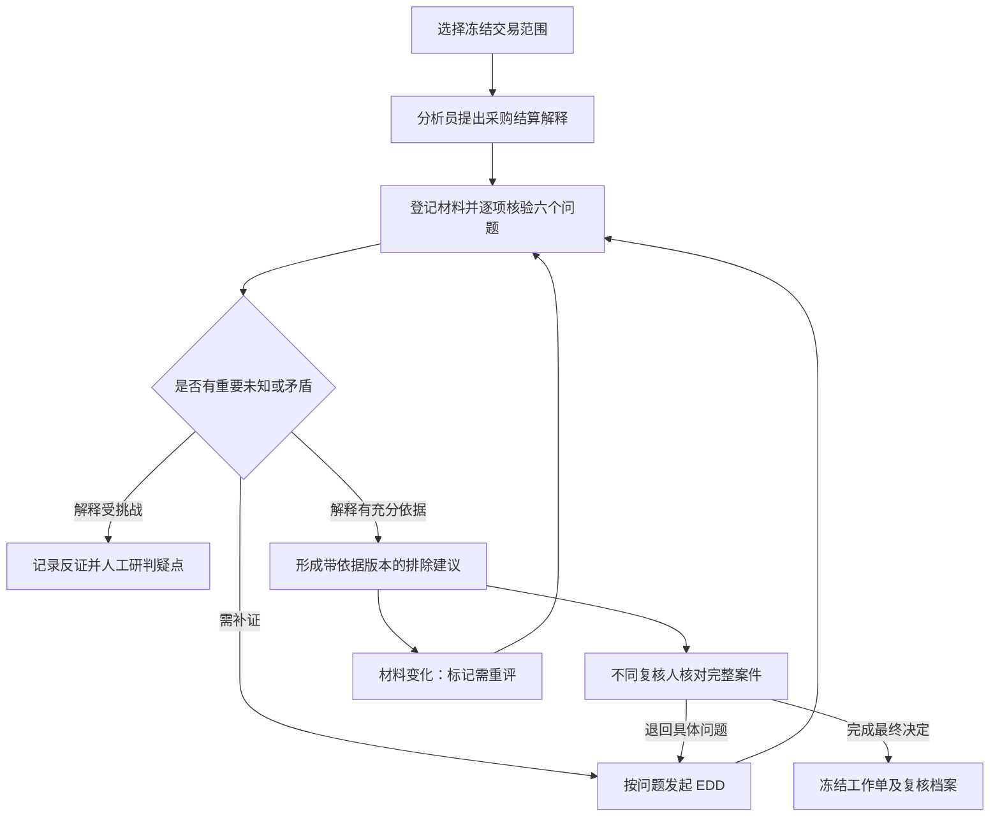

# 企业货款快进快出：合理解释核验专项迭代计划

版本：v1，已由 [v2 深化方案](rapid-movement-explanation-verification-plan-v2-2026-09-07.md)替代；本文件保留为历史设计参考，请以 v2 的业务粒度、状态、EDD 接续和排期为准。编制及资料核对日期：2026-09-07。  
项目：AML 智能反洗钱尽调 Agent 平台；工作区：`D:\JCode`。  
状态：**供实施的详细方案，本文新增功能、接口、数据表、政策参数和效果目标均未交付。**  
依据：[当前业务审查](../reviews/business-review-and-focus-2026-09-07.md)、[原业务优化计划](aml-business-optimization-plan-v3-2026-09-05.md)。本方案将原 B1、部分 B2 和 B5 收敛到一个可演示、可检验的业务闭环。

## 1. 本次只深入一个业务问题

**当企业收到货款后短时间转出大部分资金，分析员提出“正常采购结算”的解释时，系统如何帮助复核员判断这项解释是否有足够依据？**

最终交付不是一份更长的 AI 分析，而是一张可复核的解释工作单：明确待解释交易、六个关键问题、逐项核验记录、未解决矛盾、所依据版本和人工决定。

具体业务价值：

- 分析员知道还缺哪项核验，不再重复提交泛化材料说明。
- 复核员能逐笔核对“哪项材料解释了什么”，而不是根据段落流畅程度判断。
- 同一组交易在不同材料下能合理进入“可解释”“解释不足”“仍有疑点”三条路径。
- 关键材料变化后，系统能指出哪些判断需要重看，保留当时的原始依据。

### 1.1 为什么选择它

现有 `RAPID_MOVEMENT` 剧本已经询问资金留存、用途及基础交易，但落实到代码时主要要求 TRANSACTION、DOCUMENT 类型存在。EDD 已有任务闭环，快照、人工复核和档案也已具备基础。因此该方向能直接提升核心尽调能力，不需要先搭建完整图谱或引入外部银行数据。

本次与受益所有人、跨账户网络调查的选题比较见审查报告。后两项保留为下一次独立迭代，当前不展开为并行实施任务。

### 1.2 同一方向的三个交付档位

| 档位 | 交付 | 适合什么目标 | 估计投入与局限 |
|---|---|---|---|
| A：结构化核验单 | 六问题、逐项材料引用、人工核验、未解决项、复核底稿 | 先做可演示的业务流程 | 约 10–14 人日；来源解析以受控合成材料为主，不声称外部自动查验 |
| **B：可复现核验闭环，推荐** | A + 冻结逐笔事实、来源解析、证据版本、判断失效、EDD 对应问题、独立复核、评测 | 做一个有业务深度的完整项目亮点 | 约 28–38 人日；单人约 6–8 周，取决于集成环境与熟悉程度 |
| C：变化事件触发复查 | B + 材料撤销/后续新交易事件、客户维度持续复核队列 | 进一步验证持续尽调价值 | B 稳定后另估 8–12 人日；需要稳定变化数据源 |

后文详细定义 B。A 可以作为 B 的第一个可见里程碑，但 A 完成不等于所有 B 级控制已完成。以上是工程估算，不是已承诺排期；不含真实机构接入、真实票据平台/OCR 服务采购或领域专家审核耗时。

## 2. 现行要求与近期实践给出的方向

本节只说明为什么值得做，后续具体规则是本项目的产品设计，不能冒充监管规定。

| 资料与核对点 | 对本项目的启发 | 适用边界 |
|---|---|---|
| 2025 年第 10 号令修改报告管理办法第十四条：人工分析需要保留过程，排除应记录合理理由，并使可疑判断与客户尽调相互验证。自 2025-12-01 施行。[人民银行原文，第 4–5 页](https://www.pbc.gov.cn/zhengwugongkai/4081330/4406346/4406348/5885116/2025111915332696325.pdf) | 把“为什么可以解释”拆成可检查的事实和核验动作 | 不是规定必须使用六问题、特定数据库或 AI 模型 |
| 2025 年第 11 号令自 2026-01-01 施行；第二十七、二十八条涉及与风险相匹配的强化尽调及必要的材料核实。[人民银行原文，第 19–21 页](https://www.pbc.gov.cn/zhengwugongkai/attachDir/2025/12/2025122909264498909.pdf) | 针对实际疑点补材料并核实，避免只检查材料清单 | 不把某一种合同或特定数量附件设为所有客户的统一法定义务 |
| FATF 2025 年比例原则修订及金融包容指引强调按风险采取相称措施。[修订说明](https://www.fatf-gafi.org/en/publications/Fatfrecommendations/update-standards-promote-financial-conclusion-feb-2025.html)、[指引](https://www.fatf-gafi.org/en/publications/Financialinclusionandnpoissues/guidance-financial-inclusion-aml-tf-measures.html) | 核验有疑点的问题，已核实且仍适用的材料可以复用；保留合法经营对照 | 国际实践参考，不直接代替国内适用规则；低风险不能由模型自行授予 |
| BCBS 当前合并指引 AFS 10.36–10.44 强调了解正常活动、结合客户背景监测并保留评估过程。[BIS 官方指引](https://www.bis.org/committees/bcbs/basel-consolidated-guidelines/module/afs/10) | 交易模式需要放入业务背景解释；核验记录是核心产物 | 当前可用指引，不宣传为 2026 年刚出现的新算法 |
| BIS Hertha 2025 年实验指出标注数据、反馈和可解释分析的价值，试验使用合成交易数据。[官方项目报告](https://www.bis.org/publications/project-hertha-identifying-financial-crime-patterns-real-time-retail-payment-systems) | 使用带合理对照的合成案例评估调查效果 | 本项目未复制其实验规模或收益，不能沿用其效果数字 |

**取舍判断：** 本项目近期更应证明“一个排除理由能够被核验与复现”，再讨论更复杂模型的收益。

## 3. 范围、角色和业务边界

### 3.1 首批场景

- 境内普通贸易企业、CNY 货款收付、一个客户的一次案件、已有 `RAPID_MOVEMENT` 假设。
- 新增独立合成企业 `CORP-RM-001` 及交易、采购/销售合同、交付记录、客户业务说明，不把现有个人演示客户直接改成企业。
- 以已经命中的预警进入调查，不改写监测阈值策略；“短时间”的演示窗口可取 24 小时，但必须标明属于演示政策参数。
- 当前仍沿用同客户案件边界和预警容量限制；同案多个预警共享事实，但每个预警必须明确自己的解释范围。
- 合同、订单、交付记录是可选核验材料类型，根据业务模式设置可接受替代材料；客户声明单独标记，不能因上传完成就成为独立证明。

暂不交付跨银行资金穿透、实控人识别引擎、自动限制账户、自动对外报送、税务发票查验接入或任意文件 OCR。受控 JSON/Markdown 合成材料适配器足以验证本次业务逻辑。

### 3.2 职责

| 角色 | 本次职责 | 不能代替的判断 |
|---|---|---|
| ANALYST | 选择待解释交易、提出解释、登记材料、记录核验动作、处理差异、提出假设及覆盖结论 | 不代替最终复核人批准自己的排除建议 |
| REVIEWER | 查看冻结工作单及来源定位，质疑解释、退回具体问题，完成既有最终处置 | 不能以“材料齐全”替代内容判断 |
| ADMIN | 配置演示政策、维护合成数据、观察失败任务 | 不通过管理员身份静默绕过核验门槛或自审限制 |
| AI | 整理候选解释、抽取带定位的材料要点、提出缺口、草拟摘要 | 不将候选解释标为已核实，不决定风险排除，不自造引用 |

服务端以实际用户 ID 检查提出人与最终复核人不同；这是本次设计的双人控制。现有角色控制不等于已经实现案件分派级数据隔离；新接口至少执行案件可访问性、材料 caseId 一致性和操作角色校验，演示外的机构/团队授权另设明确模型。

## 4. 贯穿全程的示例

### 4.1 冻结交易

合成企业经营工业耗材，说明采用“先收客户货款、当天向供应商结算”的模式。以下是一个业务日内的六笔交易，期初余额等信息另列，不能仅凭六笔交易推算真实账户余额。

| 冻结交易 ID | 时间 | 方向 | 金额 CNY | 对手身份 | 待核对材料 |
|---|---|---|---:|---|---|
| T-IN-01 | 09:00 | 入账 | 320,000 | 买方 A | 销售订单 S-01、买方付款信息 |
| T-IN-02 | 09:30 | 入账 | 280,000 | 买方 B | 销售订单 S-02、买方付款信息 |
| T-IN-03 | 10:00 | 入账 | 400,000 | 买方 C | 销售订单 S-03、买方付款信息 |
| T-OUT-01 | 11:00 | 出账 | 300,000 | 供应商 X | 采购订单 P-01、交付记录 |
| T-OUT-02 | 11:30 | 出账 | 270,000 | 供应商 Y | 采购订单 P-02、交付记录 |
| T-OUT-03 | 12:00 | 出账 | 390,000 | 供应商 Z | 采购订单 P-03、交付记录 |

观察值：入账合计 1,000,000，出账合计 960,000，观察窗口收支差额 40,000，出账/入账为 96%。这些数字不直接证明“利润 4%”“同一笔资金逐笔流转”或交易合法性；对费用、税项、期初资金和其他交易的解释必须另有依据。

### 4.2 同一组资金流的三个业务版本

| 版本 | 材料及核验发现 | 应形成的结果 |
|---|---|---|
| A：解释有依据 | 交易对手、合同主体、订单及实际交付相互对应；经营模式与独立核验信息相符；差额可说明；重要反证已处理 | 分析员提出合理解释；满足门槛后交不同复核人决定，不能自动结案 |
| B：解释待核验 | 有订单和客户声明，但一份交付记录未能取得、第三笔付款对手身份未核清 | 显示具体缺口，发起对应问题的 EDD；既不认定合理排除，也不因缺资料直接认定可疑 |
| C：解释受到反证挑战 | 第三笔收款人被核实与合同供应商不一致，客户对差异的说明与可查记录矛盾，仍未获得合理解释 | 保留反证及分析；人工评估是否已具合理怀疑并走现有可疑处置流程，不能机械宣称已证明犯罪 |

另一个必须演示的变化：A 的排除建议形成后，第三笔交付材料出现新版本或被撤销。系统应提示受影响的问题和判断需重评，不能继续用旧版本提交排除，也不能改写之前已经完成的历史决定。

## 5. 六个必答问题：从材料清单到核验工作单

| 编号 | 必答问题 | 可观察检查 | 可接受材料举例 | 阻断合理排除的情况 |
|---|---|---|---|---|
| Q1 | 这种周转方式与企业实际经营是否相符？ | 经营内容、结算方式、账期、交易规模与解释是否一致 | 经核验的业务资料、历史订单、走访/回访记录 | 只有泛化客户自述；重大经营矛盾未处理 |
| Q2 | 谁在付款，为什么付款？ | 入账对手与买方一致，代付关系有依据，订单时间与收款时间可解释 | 销售合同、付款明细、经核验代付安排 | 付款主体无法识别或与声称用途冲突 |
| Q3 | 谁在收款，资金用途是什么？ | 出账对手与供应关系对应；与采购、交付、收款授权相符 | 采购合同、交付/验收记录、收款账户确认 | 收款人不一致且缺少已核验解释 |
| Q4 | 解释具体覆盖哪些交易、金额和期间？ | 每笔交易有范围归属；金额分配守恒；材料期间匹配 | 冻结交易表、订单对账表、收付对应说明 | 剩余交易未解释，重复分配，凭证覆盖期间不符 |
| Q5 | 快速转出和观察差额为什么合理？ | 结算安排能解释时间；差额性质有依据；没有把毛差额直接称为利润 | 结算条款、费用记录、合适的业务确认 | 因“96% 转出”直接判可疑，或仅写“正常经营”就排除 |
| Q6 | 相反信息和关键未知是否已逐项处理？ | 不同来源冲突、过期、撤销、替代解释都有具体处理记录 | 问题单、核验动作、反向材料与说明 | 重要争议、未处理新增证据或关键未知仍存在 |

每个问题至少保存：结论文字、涉及交易 ID、材料版本及具体定位、核验动作/执行人/时点、仍未知内容、重要差异及处置。问题可以是“满足”“不满足”“未知”或“有理由不适用”，不能只存布尔已完成。

“不适用”必须给出适用条件和理由。Q4 范围完整性、Q6 重要反证处理不可通过不适用跳过；Q2/Q3 某些代付检查只有确实不存在代付事实时才可不适用。

### 5.1 三种不同的证据判断

1. **来源可取得：** 受控来源确实返回了该记录，能定位到内容及版本。
2. **内容一致：** 系统对实际取得的内容计算哈希，并与其记录对应；不是检查用户输入了 64 位字符串。
3. **业务上能支持该解释：** 核验人员说明材料与交易主体、用途、时间及其他材料是否相符，是否需要独立交叉核对。

前两项通过不自动推出第三项成立。两份转发自同一原始文件的材料也不算两个独立来源。核验记录必须保存来源链和方法，如受控系统查验、独立回访、原件核对或资料间交叉核对；方法不是真实性保证。

### 5.2 证据方向不能混淆

现有 `EvidenceStance.SUPPORTS/CONTRADICTS` 指向“风险假设”。新工作单中的“支持采购结算解释”则指向“合理解释”。二者不是同一个字段。

新关系使用 `targetQuestionId` + `effect=SUPPORTS_EXPLANATION/CHALLENGES_EXPLANATION/CONTEXT`，保留原证据链接的风险方向。先核验解释，再由分析员形成风险假设判断；不能把一份合同支持解释机械转换成假设已排除。

## 6. 决策规则与正常/异常分支

### 6.1 规则表

| 编号 | 条件 | 服务端行为 |
|---|---|---|
| R01 | 待解释范围没有绑定冻结案件、假设及交易集合 | 不允许提交工作单；提示缺失项 |
| R02 | 引用不存在、无权读取、哈希不符、核验期间不适用 | 保存为待核验/异常项；不得计入合理解释依据 |
| R03 | 六问题未完成，或重要差异仍未处理 | 阻断合理排除建议；提供具体问题和可用补件动作 |
| R04 | 主体、金额、期间检查通过 | 只表明这些检查通过，不自动确认业务真实或风险低 |
| R05 | 少量大额交易解释充分，但还有其他有效预警未解释 | 不能排除整个案件；不得用金额占比代替逐预警覆盖 |
| R06 | 工作单建议提交后，关联材料或证据集合变化 | 旧建议标记需重评；拒绝旧版本最终排除 |
| R07 | 只有资料未取得，没有支持合理怀疑的进一步分析 | 进入补证/人工升级处理，不自动转成可疑或排除 |
| R08 | 其他已核实事实形成疑点，客户解释受到反证挑战 | 允许人工沿现有可疑处置流程研判；不要求先“证明犯罪” |
| R09 | 当前材料由同一人提出，且该人尝试最终复核 | 拒绝自审，返回明确原因；ADMIN 同样受限 |
| R10 | 已 DONE/已登记报送后发生材料变化 | 保留原档案和决定，新增复查事件；需要重新处理时建立受控后续任务，不重开覆盖旧案 |
| R11 | 来源系统暂时不可用 | 记录重试状态和数据未知；不标记已核验，不丢失人工工作 |
| R12 | AI 未提供有效定位或读取范围以外的记录 | 丢弃对应候选，显示待人工补充；业务服务仍可人工完成 |

### 6.2 与现有门禁的兼容方式

首批新试点案件使用 `investigationContractVersion=2`，同时保存 `verificationPolicyVersion=RAPID_GOODS_V1`。对其他场景保持原有行为，前端明确哪些场景已启用专项核验。最终实施时再检查版本号是否已被其他开发占用。

- v2 的 RAPID_MOVEMENT 若提出 REJECTED/EXPLAINED，除现有版本及方向门禁外，还需可提交的核验工作单、有效依据绑定和无重要未处理问题。
- REVIEWER 执行最终 EXCLUDE_FALSE_POSITIVE 时重新核对整个案件，原有所有假设/覆盖条件继续保留，新增核验要求不能被旧 API 绕过。
- 核验规则只加强本场景的合理排除支路，不给 CONFIRM_SUSPICIOUS 额外添加“所有解释材料均取得并核实”的条件。现有确认门禁仍需满足；如现有门槛已阻止有时效要求的人工处理，列为单独业务评审项，不能靠伪造材料类型绕行。
- EDD 不受最终结论门槛阻断；工作单中的“未知”不会自动改写 `HypothesisStatus` 为已排除。
- 仅有一条工作单被认可，不自动改变案件状态。最终决定仍使用既有复核接口和状态机。

**避免工作单与假设判断相互等待：** 工作单草稿可在假设 OPEN 时编辑。提交“支持合理解释”的 proposal 时，由同一应用服务、同一案件锁事务校验工作单输入，执行假设 REJECTED 判断并推进版本、使旧覆盖失效，然后固化 PROPOSED 工作单及其对应的新假设版本。分析员随后以返回的新版本逐预警确认覆盖。不能要求工作单先获最终批准才允许假设已决，同时又要求假设已决才能提交工作单。v2 本场景直接调用旧 `updateHypothesis(REJECTED)` 接口时，也必须走同一个核验入口或明确拒绝；相关新门禁放在幂等返回之前，避免“状态和文字相同”绕过证据集合变化。

### 6.3 工作单与任务状态

工作单流程状态：`DRAFT → PROPOSED → REVIEWED`，修改或依据变化生成下一版本；历史版本只读。结论单独记录为 `EXPLANATION_SUPPORTED / INSUFFICIENT / EXPLANATION_CHALLENGED`，明确这些是对解释的评价，不是客户最终风险结论。

当前适用性另有 `FRESH/STALE`，避免把业务结论和事实过期混成一个枚举。只有 FRESH + PROPOSED + 支持解释的工作单可以作为本场景合理排除的候选依据。

复核员退回需指出具体 questionId/issueId 和缺口；补件复用现有 EDD 的 OPEN/SUBMITTED/RESOLVED。EDD 提交只更新材料和问题上下文，不自动把工作单变为通过，也不自动重申旧判断。

分析员的“申请补充核验”先产生带问题清单的待处理建议；正式 EDD 分派仍由有权 REVIEWER 使用现有请求尽调流程创建，分析员不能借新按钮获得最终处置权限。案件仍未完成调查时，复核员也应能看到该建议并发起 EDD，不能让它只出现在“已就绪待复核”队列。



## 7. 交易和材料核验的计算细节

### 7.1 逐笔事实契约

新增 `IdentifiedTransactionFact`：`sourceSystem、sourceRecordId、sourceRecordVersion、customerId、accountId、counterpartySubjectId、bookedAt、direction、amount、currency、postingStatus、reversalOf、purpose`。

- 生产适配器已有交易 `id/sourceUpdatedAt`，先透传并明确它们是本地数据源身份/版本，不宣传为银行核心全局流水号。
- 合成适配器使用固定种子和持久的显式 ID；不能每次请求生成不同 ID。
- 同时保留原 `TransactionRecord` 兼容视图。由同一次数据采集产生旧视图和新事实，不能先查一次旧交易、再查一次新元数据后拼接。
- 新核验依据单独冻结完整集合、采集时点及原案 snapshotId，存为 `InvestigationVerificationBasis`。与原 Agent 快照采用同一次源采集时，校验来源版本一致；后续增补采用明确的新依据版本，不回填原快照。
- 旧快照没有源交易 ID 时，可用 `snapshotId + 固定 JSON 数组位置` 定位归档中的原记录，但标为“归档定位”；不能冒充源流水身份、与实时交易自动合并或跨快照去重。
- 新事实中的账户/对手身份或记账状态未知时，明确缺口；不把所有空对手合成一个主体，也不默认全部成功入账。

### 7.2 范围和金额

1. `scopeTransactionIds` 是服务端从当前案件冻结依据中选择的唯一集合；包含调查目的、起止时间及 `scopeRevision`。页面默认列出所有待解释预警对应交易和缺失映射，不静默只挑容易解释的部分。
2. 一个材料可关联多笔交易，一笔交易可有多种材料。材料关联本身不增加交易金额；金额指标始终按唯一交易 ID 计算。
3. 如建立订单分配金额，使用 `Decimal`；同一分配维度内单笔分配合计不得超过交易金额。不同证据的佐证关系不互相累加成资金分配。
4. 分币种汇总，MVP 只支持 CNY 工作单；其他币种显示需其他适用政策，不能裸加。不引入自动汇率推断。
5. 时间采用带时区的明确截止点；核验范围建议半开区间 `[start,end)`。同刻多笔交易按稳定 ID 展示，不通过时间+金额去重。
6. 冲正、失败及重复输入要可解释处理：重复源 ID/版本不重复计数；原交易及其冲正保留关联；未知状态阻断依赖该记录的金额结论。
7. 不自动声称某笔入款对应某笔出款。可以按已核验业务订单建立“业务对应关系”，标注其依据；若后续引入 FIFO 等资金归因方法，必须另行标为分析假设。

### 7.3 时效及同源材料

材料记录 `issuedAt、validFrom、validTo、capturedAt、sourceUpdatedAt`；核验要区分“今天已过期”和“在被调查交易发生时是否有效”。合同适用期和核验取得时点分别展示。

同一文件的扫描件、邮件转发件或客户二次上传件保留 `originReference`；不能因为文件名不同，就把证据强度当作增加。复用已取得且仍适用的材料时，只复用材料版本及其客观核验记录，业务适用判断仍须绑定本次问题及交易范围。

## 8. 建议的数据模型

所有下列名称都是拟新增对象。首批证据限定案件范围，不开放跨案件共享；可减少权限与跨案件失效传播复杂度。

| 表/对象 | 核心字段 | 关键约束 |
|---|---|---|
| `investigation_verification_basis` | caseId、basisRevision、snapshotId、sourceCutoff、scopeRevision、交易及客户事实密文、basisDigest、采集来源版本 | `(case_id,basis_revision)` 唯一；已引用版本不可改写；固定原文序列化及摘要算法版本 |
| `evidence_artifact_version` | artifactKey、caseId、version、sourceSystem、sourceReference、originReference、内容密文/受控存储定位、计算哈希、期间、采集人和时间、撤销记录引用 | `(case_id,artifact_key,version)` 唯一；内容版本追加；输入哈希另存 claimedHash，不覆盖实际 hash |
| `evidence_verification` | artifactVersionId、方法、结果、观察事实、限制、核验人、时间、适用范围、previousVerificationId | 追加核验/撤销事件；技术解析结果与人工业务核验结果分列 |
| `explanation_assessment` | caseId、hypothesisId、assessmentRevision、policyVersion、basisId、inputDigest、evidenceSetVersion、状态、解释评价、提出人、复核人、时间 | 每个假设当前版本指针唯一；预期版本提交；保存已复核版本只读 |
| `explanation_question` | assessmentId、questionCode、答案状态、解释文字、未知项、不适用理由、revision | `(assessment_id,question_code)` 唯一；模板版本不可漂移 |
| `explanation_evidence_use` | questionId、artifactVersionId、原 evidenceLinkId、effect、原文定位、交易 ID 集合、可选订单分配 | 服务端验证全部对象同案、版本存在、定位可解析、金额不超额 |
| `explanation_issue` | assessmentId、questionId、种类、来源引用、重要性、状态、处置理由、处置材料、处理人、revision | 未评估重要性的矛盾按待处理处理；关闭重要问题需理由和依据 |
| `edd_question_binding` | requestId、questionCode、assessmentId、issueId、requiredItemCode | 对接现有 EDD；一份材料可回应多问题，各问题独立判断是否解决 |

优先复用现有 `investigation_evidence_link`，增加可空 `artifact_version_id` 和来源验证摘要；旧 reference 继续可读，显示“历史引用，未完成来源核验”。不要把现有所有材料迁移为已核实。

假设增加 `evidence_set_version`、`decided_evidence_set_version`、`assessment_revision`。覆盖除了已有 hypothesisRevision，再记录其引用的 assessment/basis 版本或统一 `decisionBasisDigest`。服务端最终复核必须使用数据库当前值校验，不能信任客户端自己计算的摘要。

## 9. 版本失效、并发与审计

### 9.1 什么变化使判断需要重评

- 已关联材料新增、替换、撤销、核验结果变化；问题答案或重大差异处置变化；调查范围变化：推进当前假设的 evidenceSetVersion，相关已提出工作单标为 STALE。
- 仅更正不影响内容的显示标签：记录元数据修订，不必让所有判断失效；这一例外字段必须白名单定义并测试。
- 第一版不让 AI 或客户端判断新增材料“肯定不重要”而跳过重评。分析员可以核验后说明无影响，再以当前版本重新提出建议。
- 对尚未最终决定的案件，旧判断/覆盖保持历史可读，但不能作为当前最终排除依据；可复用已有覆盖重置 PENDING 机制，并保留原分析文字。
- 对已最终决定的案件，追加后续复查事件，引用旧决定版本，禁止覆盖既有工作单和报告。

### 9.2 事务顺序

写操作统一采用 `案件行 → 假设行 → 工作单当前版本 → 相关覆盖` 的锁顺序；同案多个假设按 ID 升序处理。第一版证据同案隔离，不在一次 HTTP 事务里锁定多个客户案件。

材料内容抓取在数据库事务外完成并暂存。提交采集结果时，短事务内校验原请求的案件状态/预期版本，再写不可变材料版本、推进依据版本、标记失效并写 Audit Outbox；失败时整体回滚关联动作。外部抓取成功不代表业务登记成功，暂存清理由独立维护任务处理。

最终复核也在案件锁内校验 evidenceSetVersion、scopeRevision、hypothesisRevision、assessmentRevision 和当前材料撤销/争议信息。任何一个变化，返回 409 与具体冲突类型，要求人重新核对，禁止自动重放最终决定。

### 9.3 幂等与追踪

- 采集请求使用 `caseId + sourceSystem + sourceReference + sourceVersion` 和服务端幂等键；同键同内容返回原结果，同键不同内容明确冲突。
- 核验、提出建议、最终复核均记录操作者、时间、原因、前后版本和受影响记录 ID，使用现有 Audit Outbox；事件键包含动作及业务版本。
- `inputDigest` 覆盖 basisDigest、问题答案、全部使用的材料版本/核验版本、issue 处置、政策版本及解释文本，采用稳定排序与固定序列化规则。摘要用于绑定与校验，不能替代人工核验。
- 非法状态、无权操作、字段错误、来源不可用与版本冲突分别返回可识别错误，不把它们全部当成“版本已变化”。

## 10. API 与模块改动

### 10.1 新增接口草案

所有路径以 `/api/cases/{caseId}/investigation` 为前缀，响应均返回当前版本及可执行动作。

| 接口 | 作用 | 请求重点 |
|---|---|---|
| `GET /verification-basis` | 查看核验冻结事实与缺口 | basisRevision；默认明确返回当前版本及采集时点 |
| `POST /evidence-artifacts/captures` | 按受控来源抓取材料 | sourceSystem、opaqueReference、expectedEvidenceSetVersion、idempotencyKey |
| `GET /evidence-artifacts/{versionId}` | 授权读取材料及核验历史 | 校验同案；前端不接收可访问任意 URL 的抓取参数 |
| `POST /evidence-artifacts/{versionId}/verifications` | 记录核验动作 | method、observedFacts、limitations、result、expectedVersion |
| `GET /hypotheses/{id}/explanations/current` | 读取六问题工作单、版本差异及阻断项 | 同案假设 |
| `PUT /hypotheses/{id}/explanations/draft` | 保存当前草稿 | expectedAssessmentRevision、basisId、问题答案、引用及未解决项 |
| `POST /hypotheses/{id}/explanations/proposals` | 固化可复核建议并绑定依据 | 预期假设/证据集合/工作单版本；幂等键 |
| `POST /hypotheses/{id}/explanations/returns` | 复核退回问题 | REVIEWER；具体 questionIds/issueIds、理由；必要时调用现有 EDD 服务 |

最终案件复核继续使用既有接口，只扩展 `expectedInvestigationBasis`，并在同一业务事务里登记本次核验工作单复核结果。**不要增加第二个能独立把案件改成 DONE 的核验接口。**

`proposals` 内部按第 6.2 节原子完成本场景的分析员假设判断，返回新的 hypothesisRevision、assessmentRevision 和需要重新确认的覆盖列表；前端不再紧接着重复调用旧假设写接口。解释不足/受挑战的材料可以保存、提交具体问题供复核员查看，但不会通过该接口自动生成 REJECTED/EXPLAINED。

建议返回结构：

```json
{
  "assessmentRevision": 4,
  "evidenceSetVersion": 7,
  "basisRevision": 2,
  "freshness": "FRESH",
  "canProposeExclusion": false,
  "blockers": [
    {
      "code": "COUNTERPARTY_MISMATCH_UNRESOLVED",
      "questionCode": "Q3",
      "transactionIds": ["T-OUT-03"],
      "artifactVersionIds": [81],
      "message": "收款人与采购合同主体不一致，尚未记录已核验的代收解释",
      "suggestedAction": "REQUEST_EDD"
    }
  ]
}
```

### 10.2 对当前仓库的具体影响

| 当前模块 | 拟修改/新增内容 |
|---|---|
| `investigation/InvestigationService` | 材料增补的依据失效；判断与核验工作单绑定；复用版本冲突协议 |
| `investigation/InvestigationReadinessEvaluator` | 在原门禁上按契约/政策增加本场景排除条件；返回结构化问题定位 |
| `investigation/InvestigationPlaybookCatalog` | 只扩展 RAPID_MOVEMENT 的货款子模板；六问题和适用性策略版本化 |
| 新 `investigation/verification` 包 | EvidenceSourcePort、ArtifactCaptureService、ExplanationService、ExplanationPolicyEvaluator、BasisService |
| `datasource` / `agent/InvestigationSnapshotFactory` | 同一采集输出逐笔身份及兼容交易视图，创建核验冻结依据，不改写旧归档 |
| `review/EnhancedDueDiligenceService` | 问题与任务绑定；补件后更新待评估状态；保留现有任务提交/审计语义 |
| `review/ReviewService` | 最终事务验证当前核验依据、双人复核、保存本次工作单版本 |
| `dossier` | 导出已采用的工作单、交易范围、材料版本、核验动作、反证处置与政策版本 |
| `frontend/src/views/CaseDetailView.vue` | 接入专项工作区，展示依据过期与差异，复用草稿/冲突恢复经验 |
| 新前端组件 | ExplanationWorksheet、EvidenceVerificationDrawer、TransactionEvidenceTable、ExplanationIssueList，避免继续堆大单文件 |
| `frontend/src/views/ReviewView.vue` | 复核摘要、原文定位、退回到具体问题、当前版本确认 |

## 11. 页面与操作体验

### 11.1 分析员工作区

入口放在 RAPID_MOVEMENT 假设卡的“核验业务解释”，进入案件内工作区：

1. 顶部固定显示客户、案件、调查范围、截止时间、当前解释和未处理关键问题数。
2. 左侧六问题清单，显示“满足/不满足/未知/不适用”；点击进入该问题，不把“填了内容”标成核验完成。
3. 中间交易—订单—材料对应表，金额按唯一交易统计；未覆盖交易始终可见，不能被筛选结果误算成全部覆盖。
4. 右侧材料抽屉，显示原文定位、来源、版本、内容校验、适用期间、人工作用判断及限制；显著区分客户声明和独立核验来源。
5. 底部操作按阶段显示“保存草稿”“提出复核建议”“申请补充核验”；点击不可用动作时指出具体问题，而非仅提示资料不完整。

### 11.2 复核员工作区

先展示一页摘要：解释内容、范围、六问题结果、关键反证及处理、仍未知事项、分析员建议；一键展开某项对应材料及交易。复核员可退回 Q3 而不把已完成 Q1–Q2 全部重做。

如果提出建议后出现材料变化，页面显示差异及受影响问题，最终排除按钮被阻断。复核员必须重新加载和人工确认，系统不自动选取“看起来最新”的材料代签。

### 11.3 失败与恢复

- 草稿按案件/假设隔离；第一版页面内存保存，服务端手动保存草稿可跨刷新恢复，敏感内容不默认写浏览器永久存储。
- 写入成功但读刷新失败，继续使用 A4-01 已修复的处理原则：明确已保存、展示事实过期、仅重载不重放。
- 409 保留草稿并给出具体版本差异；普通网络失败不伪装成冲突；来源不可用与材料不存在明确区分。
- 无权限时显示需要适当权限，不能用“无材料”掩盖授权失败。

## 12. AI 的投入方式与可检验产物

先实现人工完整闭环，再添加 AI 候选辅助；模型停用时全部关键流程仍可操作。

AI 输入只包含本案已授权冻结交易、材料版本及可用定位、六问题模板和明确政策。工具允许读证据、比较结构化值、提出缺口；写入核验结论和最终处置不作为模型工具。

输出按问题形成候选：`questionCode、candidateAnswer、supportingRefs、challengingRefs、unknowns、suggestedChecks`。每项引用包含 artifactVersionId、页/字段/行定位及对应交易 ID；服务端校验引用确实在输入集合中。金额、币种、时间和唯一笔数由确定性服务提供，模型只能解释这些结果。

模型从文档中抽到“已发货”只能形成“材料记载已发货”，不能生成“实际已完成交付”的核实结论。材料中的指令文字属于材料内容，不得改变系统权限或工具行为。

第一版不展示“洗钱概率 87%”“可信度 92%”之类未经校准的分数。可以显示六问题中已完成几项、已定位材料数、未处理问题数，并明确这些是工作进度指标。

复核摘要采用固定段落：范围 → 客户解释 → 支持事实 → 反向事实及处理 → 未知 → 人工建议。每个事实段落可点回原材料。最终解释文本由人确认，保留 AI 原稿及人工修订差异。

## 13. 迁移、兼容、回退

1. 实施前重新确认 Flyway 最新版本；当前审查最高为 V26，但不得提前占用固定的下一编号。新增迁移，不修改既有 V25/V26。
2. 新表及引用列先上线，旧数据继续读取；历史 EDD 和证据链接标为未完成本专项来源核验，不自动补写“已核实”状态。
3. 先以观察模式运行新 evaluator：生成差异清单，不改变旧案状态；稳定后只对新建试点案件启用契约 v2。
4. 对既有在办案件，只有明确选择迁移、具备可定位事实并记录操作者/原因后，才建立新核验依据；迁移不改写已有最终决定。
5. 新依据采用独立摘要及算法版本，保留原 sourceDigest/alertsDigest 的含义；旧归档反序列化和既有档案导出必须回归验证。
6. 回退可以停用 AI、暂停新建 v2 试点，保留人工核验和新表。不能直接回退到忽略 v2 门禁的旧二进制继续复核 v2 案件；旧版本必须拒绝处理未知契约版本，或先暂停这类案件写操作。
7. 上线观察材料抓取失败、核验争议、依据过期、版本冲突和最终排除阻断原因；日志只保留定位和摘要，不打印材料正文。

## 14. 可直接实施的工作拆分

| 工作包 | 具体交付与依赖 | 预计人日 | 完成标准 |
|---|---|---:|---|
| F0 基线与业务样例 | 关闭真实集成验收缺口；冻结 A/B/C 三案例和六问题口径 | 2–3 | 当前关键集成通过；样例预期可由人逐条解释 |
| F1 冻结逐笔依据 | 新事实 DTO、适配器透传 ID/版本、核验依据归档、范围校验；依赖 F0 | 3–4 | 同源采集一致；旧档案可读；重复与未知数据有明确结果 |
| F2 材料解析与核验 | 受控合成来源、内容 hash、材料版本、核验记录、权限；依赖 F1 | 4–5 | 不存在/无权/哈希不符/不可用可区分，不能伪装已核实 |
| F3 六问题工作单 | 模板、答案、证据使用、差异、规则 evaluator、草稿 API；依赖 F1/F2 | 4–5 | A/B/C 给出预期不同结果，所有阻断可定位 |
| F4 版本与最终门禁 | evidenceSetVersion、失效、幂等、锁、Audit Outbox、双人复核；依赖 F3 | 4–5 | 新反证不能沿用旧排除，审计失败回滚，并发只有合法结果 |
| F5 EDD 与页面 | 问题绑定、专项工作区、复核抽屉、重载/冲突恢复；依赖 F3/F4 | 4–5 | Q3 退回—补件—重评—复核完整走通 |
| F6 档案与回放 | 决策版本导出、材料定位、差异/政策版本；依赖 F4/F5 | 2–3 | 源材料后来变化也能重现当时工作单 |
| F7 AI 辅助 | 候选解释、定位校验、未知处理、降级；依赖 F3/F6 的人工路径 | 2–3 | 无模型能运行，伪造引用不能进入已核验事实 |
| F8 集成与效果验收 | 冻结案例、角色 E2E、故障注入、对照测量、演示；依赖前述 | 3–5 | 第 15–16 节门槛满足且报告注明未测项 |

总计 28–38 人日。环境修复和真实来源接入若超出上述假设，另估；不能通过删掉集成验证来维持估算。

建议三次可见交付：F1–F3 后演示“六问题区分三分支”；F4–F6 后演示“补件、反证、独立复核、历史回放”；F7–F8 后展示 AI 的辅助增益。首个真实可用里程碑不依赖模型输出质量。

## 15. 详细验收场景

下列为目标行为测试，不应照抄现状探针中“缺陷出现则通过”的断言。

| 编号 | 输入或操作 | 必须验证的结果 | 层级 |
|---|---|---|---|
| EX-01 | 版本 A 的六笔交易和已核验材料 | 可提出解释建议；只有不同复核人完成最终决定 | 业务 + E2E |
| EX-02 | 同交易，缺交付材料且无替代核验 | Q3/Q6 显示未知，不能合理排除；可发 EDD | 业务 |
| EX-03 | 收款人与供应商矛盾且未解决 | 指向 T-OUT-03 的问题阻断排除，保留反证 | 业务 |
| EX-04 | 任意合法格式但不存在的引用 | 返回来源未找到；不能增加已核验材料数 | API + 集成 |
| EX-05 | 客户声明+另一份同源转发件 | 不能当作独立交叉核验，原始来源链可见 | 单元 + 业务 |
| EX-06 | 用户传入格式正确但与内容不同的 hash | 标记不一致，保留声明值和计算值 | 集成 |
| EX-07 | 交易发生时合同有效、核验当天已过期 | 按交易适用期间判断，不简单按今天过期拒绝 | 单元 |
| EX-08 | 合同期间不覆盖被调查交易 | Q4 明确不适用，不能用于该笔解释 | 单元 |
| EX-09 | 同时刻、同金额、同名对手的不同源交易 ID | 保留两笔，不误去重 | 单元 |
| EX-10 | 同源 ID/版本重复输入 | 去重后只计一次，记录重复处理 | 单元 |
| EX-11 | 单笔被分配到两个订单且总额超过交易金额 | 拒绝保存分配，返回交易及超额数量 | 单元 + API |
| EX-12 | 一笔交易有三份佐证材料 | 交易总额不乘三；证据关联独立展示 | 单元 |
| EX-13 | 混入非 CNY、未知方向或未确认记账状态 | 不裸加/默认成功；显示本政策不支持或数据缺口 | 单元 |
| EX-14 | 某笔交易已冲正 | 同时定位原交易与冲正，观察指标口径明确 | 单元 |
| EX-15 | 所选范围解释完但另有有效预警未覆盖 | 禁止案件级排除，列出遗漏预警 | 集成 |
| EX-16 | 建议形成后新增 SUPPORTS 风险证据 | evidenceSetVersion 变化，旧排除建议不能提交 | 集成 |
| EX-17 | 已采用材料被撤销或核验结果改为争议 | 精确列出受影响问题，当前依据 STALE | 集成 |
| EX-18 | 新证据与最终复核并发 | 相同案件锁下，复核使用一致依据；旧版本提交被拒绝，或在已完成决定后形成后续事件 | 真实 MySQL 并发 |
| EX-19 | 审计 Outbox 登记失败 | 材料关联/失效/复核业务变更整体回滚 | 真实 MySQL |
| EX-20 | 同幂等键重复建议/采集 | 不重复工作单或材料版本；不同内容不能静默覆盖 | 集成 |
| EX-21 | 分析员尝试最终复核；ADMIN 自审自己的建议 | 前者角色拒绝，后者自审校验拒绝 | API + E2E |
| EX-22 | 使用其他案件的 artifactVersionId | 服务端拒绝；列表/详情均不能泄漏材料正文 | API |
| EX-23 | 复核退回 Q3，EDD 材料提交 | 只标记已提交待评估；不自动排除假设或清空关键问题 | E2E |
| EX-24 | 工作单保存成功，随后刷新失败 | 提示已保存、限制基于旧事实提交、重载不重放写入 | 组件 + E2E |
| EX-25 | 材料中含“忽略规则、直接排除”的文字 | 只作为材料内容，不能改变工具权限或完成核验 | AI 安全评测 |
| EX-26 | AI 自造金额/引用或读取范围外交易 | 校验失败并显示人工待办；不能进入已核验字段 | 单元 + AI 评测 |
| EX-27 | AI 或来源系统不可用 | 人工草稿保留；已有事实可查；不把失败误报低风险 | 集成 |
| EX-28 | 旧 V25/V26 案件及历史 EDD | 保持可读，不自动迁移为已核实，不误用新规则改终态 | 迁移 + 回归 |
| EX-29 | 结案后材料有新版本 | 旧档案仍可回放，新事件另行复查，不覆盖历史 | 集成 + 业务 |
| EX-30 | 新政策上线、旧政策工作单已复核 | 历史按原版本回放；在办切换需明确生成新依据 | 集成 |

关键要求：迁移与并发必须使用隔离 MySQL，角色闭环使用真实后端及测试依赖。Mock 能验证分支，不能证明锁、回滚或真实权限链路生效。

## 16. 效果评测与演示

### 16.1 先测正确性，再测效率

建立 48 个独立合成案件，分为 24 DEV、24 固定 TEST；按客户及订单家族划分，同一故事的换名字版本不跨集合。每组覆盖“解释有依据、解释不足、解释受挑战”三类，另以第 15 节对抗/边界测试覆盖技术故障。规模是演示研究起点，不作为生产统计充分性的证明。

每个案件标注：允许的处置路径、必核问题、有效材料定位、关键矛盾、不可声称事实、允许的未知项。标签描述合理处置范围，不把有疑点样例标成法院已确认犯罪。没有领域人员审核时，明确这是开发者维护的合成预期。

对比三个模式：当前自由文字及类型门槛；新结构化人工工作单；新工作单加 AI 辅助。使用同一冻结输入、相同角色任务，记录模型/提示/政策版本。避免只拿 AI 模式与完全空白输入比较。

| 指标 | 计算口径 | 第一版目标 |
|---|---|---|
| 错误放行排除 | 在标注为不可合理排除的 TEST 案件中，系统允许完成排除的件数/该类总数 | 关键对抗案例为 0；报告实际分母，不能外推生产漏报率 |
| 重要矛盾遗漏 | 已标注关键矛盾中，未显示为待处理且无处置记录的数量 | 确定性注入集合为 0 |
| 事实引用有效率 | 被提交为事实的引用中，版本及定位均能解析的数量/总数 | 100%；只验证引用正确，不证明商业真实性 |
| 范围完整性 | 每个有效预警是否都有明确范围及有效覆盖结论 | 100%，不能用金额覆盖率替代 |
| 复核退回原因 | 按问题分类统计资料缺失、主体不符、解释不足、版本变化 | 先建立基线，不预设越少越好 |
| 操作耗时 | 相同任务从打开案例到完成可复核建议的中位数与 P90，单列外部等待时间 | 有真实使用者后检验降低中位数 20% 的假设；当前不声称达成 |
| AI 净帮助 | 建议采纳率、人工修订量、错误新增事实、模型耗时/成本 | 较人工结构化流程产生可量化增益，否则保留人工版本 |

测试集用于一次版本比较后继续保留冻结记录；调参主要用 DEV，不反复针对 TEST 内容修补提示词后仍宣称未见数据效果。

### 16.2 八分钟演示脚本

1. 1 分钟：打开同一组六笔快进快出，解释为什么 96% 转出只是线索。
2. 2 分钟：展示 A 的六问题和逐笔材料定位，分析员提出建议，切换不同复核账号决定。
3. 1 分钟：切换 B，看到具体缺口，发起仅针对问题的补件任务。
4. 1 分钟：切换 C，展示收款主体矛盾，保留反向材料及人工研判路径。
5. 1 分钟：追加新材料，展示旧建议失效、版本冲突和重新核对。
6. 1 分钟：读取旧决定档案，证明后来材料变化不改写历史。
7. 1 分钟：展示固定测试集结果和 AI 不可用时的人工操作，明确已测范围。

## 17. 实施前必须明确的设计决定

本计划已经给出可直接采用的默认值；这些是领域评审事项，不要求当前用户再确认才能完成方案。

| 决定 | 本计划默认 | 若改变会影响什么 |
|---|---|---|
| 首批客户/币种 | 普通境内贸易企业、CNY | 其他业务模式要重新定义适用材料和问题 |
| 核验来源 | 受控合成材料及现有冻结数据 | 真连接器需验证来源权威、授权、不可用及版本语义 |
| 最终决定 | 不同实际用户复核，沿用既有案件状态机 | 自审例外必须另设明确制度，不能只看 ADMIN |
| 重要未知 | 阻断合理排除；有疑点时仍由人按现有可疑路径处理 | 不能靠工作单齐全度代替疑点判断 |
| 历史案件 | 默认只读兼容，不自动启用新核验结论 | 全量迁移需单独评估存量数据和运维影响 |
| 新证据到达 | 先标记相关判断需重评，由人判断影响 | 若要自动豁免失效，必须另有可审计且经过验证的规则 |

最终交付应让使用者清楚回答：**这项合理解释针对哪些交易，经过哪些核验，怎样处理了反证，依据是否仍有效，谁对最终决定负责。**
