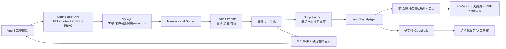

# 银行 AML 智能尽调 Agent：九阶段整改与对抗性审查报告

> 日期：2026-08-19  
> 审查口径：以当前工作区代码、实际测试结果和可观察运行边界为准；不把 Mock、DEV 调优集或未执行的隐藏测试包装成生产效果。  
> 适用岗位：Java 后端开发、AI 应用开发、AI Agent 开发。

## 1. 最终结论

本轮九个工程阶段已经按顺序完成，系统从“可演示的 Agent 项目”推进为具备真实数据边界、快照一致性、可靠异步工作流、证据化 RAG、确定性 Guardrails、人工复核和可复现评测门禁的工程化 AML 尽调平台。

当前确定性代码状态为可交付：

- 后端单元/组件测试：151 项执行，150 项通过，0 失败，1 项真实模型测试按设计跳过；
- 后端集成测试：19 项通过，覆盖 10 个 Flyway 迁移、Hibernate Schema Validate、CSRF、可靠消息和工作流 E2E；
- 最终四工具 Agent E2E：2/2 通过；
- 前端测试：4 个测试文件、13 项通过；
- 前端生产构建：通过；
- npm 生产依赖官方审计：0 个已知漏洞；
- `git diff --check`：无空白错误，仅有 Windows 换行提示。

需要明确区分：工程链路已完成，不等于模型业务效果已经获得最终背书。2026-08-19 已使用真实 `deepseek-v4-flash` 完成 9 条合成 DEV 评测，但当前仓库仍没有领域专家批准的外部隐藏 TEST 数据集，因此 DEV 结果不能替代正式泛化结论。

## 2. 当前系统主链路

核心原则已经落实为：

1. 工单与消息同事务，不接受“数据库成功但消息丢失”；
2. Agent 与 Guardrails 使用同一份冻结快照，不在推理中二次读取变化中的业务数据；
3. 模型只接收最小客户标识，可信姓名和身份字段由服务端回填；
4. Raw Agent 评级、Guardrails 最终评级、人工复核结果分别保留；
5. 模型失败可进入有明确来源标记的规则降级，但真实 Agent 评测禁止 Mock/规则 fallback 污染成绩；
6. 最终报告流不再发起第二次模型调用，展示内容与落库报告同源。

## 3. 九阶段完成情况

### 阶段一：确定性 P0 缺陷

已完成：

- 登录统一交给 Spring Security `AuthenticationManager`，禁用账号不能凭正确密码登录；
- 前端评测 Rate 按后端真实比例展示，不再重复乘 100；
- SSE 在 DONE/HOLD/FAILED 终态主动关闭，避免浏览器继续重连；
- CI 集成环境补齐 PGVector 服务，迁移和 E2E 不再依赖开发机偶然状态。

### 阶段二：生产数据边界

已完成：

- Mock 客户源限定为非生产环境；
- 生产使用关系型 `CustomerDataPort`，真实读取客户、交易、股权和制裁事实；
- 新增 V5 业务事实表，生产不再从 Mock 内部结构反推风险；
- 客户管理支持分页、CRUD、启停和受边界限制的 Excel 导入。

### 阶段三：PII 与模型最小披露

已完成：

- Prompt 和工具参数不再向模型发送姓名、证件号；工具统一以 `customerId` 绑定快照；
- 模型返回的身份字段不可信，最终报告由服务端覆盖为权威客户信息；
- 证件号采用随机 IV 的 AES-256-GCM 字段加密；
- 精确检索指纹改为密钥化 HMAC-SHA256，避免低熵证件号被普通 SHA-256 字典反查；
- 生产禁止默认字段加密密钥；历史字段在启动迁移器中重加密并修正指纹；
- 新增 V6 加密字段迁移。

### 阶段四：可靠消息闭环

已完成：

- 创建、手动触发、重试到期、超时接管、死信和死信重放统一通过 Outbox；
- Outbox 使用 owner + claimVersion fencing，陈旧发布器不能覆盖新 Claim；
- 发布扫描限制为每批 200 条，避免全表加载造成内存和锁压力；
- 工作流租约、心跳、executionVersion 和条件更新共同防止旧 Worker 污染新执行；
- 取消不安全的 Redis MAXLEN 裁剪，避免未 ACK 消息正文被提前删除；
- 新增 V7 Outbox Claim 字段。

### 阶段五：调查快照持久化

已完成：

- 模型调用前归档完整 `InvestigationSnapshot`；
- 快照保存来源系统、来源版本、法规索引版本和 sourceDigest；
- 快照正文加密保存，加载时校验元数据一致性；
- 新增 V8 快照归档表。

### 阶段六：RAG 原子发布

已完成：

- 法规索引使用 MySQL 中央 active pointer，多实例共享同一发布版本；
- 新版本先完成 embedding、写入和 smoke test，再原子切换 active；失败保留旧索引；
- 检索、关键词索引和缓存键都绑定 active corpus version；
- evidenceId 改为标题、条款和正文的稳定内容哈希，文件重排不改变证据标识；
- 生产空索引 fail-fast；reranker 模型和 tokenizer 要求 SHA-256 校验；
- 新增 V9 法规索引状态表。

### 阶段七：端到端验证强化

已完成：

- MockChatModel 支持真实工具请求/执行/最终结构化报告的多轮协议；
- E2E 不只断言终态，还断言四个工具均执行、报告来源为 AGENT、Guardrails 生效；
- Flyway 从空库执行 V1-V10 后由 Hibernate `ddl-auto=validate` 进行结构对账；
- 集成测试使用独立 schema 和 Redis stream，避免被本地开发进程抢任务。

### 阶段八：真实评测与领域审批门禁

已完成：

- 仓库内 6 条原“TEST”改名为 `DEMO_TEST`，不再冒充真正隐藏集；
- 正式 TEST 只允许从 `AML_HIDDEN_TEST_PATH` 加载；
- 外部数据集及每条标注必须是 `DOMAIN_EXPERT_APPROVED`；
- 没有外部专家集时，隐藏 TEST readiness 明确为 false；
- TEST 执行要求环境门禁、commit SHA、冻结清单和唯一 freezeId，接口仅返回聚合指标；
- 工具指标改为按每条案例的 `requiredTools` 动态计算，不再写死四个；
- 规则快照哈希按 ruleCode/version 排序，保证可复现。

尚未完成的不是代码门禁，而是外部业务输入：领域专家隐藏集尚未提供，因此不能给出正式泛化成绩。

### 阶段九：维护性、前端与安全收口

已完成：

- 最终流式展示改为从落库结构化报告确定性渲染，不再二次调用 LLM；
- 请求侧预警文本无论携带何种特殊前缀都不能触发 `RULE_ONLY`，所有业务工单执行主 Agent；
- DeepSeek 出站兼容层移除 `prompt_cache_retention`/`prompt_caching_retention`；
- DeepSeek 工具调用关闭默认 thinking，普通模型请求具有超时和有限重试；
- JWT 每次请求重新读取账号状态与角色，禁用/降权立即生效；
- 默认不解析客户端可伪造的 Forwarded/X-Forwarded-*；
- 登录限流桶增加容量上限，防止随机用户名内存 DoS；
- 执行检查点改为脱敏 DTO，不暴露内部正文和异常消息；
- 生产关闭 Swagger/OpenAPI；调试和任意 Agent 调用接口不在 prod 注册；
- 客户编号改为高熵 UUID 派生值，消除多实例 `max+1` 竞争；
- 新增 V10 工作流查询索引；
- 前端角色路由、客户管理、评测展示、SSE 对账和测试完成收口；
- CI 密钥扫描不再跳过 JSON，补充 npm 生产依赖审计和 Dependabot 周期更新。

## 4. 对抗性审查

### 4.1 已在审查中发现并修复

| 攻击面 | 原风险 | 修复结果 |
|---|---|---|
| 文本降级绕过 | 分析员可构造特殊 `alertRule` 触发零模型路径 | 业务服务强制执行 Agent，文本不能作为授权 |
| 代理头伪造 | 框架自动信任 X-Forwarded-For 时可绕过 IP 限流 | 默认 `forward-headers-strategy=none` |
| 证件号离线枚举 | 普通 SHA-256 对低熵身份字段可字典反查 | 使用派生密钥的 HMAC-SHA256 |
| 登录内存 DoS | 随机 IP/用户名桶无界增长 | 有界桶、过期清理、满载失败关闭 |
| 内部对象泄露 | `/executions` 直接返回 JPA 实体及内部正文 | 专用诊断 DTO，仅返回阶段、状态、耗时、错误码 |
| Outbox 全表加载 | 积压时一次读取全部待发布事件 | 每轮最多 200 条 |
| 多实例客户编号 | `max+1` 产生唯一键竞争 | UUID 派生高熵编号 |
| Secret Scan 空洞 | CI 排除所有 JSON，可能漏掉配置密钥 | 不再排除 JSON，扩大 Key 规则 |
| DeepSeek 参数错误 | 不支持的 prompt cache retention 进入出站请求 | 同步/流式边界统一清洗并有回归测试 |
| 双模型语义漂移 | 流式分析与最终报告各调用一次模型 | 流式内容由最终结构化报告确定性生成 |

### 4.2 尚存问题与优先级

#### P0：需要人工立即处理

1. **本地疑似明文密钥**  
   `.claude/settings.local.json` 第 118 行命中 Key 形态。该文件被 `.gitignore` 排除且未被 Git 跟踪，仓库提交面当前安全；但本机明文仍可能被备份、日志或恶意软件读取。不要把值发到聊天或提交历史，应在对应提供商后台轮换/作废旧 Key，删除本地明文并改用进程环境变量或系统 Secret Store。

#### P1：上线前应完成

1. **正式隐藏 TEST 与领域复核**  
   提供独立外部数据集，完成双人标注和第三人裁决，再运行一次冻结 TEST。当前 DEMO_TEST 和历史 DEV 成绩只能作为开发证据。

2. **分布式登录限流**  
   当前有界内存限流解决单实例内存 DoS，但多实例之间不共享计数。生产应迁移为 Redis Lua 原子窗口/令牌桶，并设置总维度和 IP 聚合限额。

3. **跨实例 SSE**  
   SSE emitter 仍是进程内对象。Worker 与浏览器连接落到不同实例时，只能依靠 REST 对账看到终态，实时 token/阶段事件可能缺失。应使用 Redis Pub/Sub/Stream 作为事件背板，或配置粘性路由并明确降级语义。

4. **Redis Stream 容量治理**  
   为避免丢 Pending 消息，本轮取消了直接 MAXLEN；代价是 Stream 会持续增长。应实现基于所有消费组安全位点的归档/裁剪作业，并设置容量与磁盘告警。

5. **RAG 构建租约与旧版本回收**  
   构建租约固定 15 分钟且无 heartbeat，大语料构建可能租约过期；失败候选和旧 corpus 也没有 GC。应增加续租、候选状态、按 active/保留窗口回收向量，并用故障测试验证。

6. **加密密钥版本与用途隔离**  
   身份字段和快照正文目前共享一个主密钥入口，没有 keyId/历史密钥环，直接换 Key 会导致旧数据无法解密。应派生独立 data keys，密文携带 keyId，并提供在线双读/重加密流程。

7. **历史身份迁移的规模化**  
   `IdCardEncryptionMigrator` 启动时 `findAll()` 并在单事务处理中完成，百万级客户会造成长事务与内存压力。应改为按主键游标分批、每批独立事务，或作为受控离线迁移任务执行。

8. **Outbox 写入竞争**  
   `existsByIdempotencyKey` 后再 `save` 仍有检查—写入竞争窗口。数据库唯一键能防重复，但冲突可能回滚上层业务事务。应使用数据库原生 `INSERT ... ON DUPLICATE KEY IGNORE` 或隔离的幂等插入语义。

9. **后端依赖漏洞自动门禁**  
    npm 生产依赖已审计且 Dependabot 已配置；Maven 当前只有 Dependabot 更新，没有在 CI 中执行 OSV/OWASP 漏洞阻断。应引入可缓存、可设阈值且不会因外部漏洞库偶发不可用而阻断所有开发的后端 SCA 流程。

10. **评测安全检测覆盖**  
    部分 forbidden claim 仍只能得到 UNSCORABLE，提示注入和事实数值编造缺少完全确定性的结构字段。应增加 `FactClaim`、动作/事实强类型和 canary 泄漏检测，再把安全 coverage 纳入发布门禁。

#### P2：持续改进

1. `AGENT_WITH_SUMMARY` 名称已不准确，实际是“Agent + deterministic report stream”，后续可做兼容迁移；
2. 真实模型异常分类仍有启发式成分，应区分工具轮次耗尽、网络错误、JSON 解析和 Schema 校验；
3. 旧规划文档保存了历史基线和旧测试数字，应标注“历史归档”，以 README 和本报告为当前口径；
4. Mockito 在 JDK 21 会提示动态 attach 未来受限，应按官方方式配置 test agent；
5. 需要补 Playwright 真浏览器流程，把登录、创建工单、SSE 终态、复核和客户管理纳入日常而非仅手工 CI。

## 5. 真实 DeepSeek DEV 评测结果

评测文件：`backend/target/agent-eval/agent-dev-1.1.0-20260819-143609.json`。

| 指标 | 结果 |
|---|---:|
| 运行状态 | COMPLETED |
| 有效案例 | 9/9 |
| Schema 成功率 | 100% |
| Raw 风险准确率 / 高风险召回 | 100% / 100% |
| Final 风险准确率 / 高风险召回 | 100% / 100% |
| 人工升级准确率 / 召回率 | 66.7% / 100% |
| 必需 Finding / Action 覆盖率 | 100% / 100% |
| Finding / Action 精确率 | 73.5% / 62.9% |
| evidenceId 召回率 | 100% |
| 必需工具召回率 / 参数准确率 | 100% / 100% |
| 工具调用精确率 | 80% |
| Forbidden 可判定合规率 | 100% |
| Forbidden detector coverage | 83.3% |
| 端到端任务通过率 | 66.7%（6/9） |
| 严格契约通过率 | 0%（0/9） |
| P50 / P95 | 7,959ms / 10,034ms |
| 模型请求 / 总 Token | 27 / 71,518 |

结论：风险分级、必需事实、必需动作、法规证据和四工具覆盖已经稳定；主要剩余问题不是漏报，而是过度保守和工具效率。AE-003、AE-004、AE-007 在金标不要求人工升级时仍输出人工复核，导致任务通过率为 6/9；每个案例均重复调用一次 `searchLegal`，导致严格契约全部失败，并把平均工具调用推高到 5 次。另有 9 个额外 Finding、13 个额外 Action，需区分“金标允许集过窄”和“模型过度输出”，不能为了抬分直接删除惩罚。

隐私复核：报告 JSON 有效，客户编号、姓名、证件号和完整夹具原文命中均为 0；Key 形态命中为 0，并已用实际用户级 Key 做精确比对，报告中不存在该值。

## 6. 下一步执行顺序

### 第一批：形成可公开的 AI Agent 证据

1. 轮换本地疑似泄露 Key，并仅以进程环境变量注入；
2. 基于本次真实 DEV 结果复核三条人工升级标签，并修复每案重复法规检索；
3. 请领域专家完成外部隐藏 TEST 双人标注和审批；
4. 冻结 commit、Prompt、数据集、规则、模型、温度和法规索引，执行一次盲测；
5. 用 Raw Agent、Guardrails Final、Task Pass、工具参数正确率、证据引用率、P95、Token/成本形成一页基线。

### 第二批：生产部署边界

1. Redis 分布式登录限流；
2. SSE 跨实例事件背板；
3. Redis Stream 安全裁剪；
4. RAG 租约续期与旧版本 GC；
5. 加密 keyId、密钥轮换和批量迁移；
6. Maven SCA 与 SBOM。

### 第三批：简历和面试材料

只有完成第一批后，再写带数字的项目经历。可以如实强调：

- Snapshot First + 动态四工具 Agent；
- Transactional Outbox + Redis Streams + fencing lease；
- PGVector/关键词/RRF/Reranker + 版本化证据；
- Raw/Guardrail/Human 三层决策与可复现 Agent Eval；
- PII 最小披露、AES-GCM/HMAC、JWT Cookie/CSRF/RBAC；
- 测试数量、真实 DEV/隐藏 TEST 和成本指标。

禁止写“生产准确率 100%”“已通过银行真实数据验证”“隐藏 TEST 已完成”等当前没有证据支持的表述。

## 7. 最终验收清单

- [x] 九阶段工程整改按顺序完成；
- [x] DeepSeek 不兼容参数在出站边界清洗；
- [x] 第二次流式模型调用移除；
- [x] 后端单元/组件测试通过；
- [x] Flyway V1-V10 与 Hibernate Validate 通过；
- [x] 消息可靠性与四工具 E2E 通过；
- [x] 前端测试与生产构建通过；
- [x] npm 生产依赖审计通过；
- [x] 对抗性审查完成并修复可安全落地的问题；
- [ ] 本机疑似明文 Key 由用户完成轮换；
- [x] 新代码基线真实 DeepSeek DEV 评测；
- [ ] 领域专家批准的外部隐藏 TEST；
- [ ] P1 生产多实例与密钥轮换能力。
