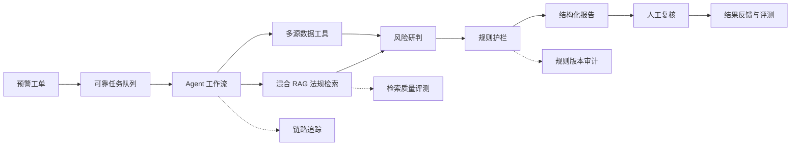
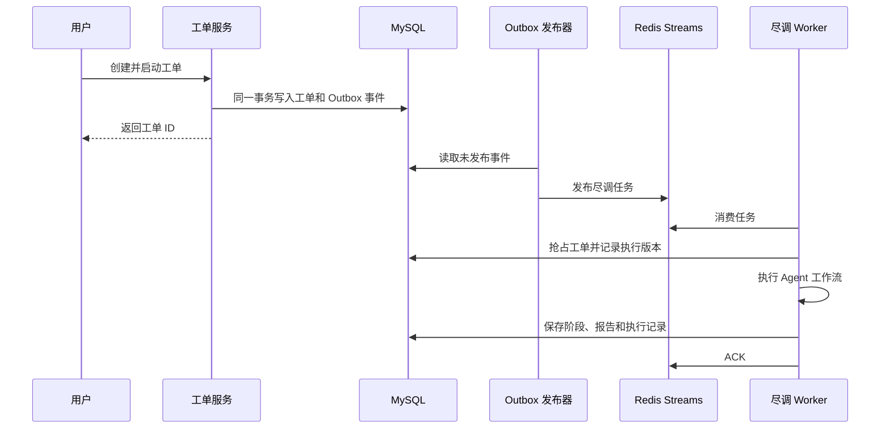
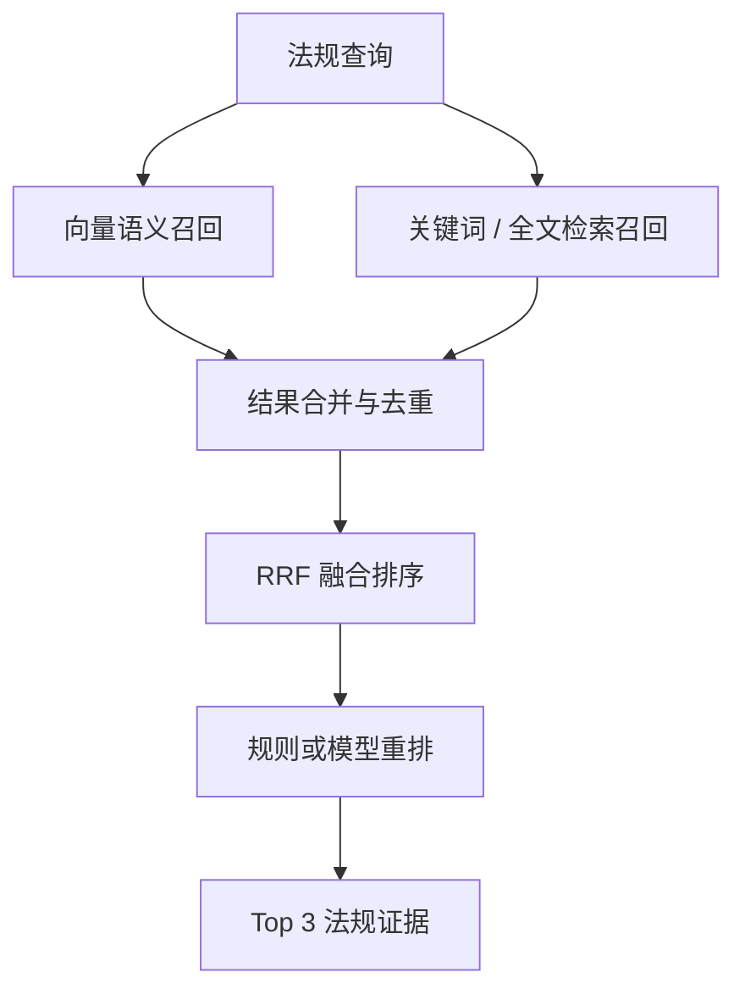

# 商业银行智能反洗钱尽调 Agent 项目优化方案

## 1. 文档目标

本文档用于指导现有 AML（反洗钱）高风险客户尽调 Agent 项目的后续优化，目标不是简单增加页面或模型调用，而是将项目升级为：

> 一个可评测、可追溯、可恢复、具备确定性规则兜底能力的企业级 AML Agent 平台。

优化后的项目应同时体现以下能力：

- Java 后端与分布式任务设计能力；
- AI Agent 编排与工具调用能力；
- RAG 检索、证据引用和效果评测能力；
- 金融风控、规则护栏和人工复核闭环；
- 测试、可观测性、安全及工程化能力；
- 能够在秋招简历和面试中用数据说明项目价值。

---

## 2. 项目最终定位

### 2.1 推荐项目名称

**商业银行智能反洗钱与高风险客户尽调 Agent 平台**

### 2.2 项目目标

系统接收反洗钱预警工单后，可靠地调度 Agent 工作流，自动完成交易画像、股权穿透、制裁名单筛查、监管法规检索、风险研判和结构化报告生成；使用独立于大模型的 Guardrails 校验最终结论，并将高风险工单转入人工复核。



### 2.3 项目核心卖点

优化完成后，项目的价值不再只是“使用 LangChain4j 调用大模型”，而是：

1. Agent 任务调用失败后可以重试、恢复和追踪；
2. 每个风险结论都能追溯到交易、名单及法规证据；
3. 大模型出现幻觉或低估风险时，规则系统能够强制修正；
4. 使用固定测试集量化风险识别、法规检索、性能和成本；
5. 形成 Agent 初审、规则兜底、人工终审的完整业务闭环。

---

## 3. 实施阶段总览

| 阶段 | 主要目标 | 秋招价值 | 建议时间 |
|---|---|---|---|
| P0 | 修复现有业务闭环和数据问题 | 基础代码质量 | 2～3 天 |
| P1 | 建设可靠异步任务与工作流状态机 | Java 后端核心亮点 | 1～2 周 |
| P2 | 增强 RAG 与法规证据追溯 | AI 工程核心亮点 | 1～2 周 |
| P3 | Guardrails 配置化与 Agent 评测 | 项目差异化亮点 | 1 周 |
| P4 | 测试、可观测性、安全与接口治理 | 企业级工程能力 | 1～2 周 |
| P5 | 人工复核闭环和项目成果包装 | 产品闭环与求职材料 | 3～5 天 |

如果时间有限，至少完成 P0～P3。P1、P2 和 P3 是最值得在简历中重点描述的部分。

---

## 4. P0：修复现有业务闭环

### 4.1 创建后自动启动尽调

#### 当前问题

前端按钮显示“创建并尽调”，实际只创建工单，没有触发处理。用户进入详情页后，工单可能一直处于 `PENDING`。

#### 优化方案

将创建接口调整为：

```http
POST /api/cases
Content-Type: application/json

{
  "customerId": "C001",
  "alertRule": "大额频繁跨境转账、夜间集中交易",
  "autoProcess": true
}
```

后端在创建工单成功后发布尽调任务，前端直接进入详情页并订阅 SSE。

不建议由前端连续调用“创建工单”和“处理工单”两个接口，否则可能出现创建成功、处理请求失败的半完成状态。

### 4.2 统一工单状态和工作流阶段

需要区分：

- 工单状态：`PENDING / RUNNING / DONE / HOLD / FAILED`；
- 工作流阶段：`PLANNING / COLLECTING / REASONING / GUARDRAIL / REPORTING`。

建议将字符串替换为 Java 枚举：

```java
public enum CaseStatus {
    PENDING, RUNNING, DONE, HOLD, FAILED
}

public enum WorkflowStage {
    PLANNING, COLLECTING, REASONING, GUARDRAIL, REPORTING
}
```

推荐阶段顺序：

```text
PENDING
  → PLANNING
  → COLLECTING
  → REASONING
  → GUARDRAIL
  → REPORTING
  → DONE / HOLD / FAILED
```

后端每次阶段切换都应保存记录并发送事件，前端只按照后端事件展示，不再自行推测阶段完成情况。

### 4.3 修复金融数据类型

当前 Mock 数据中的金额使用 `double`，时间使用字符串，并且夜间时间生成逻辑可能产生 24～28 点。

建议统一使用：

- 金额：`BigDecimal`；
- 时间：`LocalDateTime`；
- 币种：独立字段或 `Currency`；
- 国家和地区：使用枚举或统一编码；
- 金额统计过程明确舍入规则。

这是金融项目中非常容易被面试官追问的基础设计点。

### 4.4 明确 Redis 的用途

当前项目虽然配置了 Redis，但源码中没有实际使用。

推荐在 P1 中将 Redis 用作可靠任务队列；如果暂时不实施 P1，则应先移除无效依赖和配置，避免项目结构与实际能力不一致。

### 4.5 P0 验收标准

- 点击“创建并尽调”后，工单自动开始运行；
- 前后端展示的工作流顺序完全一致；
- 同一个工单不能被重复启动；
- 金额计算不再使用 `double`；
- 所有 Mock 交易时间均合法；
- C001、C002、C003 的风险结果稳定且可复现；
- 异常状态能够在页面明确显示。

---

## 5. P1：可靠异步任务与状态机

这是整个项目最值得投入的部分，也是 Java 后端岗位最有价值的面试素材。

### 5.1 当前问题

当前通过 `CompletableFuture.runAsync()` 执行工单，存在以下问题：

- 使用公共线程池，缺乏并发控制；
- 服务重启时任务丢失；
- 同一工单可能重复执行；
- 没有重试、死信和超时机制；
- 不能从失败阶段恢复；
- 数据库写入成功与任务发布成功之间缺乏一致性保证。

### 5.2 推荐架构：MySQL Transactional Outbox + Redis Streams



### 5.3 Transactional Outbox

新增表：

```text
outbox_event
- id
- aggregate_id
- event_type
- payload
- status
- retry_count
- next_retry_at
- created_at
- published_at
```

创建工单和写入 Outbox 事件必须处于同一个 MySQL 事务中，从而避免：

> 数据库中已经有工单，但消息队列没有对应任务。

发布器定时扫描未发布事件，将任务发送到 Redis Streams。发送成功后更新事件状态，发送失败则记录重试次数和下次重试时间。

### 5.4 Redis Streams 消费者组

使用 Redis Streams Consumer Group 实现：

- 多 Worker 并发消费；
- 执行成功后 ACK；
- 执行失败后按策略重试；
- 超过最大次数进入死信队列；
- 定期接管长时间未 ACK 的 Pending 消息；
- 通过 `caseId + executionVersion` 实现业务幂等。

### 5.5 工单抢占和幂等控制

建议给工单表增加：

```text
execution_version
locked_by
locked_at
retry_count
failure_code
failure_message
```

Worker 开始处理时执行条件更新：

```sql
UPDATE aml_case
SET status = 'RUNNING',
    execution_version = execution_version + 1,
    locked_by = ?,
    locked_at = NOW()
WHERE id = ?
  AND status IN ('PENDING', 'FAILED');
```

根据影响行数判断是否抢占成功。即使 Redis 至少投递一次，也不会导致同一工单被重复处理。

### 5.6 错误分类和重试策略

| 错误类型 | 处理策略 |
|---|---|
| 模型超时或网络异常 | 指数退避重试 |
| 外部数据源短暂不可用 | 限次重试 |
| 模型结构化输出错误 | 尝试修复一次，再进行规则降级 |
| 客户不存在或输入非法 | 不重试，直接失败 |
| 制裁名单服务不可用 | 禁止自动完成，进入 `HOLD` |
| 法规检索不可用 | 可降级，但报告标记“法规证据不完整” |
| 未知系统异常 | 重试后进入死信队列 |

建议使用统一业务异常：

```text
RetryableWorkflowException
NonRetryableWorkflowException
ManualReviewRequiredException
```

### 5.7 工作流检查点和恢复

新增执行记录表：

```text
case_execution
- id
- case_id
- execution_version
- stage
- input_digest
- output_json
- status
- started_at
- completed_at
- duration_ms
- error_code
- error_message
```

每个阶段完成后保存检查点。服务重启或任务重试时，根据检查点决定：

- 已成功且输入未变化的阶段直接复用；
- 失败阶段重新执行；
- 输入发生变化时，从受影响的阶段重新执行。

### 5.8 P1 验收标准

- API 服务重启后，未完成任务不会丢失；
- 同一消息重复投递不会生成两份报告；
- Worker 异常退出后，Pending 消息能够被其他 Worker 接管；
- 可重试与不可重试错误处理符合定义；
- 超过重试次数的任务进入死信队列；
- 可以查询每个阶段的执行耗时、输入、输出及失败原因；
- 并发创建多份工单时，系统能够稳定处理。

### 5.9 秋招价值

这一阶段可以重点说明：

- 为什么公共线程池不能承担可靠业务任务；
- 如何解决数据库与消息队列双写一致性；
- 如何在至少一次投递语义下保证业务幂等；
- 如何接管 Pending 消息并恢复任务；
- 如何对不同异常设置不同的降级和重试策略。

---

## 6. P2：RAG 与法规证据追溯

目标是将当前“能查询法规文本”的 RAG，升级成“可验证的法规证据系统”。

### 6.1 法规结构化入库

不要只按照空行切分文档。建议为法规片段保存以下元数据：

```text
document_id
title
document_number
issuer
effective_date
expiry_date
article_number
chapter
source_url
content_hash
version
content
```

报告中的法规依据应包含：

```text
法规：《中华人民共和国反洗钱法》
条款：第三十二条
版本：2024 年修订
生效日期：2025-01-01
证据片段：……
```

### 6.2 混合检索

将单一向量检索升级为：



推荐继续使用 PostgreSQL：

- pgvector 负责语义召回；
- PostgreSQL 全文检索负责精确关键词；
- Reciprocal Rank Fusion（RRF）负责合并结果；
- 对条款编号、金额标准、文件编号等精确内容提高关键词权重。

这样不需要额外引入 Elasticsearch，也能展示完整的混合检索能力。

### 6.3 查询改写

根据工单风险特征生成多条检索查询。例如：

```text
原始预警：夜间频繁跨境转账

改写查询：
1. 自然人跨境大额交易报告标准
2. 高频夜间交易可疑交易识别
3. 高风险客户强化尽职调查
4. 制裁名单命中后的处置要求
```

多条查询并行检索后统一融合，提升法规覆盖率。

### 6.4 Evidence ID 引用约束

不允许模型自由生成法规名称和条款。推荐流程：

1. 检索器为每个法规片段返回唯一 `evidenceId`；
2. 模型只能引用已有的 `evidenceId`；
3. 后处理校验每个引用是否存在；
4. 页面根据 `evidenceId` 从数据库读取法规原文；
5. 引用不存在时，报告生成失败并触发一次修复或重新生成。

报告结构示例：

```json
{
  "legalEvidence": [
    {
      "evidenceId": "LEGAL-AML-2024-32",
      "reason": "该条款适用于高风险客户强化尽职调查"
    }
  ]
}
```

这样能够显著降低模型编造法规标题或条款的风险。

### 6.5 法规版本管理

法规修订后：

- 新版本作为独立版本入库；
- 旧版本标记失效，但不直接删除；
- 报告记录生成时实际使用的法规版本；
- 历史报告可以还原当时适用的法规证据；
- 检索默认过滤已失效法规，历史查询则可指定时间点。

### 6.6 RAG 评测集

建立至少 30～50 个法规检索问题，每条记录包括：

```text
问题
标准法规
标准条款
可接受证据片段
风险场景
```

建议评测：

- Recall@5；
- Top3 命中率；
- MRR；
- 法规引用合法率；
- 无效或过期法规引用数；
- 平均检索耗时和 P95 检索耗时。

目标值可设为：

- Recall@5 ≥ 90%；
- Top3 命中率 ≥ 85%；
- 法规引用合法率 = 100%；
- 凭空生成法规或条款数量 = 0。

以上数字必须通过真实评测获得后才能写入简历。

---

## 7. P3：Guardrails 与 Agent 评测体系

这是项目从“LLM 应用”升级为“AI 工程项目”的关键阶段。

### 7.1 Guardrails 规则配置化

当前规则写死在 Java 代码中。建议设计规则表：

```text
risk_rule
- id
- rule_code
- rule_name
- version
- priority
- condition_expression
- target_risk_level
- action
- enabled
- effective_from
- effective_to
```

示例规则：

```text
规则编码：SANCTION_LEVEL_1
条件：sanction.maxSeverity == 1
最终评级：HIGH
动作：HOLD + MANUAL_REVIEW
优先级：100
```

第一版可以使用 Java Predicate 或轻量自定义表达式，不必为了展示技术而引入复杂规则引擎。

### 7.2 决策结果可解释

Guardrail 输出应包含模型原始结论、最终结论、触发规则和证据：

```json
{
  "modelRiskLevel": "中风险",
  "finalRiskLevel": "高风险",
  "triggeredRules": [
    {
      "ruleCode": "SANCTION_LEVEL_1",
      "ruleVersion": 3,
      "evidence": "OFAC SDN: ZHANG WEI",
      "correction": "中风险 → 高风险"
    }
  ],
  "requiredAction": "MANUAL_REVIEW"
}
```

核心设计原则是：

> 大模型负责理解、推理和总结，确定性规则系统掌握最终风险决策权。

### 7.3 Agent 测试集

建议建立约 100 条合成或脱敏案例：

| 类别 | 建议数量 |
|---|---:|
| 正常客户 | 25 |
| 夜间和跨境异常 | 20 |
| 拆分交易 | 15 |
| 制裁名单命中 | 15 |
| 复杂股权和 UBO | 15 |
| 数据缺失与工具异常 | 10 |

每条案例包含：

```text
输入客户数据
输入交易数据
预期风险等级
必须命中的规则
必须引用的证据
是否必须转人工
允许的处置建议
```

### 7.4 Agent 评测指标

建议记录：

- 高风险召回率；
- 低风险误报率；
- 一级制裁漏报数；
- 风险等级准确率和混淆矩阵；
- 结构化输出成功率；
- 工具调用成功率；
- 法规引用正确率；
- Guardrails 纠正模型错误次数；
- P50、P95 工单执行耗时；
- 单工单 Token 消耗和调用成本；
- 不同模型及 Mock 模式下的效果差异。

金融风控应优先保证高风险召回率，一级制裁名单必须做到零漏报。

### 7.5 自动回归评测

每次修改 Prompt、模型、工具、检索或规则后，自动执行固定评测集并输出版本对比：

```text
版本 A
- 高风险召回率：待实测
- 法规引用正确率：待实测
- P95 执行耗时：待实测
- 单工单平均成本：待实测

版本 B
- 高风险召回率：待实测
- 法规引用正确率：待实测
- P95 执行耗时：待实测
- 单工单平均成本：待实测
```

将评测结果保存为 JSON 和可视化报告，作为 README、简历和面试演示的依据。

### 7.6 P3 验收标准

- 风险规则具备版本、优先级和生效时间；
- 每次风险修正都有规则编号和原始证据；
- 具备不少于 100 条的固定案例集；
- 能够一键生成模型和规则评测报告；
- 一级制裁场景零漏报；
- Prompt 或模型变更后可以执行自动回归对比。

---

## 8. P4：企业级工程能力

### 8.1 自动化测试

建议建立以下测试层级。

#### 单元测试

- 交易特征聚合；
- 金额与时间边界；
- 风险评级规则；
- Guardrails 规则优先级；
- 法规结果融合排序；
- 状态机合法转换；
- 幂等键生成与校验。

#### 集成测试

- MySQL 工单状态流转；
- Outbox 事件发布；
- Redis Streams 消费、ACK、重试和接管；
- pgvector 法规检索；
- 失败后的检查点恢复。

#### 端到端测试

```text
创建工单
→ 等待 Worker 执行
→ 验证工作流阶段
→ 验证风险报告
→ 验证 HOLD / DONE 状态
→ 验证证据引用
```

建议使用 Testcontainers 启动 MySQL、PostgreSQL/pgvector 和 Redis，降低环境差异带来的问题。

### 8.2 可观测性

接入 Spring Boot Actuator、Micrometer、Prometheus 和 Grafana。

推荐指标：

```text
aml_case_total
aml_case_success_total
aml_case_failed_total
aml_case_hold_total
aml_stage_duration_seconds
aml_llm_request_total
aml_llm_token_total
aml_tool_error_total
aml_guardrail_correction_total
aml_rag_search_duration_seconds
aml_queue_pending_total
aml_dead_letter_total
```

每次执行生成 `traceId`，贯穿：

```text
HTTP 请求
→ 工单
→ Outbox
→ Redis Streams
→ Agent
→ Tool
→ RAG
→ Guardrails
→ 报告
```

日志建议使用结构化 JSON，并包含：

- `traceId`；
- `caseId`；
- `executionVersion`；
- `stage`；
- `durationMs`；
- `errorCode`；
- 脱敏后的关键上下文。

### 8.3 安全和隐私

至少实现：

- JWT 登录认证；
- `ANALYST / REVIEWER / ADMIN` 三种角色；
- 姓名、身份证号、账户号脱敏；
- 报告查看、下载和审批操作审计；
- API Key 全部使用环境变量或密钥管理；
- 日志禁止输出完整个人敏感信息；
- 敏感字段落库加密或预留统一加密接口；
- 对 Prompt 输入和模型输出进行敏感信息控制。

### 8.4 接口治理

不要直接向前端暴露 JPA Entity，统一使用 DTO。

错误响应格式：

```json
{
  "code": "CASE_ALREADY_RUNNING",
  "message": "工单正在执行",
  "traceId": "01H...",
  "timestamp": "2026-08-12T14:00:00+08:00"
}
```

同时补充：

- 全局异常处理；
- 参数校验；
- OpenAPI/Swagger；
- 接口分页；
- API 版本管理；
- 请求幂等标识；
- SSE 断线重连和历史事件补偿。

### 8.5 性能优化

前端当前主包较大，可以实施：

- 页面级动态导入；
- Element Plus 按需加载；
- ECharts 按需加载；
- 列表分页和报告懒加载。

后端可以实施：

- 工具调用独立线程池和超时；
- 同类只读查询缓存；
- RAG 批量向量化；
- 数据库索引优化；
- 大报告与列表摘要分离；
- 限制单租户或单用户并发任务数。

---

## 9. P5：人工复核闭环

当前 `HOLD` 只是工单状态，缺少真正的人工处置过程。

### 9.1 推荐流程

```text
待复核队列
→ 查看模型结论和完整证据
→ 查看 Guardrails 修正记录
→ 调整风险等级
→ 填写复核意见
→ 批准 / 驳回 / 要求补充尽调
→ 形成最终处置结果
```

### 9.2 人工复核数据模型

```text
manual_review
- id
- case_id
- reviewer_id
- agent_risk_level
- guardrail_risk_level
- reviewer_risk_level
- decision
- comment
- created_at
- completed_at
```

建议保留所有历史复核记录，不直接覆盖 Agent 原始结论。

### 9.3 反馈闭环

人工复核结果可以回流到评测体系，用于统计：

- Agent 与人工风险等级一致率；
- Guardrails 修正准确率；
- 被人工推翻的规则；
- 不同风险场景的误报和漏报；
- 需要补充的新案例和新规则。

最终形成：

> Agent 初审、规则兜底、人工终审、结果反馈。

---

## 10. 推荐技术范围

不建议为了简历盲目拆成大量微服务。推荐保持：

```text
一个 Spring Boot 后端
一个 Vue 3 前端
MySQL
PostgreSQL + pgvector
Redis Streams
Prometheus + Grafana
```

重点展示以下能力：

- 清晰的模块边界；
- 可靠任务和数据一致性；
- 风险决策的可解释性；
- RAG 证据的可追溯性；
- 可重复执行的效果评测；
- 完整的测试与可观测性。

这些内容比“为了使用微服务而拆分微服务”更容易讲清楚，也更符合该项目现阶段规模。

---

## 11. 推荐后端模块结构

```text
backend/
  case/                 工单、工单状态和人工复核
  workflow/             状态机、阶段执行、检查点和恢复
  messaging/            Outbox、Redis Streams、重试和死信队列
  agent/                Agent 定义、Prompt 和结构化输出
  tools/                交易、工商、名单和法规适配器
  rag/                  文档导入、混合检索、融合与重排
  risk/                 风险规则和 Guardrails
  evaluation/           案例集、离线评测和版本对比
  observability/        指标、链路和审计
  security/             登录、权限、加密和脱敏
  common/               通用异常、响应模型和基础组件
```

模块可以先保留在一个 Spring Boot 工程中，通过包边界进行隔离。后续只有在并发、部署或团队协作确有需要时再考虑拆分服务。

---

## 12. 建议开发顺序

### 第一周：修复主链路

- [ ] 创建工单后自动发布尽调任务；
- [ ] 定义工单状态和工作流阶段枚举；
- [ ] 统一前后端阶段顺序；
- [ ] 修复 Mock 时间生成；
- [ ] 金额替换为 `BigDecimal`；
- [ ] 增加全局异常处理和 DTO；
- [ ] 为核心规则编写第一批单元测试。

### 第二周：可靠任务系统

- [ ] 设计 Outbox 表；
- [ ] 工单与 Outbox 同事务写入；
- [ ] 接入 Redis Streams Consumer Group；
- [ ] 实现任务 ACK、重试和死信队列；
- [ ] 增加工单抢占和幂等控制；
- [ ] 编写消息重复投递集成测试。

### 第三周：状态机与恢复

- [ ] 建立 `case_execution` 表；
- [ ] 保存阶段检查点；
- [ ] 实现阶段超时；
- [ ] 实现失败任务恢复；
- [ ] 记录各阶段耗时和失败原因；
- [ ] 增加任务管理和死信查看接口。

### 第四周：RAG 证据系统

- [ ] 法规结构化解析和元数据入库；
- [ ] 向量召回与全文检索；
- [ ] RRF 结果融合；
- [ ] Evidence ID 生成和引用校验；
- [ ] 法规版本和有效期管理；
- [ ] 建立法规检索测试集。

### 第五周：Guardrails 与评测

- [ ] 风险规则配置化；
- [ ] 输出触发规则和修正证据；
- [ ] 建立约 100 条案例集；
- [ ] 编写一键评测入口；
- [ ] 输出准确率、召回率、延迟和成本；
- [ ] 比较 Mock 与真实模型效果。

### 第六周：工程化与展示

- [ ] Testcontainers 集成测试；
- [ ] Actuator、Micrometer、Prometheus、Grafana；
- [ ] traceId 全链路关联；
- [ ] JWT、角色和数据脱敏；
- [ ] 人工复核页面；
- [ ] 优化 README、架构图、演示截图和简历描述。

---

## 13. 里程碑和验收表

| 里程碑 | 必须交付的结果 | 验收方式 |
|---|---|---|
| M1：业务闭环 | 创建后自动运行，阶段一致，结果稳定 | 完成 C001～C003 端到端演示 |
| M2：可靠执行 | Outbox、Streams、幂等、重试、死信 | 模拟重复消息和服务重启 |
| M3：证据 RAG | 混合检索、Evidence ID、法规版本 | 固定检索集评测 |
| M4：安全决策 | 配置化规则、决策解释、一级名单零漏报 | 风险案例集回归 |
| M5：工程能力 | 测试、监控、链路、安全 | 自动测试和仪表盘截图 |
| M6：业务闭环 | 人工复核和反馈 | 完成 HOLD 工单复核演示 |

---

## 14. 简历项目描述模板

以下内容必须在功能实际完成并取得真实评测结果后使用，所有数字均应替换为实测结果。

### 14.1 项目简介

> 面向商业银行反洗钱场景，设计并实现高风险客户尽调 Agent 平台，自动完成交易画像、股权穿透、制裁名单筛查、监管法规检索、风险评级及人工复核，支持多模型切换、可靠异步执行和全链路证据追溯。

### 14.2 简历要点候选

1. 基于 Spring Boot、LangChain4j 和 Vue 3 构建 AML 尽调 Agent，编排交易、股权、制裁名单及法规检索等工具，输出包含风险点、监管依据和证据链的结构化尽调报告。

2. 基于 MySQL Transactional Outbox 与 Redis Streams 设计可靠异步任务链路，通过消费者组、幂等控制、指数退避和死信队列解决任务丢失、重复消费及服务重启恢复问题。

3. 基于 pgvector 与 PostgreSQL 全文检索实现法规混合召回和结果融合，引入法规版本及 `evidenceId` 引用校验，使报告引用可追溯至具体法规条款。

4. 构建独立于大模型的风险 Guardrails，对制裁名单、异常交易和评级一致性进行强制校验，实现一级制裁命中零漏报并自动转人工复核。

5. 建立覆盖正常交易、拆分交易、跨境夜间交易、复杂 UBO 和制裁名单等场景的 Agent 评测集，量化风险召回率、法规命中率、结构化输出成功率、P95 延迟及模型成本。

6. 使用 Testcontainers、Prometheus、Grafana 和全链路追踪完成集成测试与可观测性建设，实现对工单、消息队列、模型、工具和 RAG 阶段的故障定位。

最终简历建议保留最强的 3～4 条，避免堆砌技术名词。

### 14.3 量化指标模板

完成评测后，可以从以下指标中选择真实且最有优势的数据：

```text
- 构建 N 条 AML 场景评测案例；
- 高风险召回率从 A% 提升至 B%；
- 一级制裁名单漏报数为 0；
- 法规 Recall@5 达到 X%；
- 法规引用合法率达到 100%；
- 结构化输出成功率达到 X%；
- P95 工单执行耗时降低 X%；
- 重复消息场景下重复报告数量为 0；
- 服务重启后的未完成任务恢复率达到 100%；
- 单工单模型成本降低 X%。
```

禁止在没有真实测试的情况下虚构指标。

---

## 15. 面试叙事建议

面试时不要只介绍技术栈，应按照“问题—方案—权衡—结果”展开。

### 15.1 推荐叙事主线

1. 初始版本直接使用公共线程池执行 Agent，服务重启时任务可能丢失；
2. 使用 Transactional Outbox 和 Redis Streams 保证工单创建后任务最终可达；
3. Redis Streams 采用至少一次投递，可能重复消费，因此增加执行版本和数据库条件更新实现业务幂等；
4. 大模型可能低估风险或编造法规，因此将最终决策权交给独立 Guardrails，法规引用只能使用检索结果中的 Evidence ID；
5. 建立固定 AML 案例集，持续比较高风险召回率、法规引用正确率、执行延迟和模型成本；
6. 最终形成 Agent 初审、规则兜底、人工终审和结果反馈的业务闭环。

### 15.2 高频追问准备

#### 为什么不用 `CompletableFuture`？

它适合进程内异步计算，不提供任务持久化、消费确认、崩溃恢复和死信处理，无法满足长耗时风控任务的可靠执行要求。

#### 为什么使用 Outbox？

工单和任务消息跨越数据库与消息系统，直接双写可能出现一边成功、一边失败。Outbox 先在本地事务中保存业务数据和事件，再异步投递消息，保证任务最终可达。

#### Redis Streams 重复消费怎么办？

消息层使用至少一次投递，业务层使用 `caseId + executionVersion` 幂等键，并通过数据库条件更新抢占执行权。

#### 为什么不能让大模型直接决定风险等级？

大模型输出具有概率性，金融合规中的一级制裁命中等底线规则必须确定执行，因此使用独立数据源和确定性规则校验、修正模型输出。

#### 如何避免模型编造法规？

模型只能引用检索器返回的 Evidence ID，报告生成后校验 ID 是否存在，最终展示内容从法规数据库读取，而不是直接展示模型生成的法规原文。

#### 如何证明 RAG 或 Agent 有效？

使用固定标注集评测检索召回、风险召回、结构化输出、引用正确率、延迟和成本，并在 Prompt、模型或规则变化后执行回归对比。

---

## 16. 最终成果清单

项目完成后应至少具备以下成果：

- [ ] 完整 README 和本地启动说明；
- [ ] 系统架构图、任务时序图和状态机图；
- [ ] Docker Compose 一键启动环境；
- [ ] 三个以上稳定演示案例；
- [ ] Outbox、Redis Streams、重试和死信演示；
- [ ] RAG 检索评测报告；
- [ ] Agent 风险评测报告；
- [ ] Prometheus/Grafana 仪表盘截图；
- [ ] 人工复核流程截图；
- [ ] 核心单元测试和集成测试；
- [ ] 接口文档；
- [ ] 简历项目描述和面试讲稿；
- [ ] 3～5 分钟项目演示视频或演示脚本。

---

## 17. 最终优先级建议

以秋招收益为目标，建议严格按照以下顺序实施：

> 修正工作流 → Outbox + Redis Streams → Guardrails 可解释化 → Agent 评测集 → RAG 证据引用 → Testcontainers 与监控 → 人工复核页面。

其中最重要的三项是：

1. **可靠任务执行**：体现 Java 后端和分布式系统能力；
2. **Guardrails 与证据追溯**：体现对金融风控和大模型边界的理解；
3. **可重复评测**：用真实数据证明项目不是只完成了一次演示。

完成这些内容后，该项目可以同时用于 Java 后端、AI 应用工程、Agent 工程以及金融科技相关岗位的秋招投递。

---

## 18. 2026-08-12 真实 Agent 评测里程碑

已使用 DeepSeek 对冻结的 9 条合成 DEV 案例完成首轮真实 Agent 基线，标准答案未发送给模型，且每个案例使用独立工具夹具。首轮结果如下：

| 指标 | 首轮结果 | 解读 |
|---|---:|---|
| 结构化有效案例 | 7 / 9（77.8%） | 2 条因法规查询的隐藏关键词校验反复失败 |
| 原始模型风险准确率 | 4 / 9（44.4%） | 拆分交易、复杂 UBO 等高风险场景存在低估 |
| Guardrails 后风险准确率 | 7 / 9（77.8%） | 确定性规则纠正 3 条原始评级，且本轮无错误升档 |
| Guardrails 后高风险召回率 | 100% | 在可形成最终报告的高风险案例中全部兜底命中 |
| 必需工具召回率 | 94.4% | 法规工具契约是主要缺口 |
| 法规 evidenceId 召回率 | 77.8% | 与 2 条法规工具失败一致 |
| P95 单案例耗时 | 11,955 ms | 首轮共 33 次模型请求、72,674 Tokens |

本轮不是为了“刷高分”，而是形成了可解释的诊断闭环：

1. 发现法规工具依赖模型不可见的关键词白名单，导致 Agent 连续重试并浪费约 3.7 万 Tokens；
2. 将法规检索关键词写入显式工具契约，限制失败最多重试一次，并将工具轮次上限从 8 降至 5；
3. 补充拆分交易、UBO 冲突、行为突变和数据缺失的风险下限，同时要求输出最小必要代码集合；
4. 修正严重漏判指标，将“高风险漏判”和“该转人工却未转人工”按并集统计；
5. 保留苛刻的原始契约通过率，新增基于最终风险、必需证据和工具覆盖的端到端任务通过率；
6. 持久化报告改为 fail-closed 白名单脱敏，未知工具、非法风险值和非法代码不会原样落盘。

### 18.1 可用于简历的真实表述（复跑前版本）

> 构建 15 条版本化 AML Agent 合成案例集（DEV 9 / TEST 6）与逐案例隔离工具夹具，接入 DeepSeek 完成真实模型评测；分离原始模型与 Guardrails 指标，首轮将高风险召回由 40% 提升至 100%，定位法规工具隐藏参数契约造成的 2 条失效与约 3.7 万 Token 无效开销，并完成提示词、工具重试和评测口径修复。

注意：这里的 40% → 100% 是同一轮中“原始模型 → Guardrails 最终结果”的对比，不应写成跨版本模型优化；标签仍处于 `PENDING_DOMAIN_REVIEW`，面试时应明确其为合成 DEV 基线，不宣称生产效果。v3 修复后的前后版本对比必须等同一批案例复跑后再填写。
