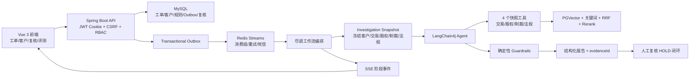

# AML Agent 项目全面审查与本轮优化报告

> **历史阶段报告：** 本文记录九阶段整改前半段的中间状态，测试数字和部分结论已经过期。当前最终口径请以《项目九阶段整改与对抗性审查报告-2026-08-19.md》为准。

> 审查日期：2026-08-19  
> 目标岗位：Java 后端开发、AI 应用开发、AI Agent 开发  
> 结论口径：只描述当前仓库中已经存在或本轮已经实现并验证的能力，不将演示数据、调优集指标包装为生产效果。

## 1. 执行结论

当前项目已经不是“调用一次大模型 API 的 Demo”，而是一个围绕银行 AML 尽调工单构建的工程化 Agent 系统。它具备：可靠异步任务、Snapshot First 数据一致性、四类 Tool Calling、混合 RAG 与证据引用、确定性 Guardrails、人工复核闭环、真实模型评测、SSE 进度展示、权限与可观测性等完整链路。

本轮完成了以下高价值整改：

1. 解决 DeepSeek 请求携带 `prompt_cache_retention` 导致的模型兼容错误，同步 Agent 和可选流式摘要均在出站边界清理不支持参数。
2. 修复客户管理模块的 Flyway 版本冲突、前端类型错误、Excel 导入安全边界、软删除重复证件校验和快照刷新原子性。
3. 修复 SSE 终态连接泄漏、终态文案不准确，以及流式摘要启动后连接被立即关闭的问题。
4. 修复集成测试与本地运行服务共用数据库/Outbox 导致任务被其他进程抢走的问题；集成测试改为独立 MySQL schema 和独立 Redis stream。
5. 更新 README 的模型、接口、安全边界、测试数量和客户管理能力说明。

验证结果：

- DeepSeek 兼容层定向测试：3/3 通过。
- 后端确定性测试：128 项执行，127 项通过、1 项真实模型测试按设计跳过。
- 后端集成/E2E：18/18 通过。
- 前端 Vitest：5/5 通过。
- 前端生产构建：通过。
- Flyway：V1 → V4 全量迁移通过，Hibernate `ddl-auto=validate` 通过。

## 2. 项目定位与不应强行增加的设计

该项目的核心交互是“预警工单触发一次有状态、可恢复的尽调流程”，不是通用聊天机器人。因此：

- 当前不需要引入 Conversation Memory。工单上下文来自数据库、执行快照和阶段检查点；加入聊天记忆反而会增加敏感数据留存、上下文污染和 Token 成本。
- 当前不需要 Multi-Agent。交易、股权、制裁、法规四项信息可以作为同一个 Agent 的并行工具，最终风险评级需要统一上下文。拆成多个 Agent 会增加模型调用、协调协议和结论冲突，收益不足。
- 前端不应为了匹配“AI 聊天项目”模板强行改成对话页。当前更有业务价值的是工单看板、阶段进度、证据链、人工复核和失败恢复。
- 模型内部 Chain of Thought 不应展示。前端只展示可审计的阶段事件、工具状态、证据引用和最终结论。

只有未来新增“分析师对已完成工单进行多轮追问”时，才值得设计短期消息 + 工单摘要 + 相关证据检索的受控 Memory。

## 3. 当前系统架构

### 3.1 前端架构

- Vue 3 + TypeScript + Vite + Element Plus。
- 路由按视图异步加载，包含工单看板、工单详情、人工复核、评测看板、客户管理。
- JWT 使用 HttpOnly Cookie；前端读取 CSRF Cookie 并回传请求头。
- 工单详情通过 SSE 展示阶段状态，页面刷新后通过 REST 重新获取权威状态，避免仅依赖内存流。
- 角色路由守卫只负责用户体验，最终权限由后端 `@PreAuthorize` 决定。

### 3.2 Java 后端架构

- Controller：认证、工单、客户、复核、评测、队列管理。
- Service：工单编排、客户管理、SSE、规则兜底报告。
- Messaging：Transactional Outbox、Redis Streams、Pending 接管、重试、死信。
- Agent：LangChain4j AiServices、结构化报告、动态绑定快照工具。
- Tool/RAG：交易、股权、制裁、法规工具；PGVector + 关键词 + RRF +本地 reranker。
- Guardrail：数据库配置化规则 DSL，模型评级与规则最终评级分开保留。
- Evaluation：规则回归、RAG 评测、逐案例隔离的真实 Agent DEV/隐藏 TEST 评测。
- Storage：MySQL 存业务数据；PostgreSQL/PGVector 存法规向量；Redis 用于队列、检索缓存和限流。

### 3.3 一次请求的完整执行链路

1. 用户选择客户并创建预警工单。
2. 同一数据库事务写入 `case` 与 `outbox_event`，避免数据库成功但消息丢失。
3. Outbox 发布器抢占事件并投递 Redis Stream。
4. Worker 通过消费组接收任务，使用执行版本和租约抢占，避免旧 Worker 覆盖新执行。
5. `InvestigationSnapshotFactory` 一次性冻结客户、交易、股权、制裁和法规信息，并计算快照标识与摘要。
6. 每个工单创建独立 Agent，绑定只读快照工具；无依赖工具可并行调用，并限制最大工具轮次。
7. 法规工具执行混合检索并返回可追溯 `evidenceId`。
8. 模型生成结构化报告；异常时按配置进入规则兜底，同时记录 fallback 指标和来源。
9. Guardrails 使用同一快照进行确定性校验，只允许提高风险或强制人工，不掩盖原始模型评级。
10. 报告和终态写入 MySQL；高风险/指定规则进入 HOLD 人工复核。
11. 阶段事件经 SSE 推送；终态、错误、超时和客户端断开都会释放连接。

## 4. 本轮实际修改

### 4.1 DeepSeek 参数兼容与多轮工具稳定性

原问题：OpenAI 兼容客户端可能向请求附加 `prompt_cache_retention` 或 `prompt_caching_retention`，DeepSeek 不接受该字段，导致请求在到达模型前直接失败。DeepSeek V4 的 thinking 模式又要求工具调用后续轮次正确回传 reasoning 内容，当前链路存在兼容风险。

实施：

- 新增同步和流式 DeepSeek 模型包装器。
- 在最终出站请求边界清理两种不支持的缓存保留参数，其他参数不变。
- 同步 Agent 与可选流式摘要均显式关闭 thinking，保证多轮工具调用稳定。
- 保留 DeepSeek 服务端自动上下文缓存，不自行模拟缓存语义。
- 增加同步/流式请求回归测试，确保 `thinking` 保留而不兼容字段被删除。

收益：修复明确的 API 兼容错误，且不是简单删除某一处配置，而是在模型出站边界防御未来调用方再次注入。

### 4.2 客户管理模块

原问题：新增迁移和已有 `V3` 重号会导致 Flyway 启动失败；前端类型检查失败；内存快照刷新期间可能被并发请求读到部分状态；证件号唯一性未覆盖软删除数据；Excel 导入缺少严格文件和数据边界。

实施：

- 客户迁移调整为 `V4__customer_management.sql`，增加迁移版本唯一性测试。
- 客户增删改查、启停、分页搜索与 Excel 导入仅向 ADMIN 开放。
- 客户快照改为“先构建完整不可变快照，再一次性替换引用”。
- 新增字段必填、长度、状态和数据库约束一致性校验。
- 证件号重复校验覆盖软删除记录，防止恢复或审计时产生身份冲突。
- Excel 仅允许 xls/xlsx，限制 5MB、1000 行，校验表头，拒绝公式单元格，证件号必须为文本以防 Excel 数值精度损失。
- 数据提交成功后再刷新快照，刷新失败不制造“数据库已提交但接口显示回滚”的假象。
- 修复 Vue/Element Plus 表格事件类型与错误对象类型，前端构建恢复通过。

### 4.3 SSE 与可选流式摘要

原问题：订阅已完成工单时仍可能长期保持心跳；FAILED/HOLD 与 DONE 的终态文案不一致；异步摘要刚启动，主流程就关闭 SSE，后续 token 无法到达前端。

实施：

- 已处于 DONE/HOLD/FAILED 的工单订阅后立即发送终态并完成连接。
- 终态事件根据真实状态发送，不再统一写“完成”。
- 失败、死信、Pending 接管耗尽仅在数据库状态更新成功后终止 SSE。
- 摘要输入在主流程中准备，但仅在报告落库成功后异步启动。
- 摘要完成、异常、60 秒超时或执行器拒绝时统一关闭 SSE；迟到 token 被忽略。
- 摘要默认关闭，避免额外一次模型调用、延迟和与主报告语义不一致。

### 4.4 测试隔离

原问题：集成测试与本地正在运行的后端共用 `aml_agent` 数据库。测试写入 Outbox 后，另一个进程可能先抢占并向默认 Redis Stream 发布，测试自身一直等待而超时。

实施：

- 为安全、可靠性和 E2E 测试分别创建受白名单约束的独立 `*_test` schema。
- 每个测试上下文使用独立 Redis stream/group。
- Maven 默认排除 `integration` 标签；仅 `-Pintegration-test` 显式运行容器集成测试。
- 只允许删除符合 `aml_[a-z0-9_]+_test` 的专用测试库，避免误操作业务库。
- 验证 Flyway V1 到 V4、Hibernate validate、CSRF、Outbox、重试和端到端工作流。

结果：18 项集成/E2E 全部通过，本地后台服务继续运行也不会抢测试消息。

## 5. 问题优先级与下一步工作包

## P0：生产化前必须完成

### P0-1 真实数据适配器与演示数据边界

当前问题：客户主数据已经来自数据库，但客户的交易、股权和名单信息仍由演示适配器生成。新增真实客户后会得到确定性的合成尽调事实。如果不显式限制，容易让使用者误以为这是真实业务结果。

修复方案：

1. 将 `CustomerDataPort` 按客户、交易、股权、制裁拆为可独立替换的 Port。
2. 实现数据库或上游 HTTP Adapter，并为每种来源返回 `sourceSystem/asOfTime/dataQuality`。
3. 在 prod profile 禁止 Mock/Synthetic Adapter；若真实适配器缺失则启动失败或拒绝创建尽调工单。
4. 前端和报告明确展示数据来源与更新时间。

验收：prod 下任何报告不得包含 synthetic 来源；缺数据必须得到 `DATA_UNAVAILABLE`，不能生成假正常结果。

### P0-2 敏感身份数据最小化

当前问题：`id_card` 以明文存储；为让模型调用制裁工具，姓名和证件号可能进入外部模型上下文。DTO 脱敏只能保护界面，不能保护数据库、Prompt 和第三方传输。

修复方案：

1. 数据库保存证件号密文 + 检索用 HMAC/Token，不使用可逆字段做普通日志。
2. 制裁身份绑定由服务端完成：模型只决定“是否需要名单检查”，不接触完整证件号。
3. Tool trace、异常、评测报告继续使用白名单/摘要，不持久化模型自由文本中的身份信息。
4. 增加日志、Prompt、报告序列化的 canary 泄漏测试。

验收：数据库、日志、模型请求、SSE、评测 JSON 中均不能出现明文证件号。

## P1：重要工程改进

### P1-1 客户编号与缓存刷新支持多实例

当前问题：客户编号扫描 + JVM `synchronized` 只保证单实例；客户快照刷新只作用于当前实例。

方案：客户编号改为数据库序列/雪花 ID/UUID；事务提交后发布版本事件，各实例按版本原子刷新，或查询路径直接使用数据库并做短 TTL 缓存。

验收：两个实例并发新增 1000 个客户无重复编号；任一实例修改后其他实例在目标时间内可见。

### P1-2 Excel 导入事务语义

当前问题：接口返回逐行结果，但单个数据库约束异常可能让整个外层事务回滚，形成“返回部分成功但实际未提交”的语义风险。

方案二选一：

- 推荐：先全量解析和校验，全部通过后一次事务写入，任何错误均不落库；界面展示完整错误清单。
- 若业务必须部分成功：每一批或每一行使用独立事务，结果明确记录已提交 ID。

验收：返回的成功数必须等于数据库真实新增数，异常重试不产生重复数据。

### P1-3 RAG 索引原子发布

当前问题：法规重建使用先删后写，重建期间可能出现空索引或部分索引；索引版本文件是单机本地状态；顺序型 evidenceId 在文档插入后可能变化。

方案：构建带版本的新表/新集合，完成校验后原子切换 active version；版本存数据库；evidenceId 使用规范化文档 ID + 条款 + 内容哈希稳定生成。

验收：重建期间旧索引持续可查；切换失败自动保留旧版本；相同条款重复导入 evidenceId 不变。

### P1-4 Tool 级超时与错误分类

当前问题：模型总超时和有限重试已存在，但不同上游 Tool 未来接入真实 HTTP 后，需要各自隔离超时、重试和熔断策略，不能统一重试所有异常。

方案：定义 `ToolException` 错误码；只重试超时、连接重置、限流等可恢复错误；业务校验错误不重试；记录 toolName、errorCode、latency，不记录敏感参数。

验收：失败工具不会无限重试；单个上游超时不长期占用 Worker；前端能区分可重试与需人工处理。

## P2：可维护性与体验

### P2-1 拆分 `DueDiligenceService`

当前问题：该类同时负责阶段推进、快照、模型调用、Guardrails、持久化、摘要和 SSE 生命周期，修改任一职责都容易扩大回归范围。

方案：拆为 `InvestigationOrchestrator`、`AgentExecutionService`、`ReportPersistenceService`、`SummaryStreamService`，主编排仅表达阶段顺序和事务边界。

### P2-2 前端状态与可访问性

补充客户管理组件测试、Excel 错误明细展示、SSE 重连提示、空状态和键盘可操作性；不展示模型思维链，只展示可审计阶段。

### P2-3 数据库与查询观测

为客户分页关键词、工单状态/创建时间、复核状态等真实查询执行 `EXPLAIN`；根据数据规模决定复合索引，不为了简历预设“千万级优化”。

## P3：后续增强

- 使用 Testcontainers 提高 CI 环境一致性，但当前 Docker 集成测试已可稳定运行，不属于阻断项。
- 增加 OpenTelemetry trace 将 HTTP、Outbox、Worker、Tool、RAG 串成跨线程链路；现有 Micrometer 已足够本阶段使用。
- 只有增加分析师交互问答后再实现受控 Memory。
- 只有出现明确职责隔离和并行自治需求后再考虑 Multi-Agent。

## 6. 功能模块状态

| 模块 | 当前状态 | 判断 |
|---|---|---|
| 登录/RBAC/CSRF | 已实现数据库用户、JWT Cookie、CSRF、角色授权 | 可演示，生产需强密钥和账号初始化策略 |
| 客户管理 | CRUD、分页、启停、Excel 导入、原子快照 | 本轮完成；多实例和 PII 仍需处理 |
| 工单工作流 | Outbox、Redis Stream、租约、重试、死信、接管 | 项目最强的 Java 后端亮点之一 |
| Agent | 单 Agent + 四工具 + 最大轮次 +结构化报告 | 与业务匹配，不需要强行多 Agent |
| Tool Calling | 快照绑定、参数业务校验、并行、轨迹 | 真实上游接入后需 tool 级隔离策略 |
| RAG | PGVector、关键词、RRF、rerank、citation | 链路完整；索引发布仍需原子化 |
| Guardrails | 配置化 DSL、单调升级、人工复核 | 可解释，且与模型原始结果分开评测 |
| 评测 | 规则/RAG/真实 Agent 三层评测 | 有竞争力；DEV 指标不可当生产准确率 |
| SSE | 阶段事件、心跳、终态释放、可选摘要 | 本轮修复生命周期问题 |
| 可观测性 | traceId、Micrometer、Prometheus/Grafana | 已有基础，后续可做跨线程 tracing |
| 前端 | 工单/详情/复核/评测/客户管理 | 构建和测试通过；不是聊天产品 |
| 部署 | Docker Compose + prod profile + Flyway | 适合本地演示；尚非云原生生产部署 |

## 7. 测试与回归证据

| 检查 | 结果 |
|---|---|
| DeepSeek 同步/流式参数清洗 | 3 项测试通过 |
| 客户管理服务 | 覆盖提交后刷新、软删除证件冲突、大文件、证件号精度 |
| SSE 生命周期 | 覆盖历史终态立即关闭、运行连接移除 |
| Flyway 版本唯一性 | 通过，当前 V1-V4 |
| Flyway + Hibernate validate | 通过 |
| 后端集成/E2E | 18/18 通过 |
| 前端测试 | 5/5 通过 |
| 前端 production build | 通过 |

真实 Agent 评测中的 100% DEV 指标来自反复调优的 9 条合成 DEV，不代表生产准确率；简历应同时注明独立 TEST 和领域专家标注仍是后续工作。

## 8. 简历可用项目描述

项目名称建议：**商业银行 AML 智能尽调 Agent 平台**

一句话描述：基于 Java 21、Spring Boot、LangChain4j 构建面向反洗钱预警工单的智能尽调平台，通过 Tool Calling、混合 RAG、确定性 Guardrails 和可靠异步工作流完成风险研判、证据追溯与人工复核闭环。

可选 bullet（根据版面选 4-6 条）：

1. 设计 Transactional Outbox + Redis Streams 消费组的异步尽调链路，引入发布抢占、执行版本、租约心跳、指数退避、死信与 Pending 接管，支持任务幂等、失败恢复和服务重启续跑。
2. 基于 LangChain4j 实现单 Agent + 4 个领域工具（交易画像、股权穿透、制裁筛查、法规检索），按工单动态绑定只读快照并并行调用，限制最大工具轮次，避免重复取数造成结论时序不一致。
3. 构建 PGVector 向量召回 + 关键词召回 + RRF 融合 + bge-reranker 精排的法规 RAG，使用 `evidenceId` 将模型报告引用回溯到具体法规片段；当前同源 35 条检索集 Recall@5 为 94.3%，并明确保留数据集局限。
4. 实现数据库配置化 Guardrails，对模型原始评级执行确定性风险下限和人工升级规则；搭建规则回归、RAG 评测、逐案例真实 Agent DEV/隐藏 TEST 三层评测体系，区分模型结果与护栏最终结果。
5. 通过 Snapshot First 冻结客户、交易、股权、制裁和法规证据，计算快照标识并让 Agent、Guardrails、规则兜底共享同一数据版本，消除长链路多次读取可变数据导致的不一致。
6. 实现 SSE 工作流状态推送并修复终态连接泄漏、失败状态不一致和异步摘要提前断流；对摘要设置 60 秒上限和异常释放，默认关闭第二次模型调用以控制 Token、延迟及语义偏差。
7. 完成 JWT HttpOnly Cookie、CSRF、RBAC、登录限流、Prompt 注入防护、敏感评测报告白名单脱敏和 Micrometer/Prometheus 指标，记录模型/工具耗时、Token、错误与 fallback。
8. 建设 128 项确定性测试、18 项 MySQL/Redis/PGVector 集成与 E2E 测试、5 项前端测试；隔离测试数据库与消息流，解决本地多进程抢占 Outbox 导致的偶发超时。

## 9. 面试风险提示

- 不要说“生产级银行系统”：当前数据和标签主要为合成/演示数据，未经过金融机构上线验证。
- 不要说“模型准确率 100%”：只能说 9 条调优 DEV 达到 100%，并主动说明过拟合风险与隐藏 TEST 设计。
- 不要说“实现了多 Agent/Memory/Kafka/微服务/Kubernetes”：仓库没有这些实现，也没有必要强行加入。
- 说 RAG 94.3% 时必须说明是 35 条同源问题集，不是独立专家测试集。
- 说“高并发”前应能够解释当前单 Worker、Outbox 轮询和连接池边界；现有 379 工单/秒仅是本机 Mock 创建吞吐，不代表真实模型端到端吞吐。
- 准备解释为什么选 Redis Streams 而不是 Kafka、为什么 Guardrails 只上调不下调、为什么 Snapshot First 比让工具实时查库更适合审计，以及为什么当前不需要 Memory/Multi-Agent。

## 10. 推荐执行顺序

1. 先完成 P0-1：真实数据适配器或 prod 禁止 synthetic facts，防止业务语义错误。
2. 完成 P0-2：证件号加密/Token 化和服务端制裁身份绑定。
3. 完成 P1-1：客户编号与缓存刷新多实例一致性。
4. 完成 P1-2：明确 Excel 全量原子导入或真实部分提交语义。
5. 完成 P1-3：RAG 蓝绿索引和稳定 evidenceId。
6. 拆分 `DueDiligenceService`，补充组件测试与跨线程 trace。
7. 冻结隐藏 TEST，由非开发者独立标注并完成最终泛化评测，再更新简历指标。

按照这个顺序推进，项目的提升重点会从“功能完整”转向“数据可信、隐私可控、多实例一致、可复现评测”，这些比增加更多框架名更有秋招价值。
